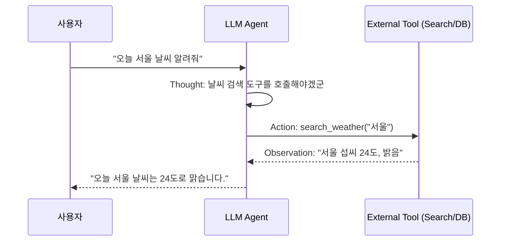

# 🤖 AI & 프롬프트 엔지니어링 스터디

> [!WARNING]
> 대형 언어 모델(LLM)을 활용한 소프트웨어 개발 및 자동화 시스템 구축 시 필수적인 **프롬프트 패턴과 Agent 설계** 가이드라인입니다.

---

## 1. 프롬프트 기법 (Prompting Techniques)

### 🎯 Chain-of-Thought (CoT)
모델에게 단계별 추론 과정(Let's think step by step)을 유도하여 복잡한 수학이나 논리 문제를 풀게 하는 기법입니다.

```text
Q: 과일 바구니에 사과 5개가 있습니다. 사과 2개를 먹고, 새로 사과 3개를 사 왔습니다. 사과는 몇 개일까요?
A: 단계별로 생각해보겠습니다.
1. 처음 사과 개수: 5개
2. 사과 2개를 먹음: 5 - 2 = 3개
3. 새로 사과 3개를 사 옴: 3 + 3 = 6개
따라서 최종 사과 개수는 6개입니다.
```

---

## 2. ReAct (Reasoning + Acting) 프롬프트 패턴

LLM이 단순히 텍스트만 생성하는 것을 넘어 **도구(Tool)를 활용하여 외부 환경과 상호작용**하도록 만드는 패턴입니다.


