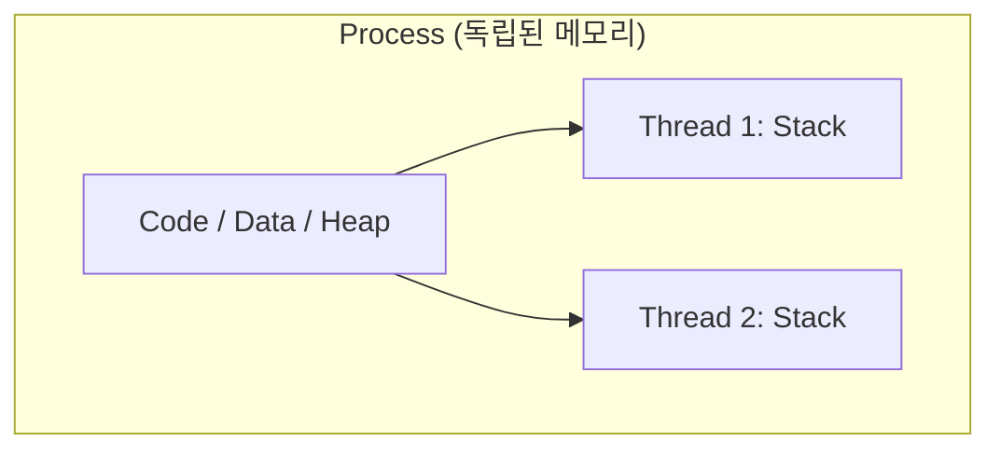

# 💻 운영체제 핵심 개념 정리

> [!NOTE]
> 이 문서는 CS 스터디 중 **프로세스(Process)와 스레드(Thread)**, 그리고 **가상 메모리(Virtual Memory)**의 작동 원리를 마크다운으로 정리한 노트입니다.

---

## 1. 프로세스(Process)와 스레드(Thread)의 차이

### 📌 핵심 비교 요약

| 구분 | 프로세스 (Process) | 스레드 (Thread) |
| :--- | :--- | :--- |
| **정의** | 메모리에 로드되어 실행 중인 프로그램의 인스턴스 | 프로세스 내에서 실행되는 흐름의 단위 |
| **자원 공유** | 각 프로세스는 독자적인 메모리 공간(Code, Data, Heap, Stack) 소유 | 동일 프로세스 내에서 **Code, Data, Heap 공유** (Stack만 독립) |
| **오버헤드** | 컨텍스트 스위칭(Context Switching) 오버헤드 큼 | 자원 공유로 인해 스위칭 오버헤드 상대적으로 적음 |
| **안정성** | 한 프로세스 장애 발생 시 타 프로세스에 영향 없음 | 프로세스 내 한 스레드 장애 발생 시 전체 프로세스 종료 위험 |



---

## 2. 컨텍스트 스위칭 (Context Switching)

CPU가 한 프로세스/스레드에서 다른 프로세스/스레드로 제어를 넘길 때, 현재 상태(Register, Program Counter 등)를 저장하고 다음 상태를 복구하는 과정을 말합니다.

### ⚡ 프로세스 컨텍스트 스위칭 과정
1. 인터럽트(Interrupt) 또는 시스템 콜(System Call) 발생
2. 현재 실행 중인 프로세스의 상태를 **PCB(Process Control Block)**에 저장
3. 다음에 실행할 프로세스의 정보를 PCB에서 로드
4. **TLB(Translation Lookaside Buffer) Cache Flush** 발생 (프로세스 스위칭 시 메모리 매핑이 바뀌므로 성능 영향 커짐)

> [!TIP]
> 스레드 스위칭 시에는 메모리 주소 공간(Code, Data, Heap)을 공유하므로 TLB를 비울 필요가 없어 스위칭 속도가 훨씬 빠릅니다.

---

## 3. 메모리 관리 (Memory Management)

### 🧠 가상 메모리 (Virtual Memory)
실제 물리 메모리(RAM)보다 더 큰 메모리 영역을 사용할 수 있도록 프로세스마다 가상의 메모리 주소를 할당하는 방식입니다.

```python
# 예시: 가상 주소를 물리 주소로 변환하는 룩업 개념 (MMU)
def translate_virtual_to_physical(virtual_address, page_table):
    page_number = virtual_address >> 12
    offset = virtual_address & 0xFFF
    
    if page_number in page_table:
        frame_number = page_table[page_number]
        physical_address = (frame_number << 12) | offset
        return physical_address
    else:
        raise PageFaultException("페이지 부재(Page Fault) 발생!")
```

---

## 4. 스터디 요약 체크리스트

- [x] 프로세스와 스레드의 메모리 구조 차이 이해
- [x] PCB와 TCB의 역할 파악
- [x] 가상 메모리와 Page Fault 처리 흐름 정립
- [ ] 캐시 라인 및 메모리 펜스(Memory Barrier) 학습 예정
