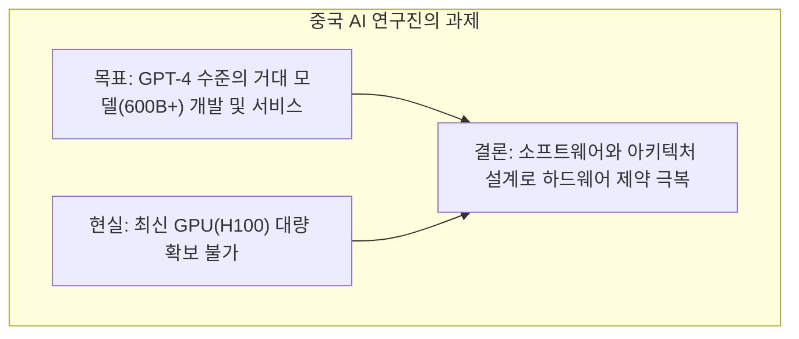
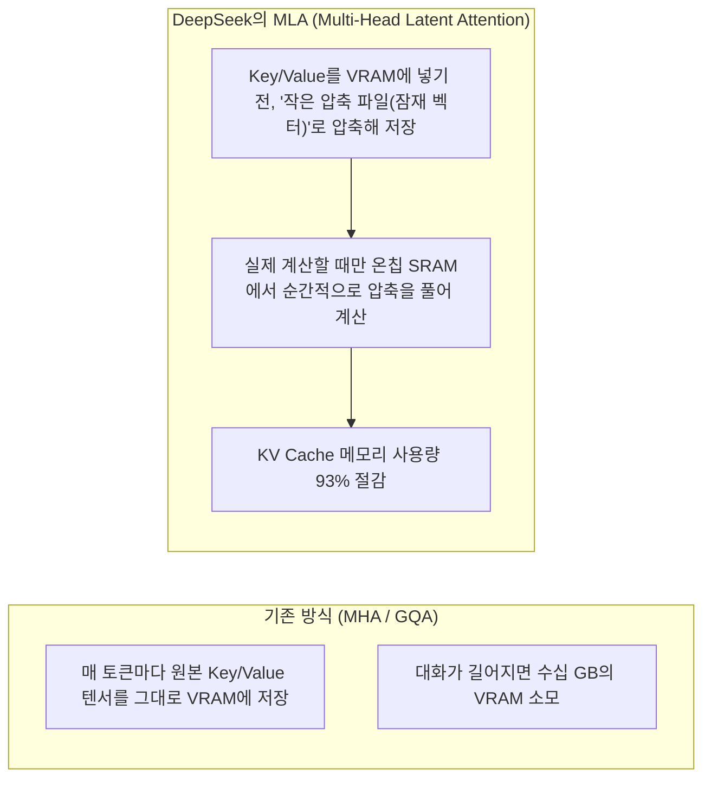
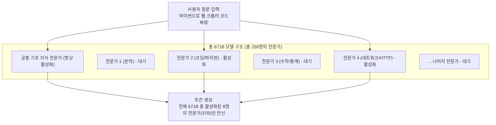
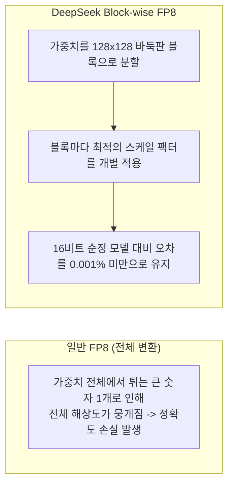
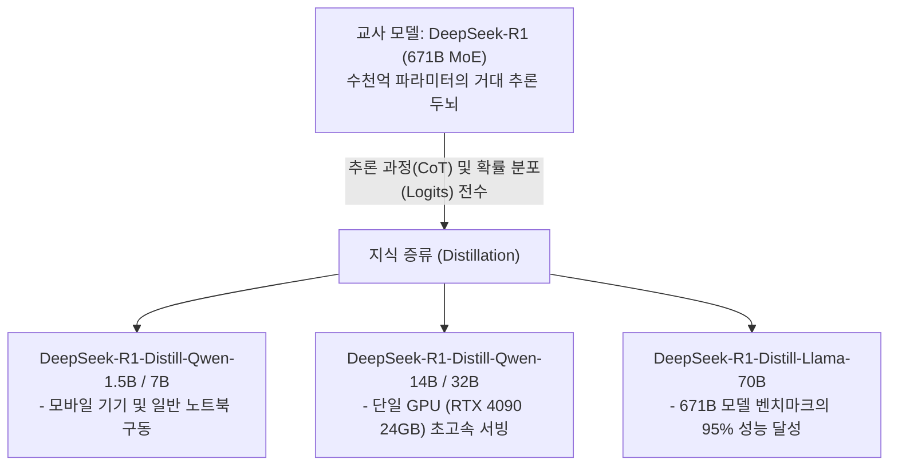
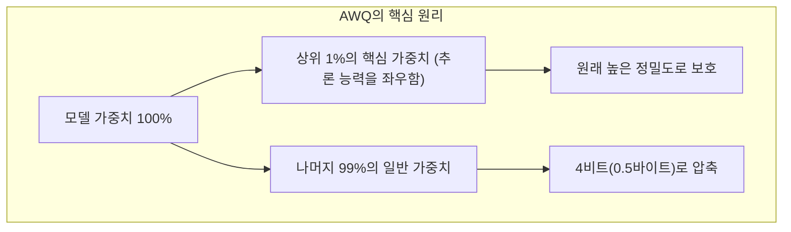
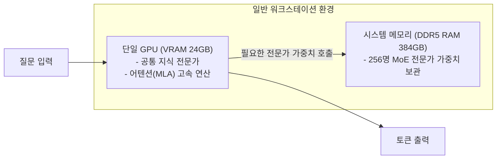

:::note[📖 Quick Glossary: 핵심 용어 사전]
| 용어 | 설명 |
| :--- | :--- |
| **MoE (Mixture of Experts)** | 거대한 모델을 여러 명의 '분야별 전문가'로 나누고, 입력된 질문에 필요한 소수 전문가만 활성화하여 계산하는 기술입니다. |
| **MLA (Multi-Head Latent Attention)** | 대화가 길어질수록 증가하는 KV Cache 메모리를 저차원 잠재 벡터(Latent Vector) 형태로 압축해 VRAM을 90% 이상 절감하는 기술입니다. |
| **FP8 Quantization** | 16비트 실수 숫자로 된 모델 파라미터 정밀도를 8비트로 변환하여 VRAM 용량과 메모리 전송량을 절반으로 줄이는 기법입니다. |
| **Knowledge Distillation** | 거대 교사(Teacher) 모델의 추론 능력과 로짓을 작은 학생(Student) 모델에 전수하여 소형 모델의 지능을 극대화하는 압축 기술입니다. |
| **AWQ (Activation-aware Weight Quantization)** | 모델에서 중요한 1%의 핵심 파라미터만 원래 정밀도로 보존하고, 나머지 99%는 4비트로 압축하는 양자화 기술입니다. |
| **CPU/GPU Offloading** | GPU VRAM이 부족할 때 고용량 시스템 메모리(RAM)를 보조 저장소로 활용하는 기법입니다. |
:::

---

## 1. 배경: 왜 중국 모델들은 효율성에 집중했을까?

2023년 이후 미국은 최신 데이터센터용 GPU(NVIDIA H100, B200 등)의 대중국 수출을 제한했습니다.

미국 빅테크 기업들이 대규모 GPU 인프라를 증설하며 서빙을 확장한 반면, DeepSeek과 Alibaba(Qwen) 연구진은 한정된 GPU 자원에서 600B 이상의 대형 모델을 서비스해야 했습니다.

이 하드웨어 제약은 AI 서빙 아키텍처를 효율 중심으로 재편하는 계기가 되었습니다.

---

## 2. DeepSeek 아키텍처: MLA를 통한 KV Cache 압축

LLM은 이전 대화 내용을 기억하기 위해 KV Cache를 VRAM에 누적합니다. 대화가 길어지고 동시 사용자가 늘어나면 모델 가중치보다 KV Cache가 VRAM을 더 많이 차지합니다.

### 일상 비유로 이해하는 MLA
* **기존 방식 (MHA/GQA)**: 책 한 권을 읽을 때 모든 페이지를 복사본 그대로 책상 위에 넓게 펼쳐두는 방식입니다. 책상이 금방 꽉 찹니다.
* **DeepSeek의 MLA**: 책의 핵심 내용만 초소형 요약본(잠재 벡터)으로 압축하여 보관합니다. 머릿속에서 연산할 때만 잠깐 요약본을 펼쳐서 봅니다.

이 구조 덕분에 DeepSeek-V3는 수천 명의 사용자가 동시에 긴 대화를 나누어도 KV Cache **메모리 증가를 최소화하며 높은 서빙 효율**을 유지합니다.

---

## 3. DeepSeek 아키텍처: 초미세 전문가 분할 (DeepSeekMoE)

DeepSeek-V3는 총 파라미터 수가 **6,710억 개(671B)** 에 달하는 초대형 모델입니다.

일반적인 671B 모델은 토큰 1개를 만들 때도 6,710억 개의 숫자를 전부 계산해야 하므로 연산 비용이 큽니다. DeepSeek은 이를 **초미세 MoE(Mixture of Experts)** 구조로 해결했습니다.

* **원리**: 671B 모델을 잘게 쪼개어 **256명의 소형 전문가**로 나눕니다.
* 코딩 질문이 들어오면 문학, 법률, 역사 전문가는 대기시키고, **질문과 관련된 8명의 코딩/네트워크 전문가(37B 분량)만 활성화**합니다.
* **결과**: 모델의 지능은 671B급으로 유지되면서, **실제 연산량과 소요 시간은 37B 소형 모델 수준으로 줄어듭니다**.

---

## 4. DeepSeek 아키텍처: Block-wise FP8 양자화

16비트(BF16) 숫자를 8비트(FP8)로 줄이면 수치 해상도가 낮아져 답변 품질이 떨어질 수 있습니다(이상치 Outlier 문제).

DeepSeek은 가중치를 통째로 변환하지 않고, 128 × 128 크기의 블록(Tile) 단위로 나누어 각각 스케일 팩터를 개별 적용하는 블록 스케일링 기법을 적용했습니다.

* **서빙 효과**: 671B 모델의 가중치 용량과 메모리 전송량이 **정확히 절반(50%)으로 감소**했습니다.
* VRAM에서 연산 코어로 이동하는 데이터 크기가 줄어들며 **토큰 생성 처리량(Throughput)이 2배 향상**되었습니다.

---

## 5. DeepSeek과 Qwen의 결합: 지식 증류(Distillation)를 통한 소형 모델 서빙

DeepSeek의 진정한 파급력은 671B 모델 자체에 그치지 않고, 알리바바의 Qwen과 메타의 Llama 같은 소형 오픈소스 모델에 DeepSeek-R1의 추론 능력을 직접 증류(Distillation)하여 배포한 데서 완성되었습니다.

### DeepSeek-R1의 Qwen 지식 증류 효과
* **서빙 하드웨어 요구량의 극적 축소**: 671B MoE 모델을 직접 띄우려면 고용량 VRAM이 필요하지만, Qwen-7B나 14B로 증류된 모델은 개인용 그래픽카드인 RTX 4090 1장이나 M 시리즈 맥북에서도 최상급 추론(Reasoning) 모델을 가볍게 서빙할 수 있습니다.
* **Qwen 아키텍처의 우수성 결합**: DeepSeek 연구진은 여러 오픈소스 베이스 모델 중 알리바바의 Qwen2.5가 증류 효율과 수학/코딩 표현력이 가장 뛰어나다는 점에 주목하여 주력 증류 모델로 채택했습니다.

---

## 6. Alibaba Qwen의 경량화: AWQ 4-bit 양자화

알리바바의 Qwen 연구팀은 일반 개발 환경에서도 거대 모델을 서빙할 수 있도록 **AWQ (Activation-aware Weight Quantization)** 포맷을 적극적으로 도입했습니다.

### AWQ의 가중치 보호 원리와 실전 서빙 효과
* 4-bit 양자화는 코드 문법이나 수식 기호 같은 미세 토큰을 손상시켜 벤치마크 점수를 떨어뜨리기 쉽습니다.
* Qwen은 실제 추론 과정에서 자주 활성화되는 상위 1% 가중치만 원본 정밀도로 보존하고, 나머지 99%만 4비트로 변환합니다.
* 그 결과, Qwen2.5-Coder-32B 같은 모델을 개인용 GPU인 RTX 4090(24GB)이나 RTX 4070(12GB)에서도 추론 성능 손실 없이 안정적으로 서빙할 수 있습니다.

---

## 7. KTransformers 기반 CPU/GPU 하이브리드 오프로딩 서빙

DeepSeek의 671B 모델은 압축 후에도 가중치 용량이 300GB를 넘습니다.

칭화대와 오픈소스 커뮤니티는 KTransformers 같은 CPU/GPU 하이브리드 오프로딩 프레임워크를 통해 단일 워크스테이션 환경에서도 구동 가능하도록 만들었습니다.

* **작동 원리**:
  * 속도가 빠른 **GPU VRAM**에는 어텐션 연산(MLA)과 공통 가중치를 상주시킵니다.
  * 300GB 규모의 **MoE 전문가 가중치는 대용량 시스템 메모리(DDR5 RAM)**에 적재합니다.
  * 질문 처리 시 활성화되는 **전문가 가중치만 PCIe 대역폭을 통해 GPU로 전송**하여 계산합니다.
* **결과**: 대규모 GPU 클러스터 없이 **고용량 RAM과 단일 GPU를 갖춘 단일 시스템에서도 671B 모델 구동**이 가능해졌습니다.

---

## 8. 엔지니어링 시사점: 아키텍처 중심의 서빙 효율화

DeepSeek과 Qwen의 사례는 하드웨어 증설 외에도 **아키텍처, 지식 증류, 시스템 엔지니어링의 최적화가 서빙 비용을 낮추는 핵심 경로**임을 보여줍니다.

| 구분 | 대규모 인프라 중심 접근 | 고효율 아키텍처 접근 (DeepSeek, Qwen) |
| :--- | :--- | :--- |
| **확장 방식** | GPU 클러스터 대규모 증설 | 아키텍처(MLA, MoE)와 증류·양자화로 자원 요구량 축소 |
| **어텐션 메모리** | MHA/GQA 기반 VRAM 관리 | MLA로 KV Cache를 93% 압축해 동시 수용력 확보 |
| **경량화 전략** | BF16 (16비트) 기본 구성 | DeepSeek-R1 Distill (Qwen/Llama) 및 Block-wise FP8/AWQ |
| **서빙 비용 (API)** | 백만 토큰당 수 달러 ($2 ~ $10) | **백만 토큰당 수십 센트 ($0.14 ~ $0.50 수준)** |

---

## 9. 핵심 3줄 요약

1. **제약과 효율화**: 하드웨어 수급 제약 속에서 MLA, 초미세 MoE, 정밀 양자화, 지식 증류를 결합한 고효율 서빙 기술이 발전했습니다.
2. **DeepSeek 3대 기술 & 증류**: MLA로 대화 메모리를 93% 줄이고, DeepSeekMoE로 연산량을 37B 수준으로 낮추었으며, DeepSeek-R1-Distill-Qwen으로 소형 GPU 서빙 생태계를 완성했습니다.
3. **오픈소스 생태계**: Qwen의 AWQ 4-bit와 KTransformers 하이브리드 서빙 기술을 통해 일반 개발 환경에서도 대형 모델 활용이 가능해졌습니다.
