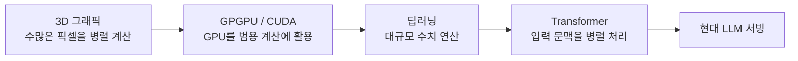
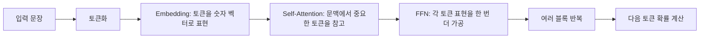
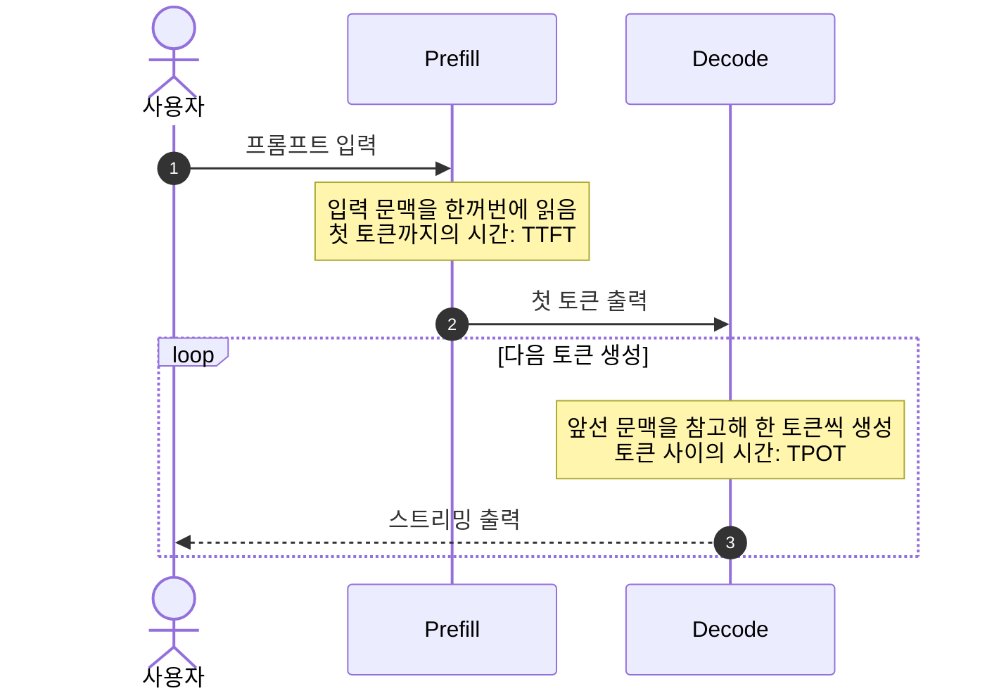

:::note[스터디 기록]
Hands-On LLM Serving and Optimization 스터디 1주차 - GPU 병렬 연산의 배경과 LLM 서빙의 병목을, 다음 편의 KV Cache 실습으로 이어지도록 정리한 1편 포스트입니다.
:::

---

:::note[📖 Quick Glossary: LLM 서빙 핵심 용어 사전]
| 용어 | 이 글에서 알아둘 뜻 |
| :--- | :--- |
| **TTFT** | 요청 후 첫 토큰이 나오기까지의 시간입니다. |
| **TPOT** | 첫 토큰 이후, 토큰 하나를 더 만드는 데 걸리는 평균 시간입니다. |
| **TPS** | 초당 생성되는 토큰 수입니다. |
| **Compute-Bound** | 메모리 이동보다 GPU 연산량이 성능을 더 크게 좌우하는 상태입니다. |
| **Memory-Bound** | 연산보다 VRAM에서 데이터를 읽어 오는 속도가 성능을 더 크게 좌우하는 상태입니다. |
| **KV Cache** | 이전 토큰의 Attention 계산 결과 일부를 저장해 다음 토큰 생성에 재사용하는 공간입니다. |
:::

---

## 1. 들어가며: 웹 서버와 LLM 서빙의 근본적인 차이

전통적인 웹 서비스 인프라의 스케일링 공식은 명쾌했습니다. Nginx나 API 서버의 CPU 및 RAM 사용률이 80%를 넘어서면 로드밸런서 뒤에 Pod 인스턴스를 단순 증설(Scale-out)하여 스래싱(Thrashing)을 방지했습니다. API 요청 하나는 몇 킬로바이트(KB) 수준의 메모리만 점유하며, CPU 코어가 순차적으로 처리하는 무상태(Stateless) 구조였기 때문입니다.

하지만 대형 언어 모델(LLM) 서빙에서는 GPU 사용률만으로 응답 속도를 판단하기 어렵습니다. 경우에 따라 GPU 연산 사용률이 높지 않아도, 사용자는 긴 응답 지연을 경험할 수 있습니다.

:::caution[왜 이런 현상이 일어날까?]
LLM 서빙은 계산량뿐 아니라 **모델 가중치와 이전 문맥을 GPU 메모리에서 읽어 오는 비용**의 영향을 크게 받기 때문입니다.
:::

---

## 2. GPU의 병렬성은 어떻게 Transformer로 이어졌을까?

LLM이 GPU 위에서 동작하는 이유는 GPU가 원래부터 **같은 종류의 계산을 아주 많이, 동시에 처리하는 장치**였기 때문입니다. 이 특성은 3D 그래픽에서 출발해 딥러닝을 거쳐 Transformer로 이어졌습니다.

### (1) CPU와 GPU의 역할 차이

- **CPU**는 복잡한 분기와 순서가 중요한 일을 빠르게 처리하는 데 강합니다.
- **GPU**는 비교적 단순하고 반복되는 일을 수천 개 단위로 나누어 처리하는 데 강합니다.

3D 게임 화면을 그릴 때도 수많은 픽셀에 비슷한 계산을 적용합니다. CUDA가 등장한 뒤에는 이 병렬 계산 능력을 그래픽 밖의 수치 연산에도 활용할 수 있게 되었고, 딥러닝 학습과 추론이 GPU를 중심으로 발전했습니다.

### (2) RNN의 순차 처리와 Transformer의 전환

초기 언어 모델인 RNN은 앞 단어의 계산이 끝나야 다음 단어를 계산할 수 있었습니다. 문장을 읽는 단계에서도 순서 의존성이 커서 GPU의 병렬성을 충분히 활용하기 어려웠습니다.

Transformer는 입력 문장의 토큰들을 함께 보면서 서로의 관계를 계산하는 Self-Attention을 사용합니다. 따라서 **입력 문맥을 읽는 Prefill 단계**에서는 많은 계산을 병렬로 처리할 수 있습니다.

다만 출력 문장을 만들 때는 다음 토큰이 앞선 토큰에 의존하므로 한 토큰씩 생성해야 합니다. 이 차이 때문에 LLM 서빙은 Prefill과 Decode라는 서로 다른 성격의 단계로 나뉩니다.

---

## 3. 트랜스포머: 서빙을 이해하기 위한 최소 배경지식

텍스트를 받아 다음 토큰을 예측하는 과정은 복잡하지만, 이 글에서는 아래 흐름만 이해하면 충분합니다. 세부 구현과 수식은 뒤로 미루고, 2편의 KV Cache를 이해하는 데 필요한 용어만 정리합니다.

### 핵심 용어

| 용어 | 이 글에서 알아둘 뜻 |
| :--- | :--- |
| **토큰(Token)** | 모델이 문장을 처리하는 작은 단위입니다. 한글 한 글자나 단어와 꼭 일치하지는 않습니다. |
| **벡터(Vector)** | 여러 숫자를 한 줄로 묶은 표현입니다. 모델은 단어를 문자 그대로가 아니라 벡터로 다룹니다. |
| **차원(Dimension)** | 벡터 안에 들어 있는 숫자의 개수입니다. 예를 들어 hidden size가 896이면 토큰 하나를 896개의 숫자로 표현한다는 뜻입니다. |
| **Embedding** | 토큰 ID를 의미를 담은 벡터로 바꾸는 단계입니다. |
| **Self-Attention** | 현재 토큰이 문장 속 다른 토큰을 얼마나 참고할지 정하는 과정입니다. |
| **FFN (Feed-Forward Network)** | Attention으로 모은 문맥을 바탕으로 각 토큰의 표현을 한 번 더 가공하는 층입니다. |
| **Transformer block** | Attention, FFN 등으로 이루어진 한 묶음입니다. 이 블록을 여러 번 반복해 문맥 이해를 정교하게 만듭니다. |
| **Logits / Sampling** | 모델이 다음 토큰 후보마다 점수를 매기고, 그중 하나를 고르는 마지막 단계입니다. |

### 서빙과 연결해서 보기

입력 문장을 한꺼번에 읽는 과정은 **Prefill**, 이후 다음 토큰을 하나씩 이어 만드는 과정은 **Decode**입니다. Decode에서는 매번 앞선 문맥을 다시 참고해야 합니다. 이때 Attention 계산에 이미 만들어 둔 정보를 재사용하는 방법이 바로 2편에서 다룰 **KV Cache**입니다.

이 글에서는 `Q·K·V 수식`, `RoPE`, `SwiGLU`, `RMSNorm`처럼 모델 구현·학습에 가까운 내용은 다루지 않습니다. 필요한 시점에 별도 글로 정리합니다.

---

## 4. 트랜스포머가 서빙에서 만나는 병목

트랜스포머의 기본 구조를 이해하고 나면, 왜 이 뛰어난 아키텍처가 실제 서빙 인프라 현장에서 **2가지 치명적인 물리적 병목**을 유발하는지 명확해집니다.

---

### (1) 긴 문맥이 만드는 비용

Self-Attention은 토큰들이 서로 어떤 관계가 있는지 비교합니다. 따라서 프롬프트가 길어질수록 비교해야 할 관계와 필요한 계산이 빠르게 늘어납니다.

장문 대화나 RAG처럼 입력 문맥이 길어지는 서비스에서는 이 비용이 TTFT와 GPU 메모리 사용량에 영향을 줍니다. 세부 구현에 따라 메모리 사용 방식은 다르지만, **문맥 길이는 서빙 비용을 크게 바꾸는 변수**라는 점이 핵심입니다.

---

### (2) 모델 가중치와 메모리 전송

LLM은 다음 토큰 하나를 만들 때도 모델의 많은 가중치를 GPU 메모리에서 읽어 연산합니다. 특히 Decode 단계는 한 토큰씩 진행되므로, 연산기 자체보다 **가중치와 KV Cache를 VRAM에서 가져오는 속도**가 전체 응답 속도를 제한하는 경우가 많습니다.

여기서 중요한 것은 특정 내부 층의 정확한 파라미터 비율이 아니라, **모델이 클수록 읽어야 할 데이터도 많아진다**는 점입니다. 그래서 GPU 사용률이 아주 높지 않아도 응답이 느릴 수 있고, KV Cache를 효율적으로 저장·재사용하는 서빙 엔진이 중요해집니다.

---

## 5. GPU 메모리와 LLM 서빙의 2단계: Prefill vs Decode

GPU는 빠르게 계산할 수 있지만, VRAM에서 모델 가중치와 KV Cache를 읽어 오는 속도에는 한계가 있습니다. LLM 요청은 이 특성 때문에 두 단계로 나누어 이해하는 편이 좋습니다.

| 구분 | Prefill | Decode |
| :--- | :--- | :--- |
| **하는 일** | 입력 프롬프트 전체를 읽고 첫 토큰을 준비 | 다음 토큰을 하나씩 이어서 생성 |
| **사용자 체감 지표** | TTFT: 첫 토큰이 나오기까지의 시간 | TPOT/TPS: 이후 생성 속도 |
| **특성** | 많은 입력을 한 번에 처리하므로 연산량의 영향이 큼 | 매 토큰마다 모델 가중치와 이전 문맥을 참고하므로 메모리 접근의 영향이 큼 |

:::tip[이 글에서 기억할 한 가지]
Prefill은 **입력을 읽는 시간**, Decode는 **답변을 이어 쓰는 시간**입니다. 2편에서 다룰 KV Cache는 Decode에서 이미 계산한 문맥 정보를 재사용해 불필요한 계산을 줄이는 장치입니다.
:::

---

## 6. 결론 및 시사점

이번 스터디에서 정리한 핵심은 GPU와 LLM 요청이 같은 방식으로 움직이지 않는다는 점입니다.

1. **GPU 사용률만으로 병목을 단정할 수 없다**: 연산이 아니라 VRAM 접근이나 요청 처리 방식이 응답 속도를 제한할 수 있습니다.
2. **Prefill과 Decode는 다르게 봐야 한다**: 하나는 입력을 읽는 시간(TTFT), 다른 하나는 답변을 이어 쓰는 속도(TPOT/TPS)에 영향을 줍니다.
3. **KV Cache가 다음 주제다**: 이미 계산한 문맥을 재사용하면 Decode의 불필요한 계산을 줄일 수 있습니다. 하지만 Cache가 커질수록 VRAM을 어떻게 효율적으로 관리할지도 중요해집니다.

---

## 📚 참고 자료 (References)

1. **bRd 3D**, "GPU는 어떻게 작동할까" (GPU 3D 렌더링 파이프라인 및 병렬 처리 해설 영상), [https://www.youtube.com/watch?v=ZdITviTD3VM](https://www.youtube.com/watch?v=ZdITviTD3VM)
2. **지식채널 / 10분 딥러닝**, "ChatGPT 작동 원리 (RNN부터 Transformer까지)" (RNN 순차 처리 병목 대 트랜스포머 행렬 병렬화 해설 영상), [https://www.youtube.com/watch?v=g38aoGttLhI](https://www.youtube.com/watch?v=g38aoGttLhI)
3. **Polo Club**, "Transformer Explainer" (트랜스포머 인터랙티브 연산 시각화 툴), [https://poloclub.github.io/transformer-explainer/](https://poloclub.github.io/transformer-explainer/)
4. **Vaswani et al. (2017)**, "Attention Is All You Need", NIPS 2017, [https://arxiv.org/abs/1706.03762](https://arxiv.org/abs/1706.03762)
5. **Kwon et al. (2023)**, "PagedAttention Paper", SOSP 2023 (vLLM 서빙 엔진 논문), [https://arxiv.org/abs/2309.06180](https://arxiv.org/abs/2309.06180)
