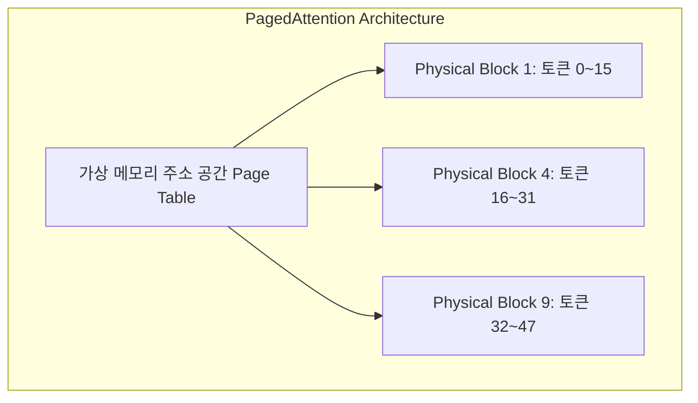
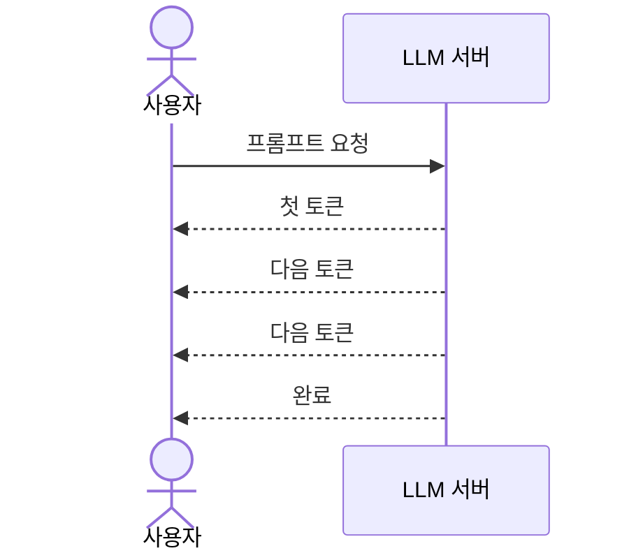
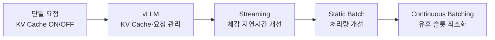

:::note[스터디 기록]
Hands-On LLM Serving and Optimization 스터디 1주차 - vLLM, PagedAttention, Continuous Batching, FlashAttention 등 실제 서빙 현장에서 GPU 메모리 효율과 처리량을 극대화하는 2편 포스트입니다.
:::

---

:::note[Quick Glossary: Part 2 핵심 실전 용어 사전]
| 용어 | 이 글에서 알아둘 뜻 |
| :--- | :--- |
| **KV Cache** | 이전 토큰의 Key/Value 정보를 VRAM에 저장해, 다음 토큰을 만들 때 같은 Attention 계산을 반복하지 않도록 하는 공간입니다. |
| **PagedAttention** | KV Cache를 작은 블록으로 나누어 필요한 만큼 할당하는 기술입니다. |
| **Continuous Batching** | 요청이 끝난 자리에 새 요청을 바로 넣으며, 토큰 단위로 배치를 계속 구성하는 방식입니다. |
| **FlashAttention** | Attention 계산 중 GPU 메모리 이동을 줄이도록 구현한 최적화 기법입니다. |
| **Tensor Parallelism (TP)** | 큰 모델을 여러 GPU에 나누어 올리고 함께 계산하는 방식입니다. |
| **P/D Disaggregation** | 입력을 읽는 Prefill과 토큰을 생성하는 Decode를 서로 다른 자원에서 처리하는 구성입니다. |
:::

---

## 1. 들어가며: 1편의 병목을 실전 인프라에서 어떻게 풀 것인가?

1편에서 살펴본 LLM 서빙의 물리적 한계는 크게 두 가지였습니다.
- 문장이 길어질수록 어텐션 메모리가 제곱($O(N^2)$)으로 팽창하는 문제.
- 단어 하나를 만들 때마다 모델 덩치의 2/3에 달하는 FFN 가중치를 VRAM에서 코어로 매번 퍼 올려야 하는 **Memory-Bound(메모리 대역폭 병목)** 문제.

이 상태에서 PyTorch나 HuggingFace 기본 서빙 코드를 사용하면, 아무리 고성능 GPU를 투입해도 동시 요청이 조금만 몰리면 VRAM OOM(Out of Memory)이 발생하거나 응답 지연이 심해집니다. 

이 글은 문제를 푸는 순서를 따라갑니다. 먼저 단일 요청에서 **KV Cache**로 중복 계산을 제거해 Decode 지연을 낮춥니다. 다음으로 캐시가 VRAM에 만들어내는 할당·파편화 문제를 **PagedAttention**으로 다루고, Attention의 메모리 이동 자체는 **FlashAttention**으로 줄입니다. 마지막으로 **Continuous Batching**과 Prefill-Decode 분리로 이 최적화를 다수 요청 환경까지 확장합니다.

---

## 2. KV Cache의 동작 원리와 VRAM 메모리 파편화 문제

해설 영상 [Explanation with KV cache visualization](https://www.youtube.com/watch?v=sq3XGM1qdQY)에서 시각적으로 나타나듯, 자가회귀(Auto-regressive) 모델은 이전 토큰들의 Key와 Value 텐서를 VRAM에 캐싱(KV Cache)하여 중복 연산을 방지합니다. 이는 토큰 생성 속도를 높이는 첫 번째 해법이지만, 요청마다 길이가 다른 캐시를 VRAM에 쌓아야 한다는 새로운 메모리 관리 문제도 함께 만듭니다.

```
[ 기존 서빙 프레임워크의 KV Cache 할당 방식 (고정 크기 미리 선점) ]

Max Sequence Length = 4,096 토큰 (최대 생성 가능 길이로 미리 할당)
┌────────────────────────────────────────────────────────┐
│ [실제 사용 영역: 100토큰] │ ░░░ 미사용 VRAM 공간 (3,996토큰분) ░░░    │
└────────────────────────────────────────────────────────┘
  ↳ 100글자만 생성하고 요청이 끝나도 4,096글자 분량의 VRAM이 그대로 선점됨
```

:::caution[기존 서빙 방식의 한계: 메모리 파편화 (Fragmentation)]
일부 단순 서빙 구현은 요청마다 최대 시퀀스 길이를 기준으로 **연속된(Contiguous) VRAM 공간**을 크게 예약합니다. Hugging Face의 단일 요청 `generate()`는 설정과 버전에 따라 캐시를 동적으로 늘릴 수 있지만, 여러 요청을 정적 용량으로 운영하면 같은 종류의 유휴 공간과 파편화 문제가 다시 나타납니다.
1. 사용자 요청이 올 때 생성될 전체 토큰 길이를 알 수 없으므로, 설정된 최대 시퀀스 길이(Max Sequence Length, 예: 4,096 토큰)에 맞춰 VRAM 공간을 크게 선점합니다.
2. 하지만 실제 대부분의 대화는 100~200 토큰 내외에서 종료됩니다.
3. 결과적으로 할당만 해두고 쓰지 않는 내부 파편화(Internal Fragmentation)와 메모리 조각이 흩어지는 외부 파편화(External Fragmentation)가 겹치며 VRAM의 60%~80%가 낭비됩니다.
:::

---

## 3. vLLM과 PagedAttention: OS 페이징 기반 메모리 동적 할당



### PagedAttention의 작동 원리
vLLM 개발진(UC 버클리)은 운영체제(OS)의 **가상 메모리(Virtual Memory) 페이징 기법**을 GPU VRAM 관리에 도입했습니다.
1. **고정 크기 블록 분할**: 물리 VRAM 공간을 작은 고정 크기 블록(예: 16개 토큰 분량)으로 쪼갭니다.
2. **필요 시점 동적 할당**: 대용량 메모리를 미리 예약하지 않고, 토큰이 실제로 생성되는 시점에 필요 블록을 1개씩 할당합니다.
3. **페이지 테이블 매핑**: 물리적으로 흩어져 있는 VRAM 블록들을 가상 주소 테이블(Page Table)을 통해 연속된 메모리처럼 참조합니다.

:::tip[인프라 관점의 개선 효과]
- **메모리 파편화 최소화**: 미리 크게 할당하던 유휴 공간을 없애 VRAM 활용률을 높입니다.
- **동시 처리 수 증가**: 버려지던 메모리를 줄여 동일 GPU 인스턴스에서 처리할 수 있는 최대 배치 크기(Batch Size)를 늘립니다.
:::

이제 이론을 잠시 멈추고, 왜 캐시가 필요한지를 단일 RTX 4070 환경에서 먼저 재현해 봅니다. 여기서 확인한 “재계산 제거”의 이득이, 뒤에서 PagedAttention이 관리해야 하는 KV Cache의 가치이기도 합니다.

---

## 4. 실전 핸즈온 실습: LLM 내부 동작을 코드로 뜯어보기

> 📔 실습 노트북 원본: [ch2_Inside_the_Mind_of_a_Transformer.ipynb](https://github.com/orca3/llm-model-inference/blob/main/ch02/ch2_Inside_the_Mind_of_a_Transformer.ipynb) · [ch2_Workthrough_LLM_execution.ipynb](https://github.com/orca3/llm-model-inference/blob/main/ch02/ch2_Workthrough_LLM_execution.ipynb)

앞 절의 개념을 숫자와 코드로 연결하기 위해 Qwen2.5-0.5B를 사용합니다. 작은 모델이라도 레이어 구조와 토큰 생성 루프는 대형 LLM 서빙과 동일한 원리를 따르므로, 이후의 vLLM 최적화가 무엇을 줄이는지 관찰하기에 적합합니다.

### [실습1] model.config로 아키텍처 파라미터 직접 확인하기

모델을 서빙하기 전에, 레이어 수·은닉 차원·어텐션 헤드 수·어휘 크기 등을 파악해야 GPU 메모리 추정과 최적화 전략 수립이 가능합니다.

```python
from transformers import AutoModelForCausalLM
from pprint import pprint

model_name = "Qwen/Qwen2.5-0.5B"
model = AutoModelForCausalLM.from_pretrained(
    model_name,
    trust_remote_code=True,
    device_map="auto"
)

config = model.config
print("=== Model Configuration Parameters ===")
print(f"Hidden size: {config.hidden_size}")           # 896  — 모든 레이어를 관통하는 토큰 벡터 차원
print(f"Number of layers: {config.num_hidden_layers}") # 24   — Self-Attention + FFN 블록 반복 수
print(f"Number of attention heads: {config.num_attention_heads}")  # 14
print(f"Intermediate size: {config.intermediate_size}")             # 4864 — FFN 은닉층 크기
print(f"Vocabulary size: {config.vocab_size}")                     # 151,936 — 인식 가능한 서브워드 수
print(f"Max position embeddings: {config.max_position_embeddings}") # 32,768 — 컨텍스트 윈도우 크기

total_params = sum(p.numel() for p in model.parameters())
print(f"Total parameters: {total_params:,}")  # 494,032,768 ≈ 약 4.94억 개
```

```
=== Model Configuration Parameters ===
Hidden size: 896
Number of layers: 24
Number of attention heads: 14
Intermediate size: 4864
Vocabulary size: 151936
Max position embeddings: 32768
Total parameters: 494,032,768
```

:::note[num_key_value_heads: 2 — GQA(Grouped Query Attention)]
Query 헤드는 14개지만 KV 헤드는 단 2개입니다. 즉 7개의 Query 헤드가 하나의 K/V 헤드를 공유합니다.
이 `GQA` 설계 덕분에 Decode 단계에서 유지해야 할 **KV Cache 크기가 약 7배 줄어들어** VRAM 사용량과 서빙 비용을 크게 낮춥니다. 바로 뒤에서 다룰 KV Cache 최적화의 아키텍처적 근거가 됩니다.
:::

---

### [실습2] 디코더 레이어 구조 확인 — Self-Attention + FFN 반복 구조

```python
import torch
from transformers import AutoModelForCausalLM

model = AutoModelForCausalLM.from_pretrained(
    "Qwen/Qwen2.5-0.5B",
    trust_remote_code=True,
    device_map="auto"
)

def print_module_structure(module, prefix=''):
    for name, child in module.named_children():
        print(f"{prefix}{name}: {type(child).__name__}")
        if list(child.children()):
            print_module_structure(child, prefix + '  ')

print_module_structure(model)
```

```
model: Qwen2Model
  embed_tokens: Embedding          # 토큰 ID → 임베딩 벡터
  layers: ModuleList               # 디코더 블록 24개 (0~23)
    0: Qwen2DecoderLayer
      self_attn: Qwen2Attention
        q_proj: Linear [896, 896]  # 14 heads × head_dim 64
        k_proj: Linear [128, 896]  # 2 KV heads × head_dim 64 (GQA!)
        v_proj: Linear [128, 896]
        o_proj: Linear [896, 896]
      mlp: Qwen2MLP                # SwiGLU 계열 FFN
        gate_proj / up_proj / down_proj: Linear
        act_fn: SiLUActivation
      input_layernorm: Qwen2RMSNorm
      post_attention_layernorm: Qwen2RMSNorm
    1~23: Qwen2DecoderLayer        # 동일 구조 반복
  norm: Qwen2RMSNorm
  rotary_emb: Qwen2RotaryEmbedding # RoPE 위치 인코딩 — 모든 레이어 공유
lm_head: Linear                    # hidden state → vocab logits (151,936)
```

---

### [실습3] 토큰 단위 생성 루프 — KV Cache 미사용 시 왜 점점 느려지는가?

Hugging Face `pipeline()` 추상화를 벗겨내고, 토큰 하나씩 직접 생성합니다.

```python
import time
import torch
from transformers import AutoTokenizer, AutoModelForCausalLM

model_name = "Qwen/Qwen2.5-0.5B"
tokenizer = AutoTokenizer.from_pretrained(model_name, trust_remote_code=True)
model = AutoModelForCausalLM.from_pretrained(
    model_name, trust_remote_code=True
).to("cuda" if torch.cuda.is_available() else "cpu")
model.eval()

prompt = "The history of human communication tools — from cave paintings to the printing press, from the telegraph to the smartphone — reflects our relentless drive to connect. How might the next wave of communication tools shape our relationships?"

max_new_tokens = 100
idx = tokenizer(prompt, return_tensors="pt").input_ids.to(model.device)
times = []
start_time = time.time()

for _ in range(max_new_tokens):
    idx_cond = idx                            # (A) 매 스텝 전체 시퀀스를 입력
    with torch.no_grad():
        outputs = model(idx_cond, use_cache=False)  # (B) Cache 없이 Forward pass
        logits = outputs.logits[:, -1, :]     # (C) 마지막 토큰의 logits만 선택
    probas = torch.softmax(logits, dim=-1)
    idx_next = torch.multinomial(probas, num_samples=1)  # (D) 확률 샘플링

    idx = torch.cat((idx, idx_next), dim=1)  # (E) 시퀀스 끝에 이어붙임 (자기회귀)
    times.append(time.time() - start_time)
    start_time = time.time()

    if idx_next.item() == tokenizer.eos_token_id:
        break

generated_text = tokenizer.decode(idx[0], skip_special_tokens=True)
print(f"총 생성 시간: {sum(times):.2f}초 / 토큰당 평균: {sum(times)/len(times)*1000:.0f}ms")
```

```
총 생성 시간: 12.87초 / 토큰당 평균: 128ms
```

:::caution[왜 토큰이 생성될수록 점점 느려지는가?]
매 스텝마다 `idx_cond = idx` 즉 **누적된 전체 시퀀스**를 모델에 다시 통째로 입력합니다.
이전에 계산한 토큰들의 Q/K/V 어텐션을 매번 처음부터 재계산하는 것이므로,
토큰이 쌓일수록 연산량이 **O(L²D)** 로 계속 늘어납니다.
→ 이 불필요한 재계산을 없애는 것이 **KV Cache** 입니다.
:::

이 루프의 각 스텝은 누적 시퀀스를 전부 Forward pass하므로, **전체 문맥을 처리하는 Prefill과 같은 성격의 연산**을 수행합니다. 차이는 실제 서빙에서는 요청당 Prefill을 한 번 수행한 뒤 KV Cache를 넘겨 Decode로 전환한다는 점입니다. 반면 이 실습은 매 새 토큰마다 Prefill-like 전체 시퀀스 연산을 반복합니다. 즉 실제 단계 전환을 그대로 재현한 코드는 아니지만, KV Cache가 없을 때 발생하는 중복 계산 비용을 의도적으로 확대해 관찰하는 코드입니다.

---

### [실습4] KV Cache ON vs OFF — 실측 성능 비교

`past_key_values`를 활용해 이전 토큰들의 K/V만 캐싱하면, Decode 단계 입력이 신규 토큰 1개로 줄어듭니다.

:::note[첫 로컬 측정: 왜 차이가 1.0배였을까?]
처음에는 짧은 프롬프트(`"The history of human communication tools..."`)와 최대 100개 생성 토큰으로 비교했고, RTX 4070 환경에서 다음 결과가 나왔습니다.

```
KV Cache OFF: 2.03초
KV Cache  ON: 2.06초
속도 향상:    1.0배
```

이는 KV Cache가 효과가 없다는 뜻이 아닙니다. 입력 문맥과 생성 길이가 짧아 Cache OFF가 다시 계산할 양이 작았고, 작은 0.5B 모델에서는 GPU 실행·샘플링 같은 고정 오버헤드가 전체 시간에서 큰 비중을 차지했습니다. 또한 샘플링 생성은 실행마다 종료 시점이 달라질 수 있고, CUDA는 비동기 실행이므로 단순한 CPU 시간 측정만으로는 비교가 흔들릴 수 있습니다. 그래서 아래에서는 문맥과 생성 길이를 늘리고, 생성 경로와 측정 방법을 통제합니다.
:::

```python
import time
import torch
from transformers import AutoTokenizer, AutoModelForCausalLM

model_name = "Qwen/Qwen2.5-0.5B"
tokenizer = AutoTokenizer.from_pretrained(model_name, trust_remote_code=True)
model = AutoModelForCausalLM.from_pretrained(
    model_name, trust_remote_code=True
).to("cuda" if torch.cuda.is_available() else "cpu")
model.eval()

base_prompt = """
The history of human communication tools — from cave paintings to the printing press,
from the telegraph to the smartphone — reflects our relentless drive to connect.
How might the next wave of communication tools shape our relationships?
"""

# Cache 없이 반복 계산할 문맥을 충분히 길게 만든다.
prompt = base_prompt * 30
input_ids = tokenizer(prompt, return_tensors="pt").input_ids.to(model.device)

def synchronize_cuda():
    """CUDA 비동기 실행이 실제로 끝난 시점까지 대기한다."""
    if torch.cuda.is_available():
        torch.cuda.synchronize()

# 첫 CUDA 실행의 초기화·메모리 할당 비용은 본 측정에서 제외한다.
with torch.inference_mode():
    model.generate(input_ids[:, :16], max_new_tokens=4, do_sample=False)
synchronize_cuda()

def benchmark(use_cache, runs=5, max_new_tokens=256):
    """같은 입력·생성 길이를 여러 번 실행해 중앙값을 반환한다."""
    elapsed_times = []

    for _ in range(runs):
        synchronize_cuda()
        start = time.perf_counter()

        with torch.inference_mode():
            model.generate(
                input_ids,
                max_new_tokens=max_new_tokens,
                min_new_tokens=max_new_tokens,  # EOS로 조기 종료되지 않도록 고정
                do_sample=False,                # 매 실행의 생성 경로를 동일하게 유지
                use_cache=use_cache,
                pad_token_id=tokenizer.eos_token_id,
            )

        synchronize_cuda()
        elapsed_times.append(time.perf_counter() - start)

    return sorted(elapsed_times)[len(elapsed_times) // 2]

time_no_cache = benchmark(use_cache=False)
time_with_cache = benchmark(use_cache=True)

print(f"KV Cache OFF: {time_no_cache:.2f}초")
print(f"KV Cache  ON: {time_with_cache:.2f}초")
print(f"속도 향상:    {time_no_cache / time_with_cache:.1f}배")
```

```
KV Cache OFF: 8.22초
KV Cache  ON: 5.12초
속도 향상:    1.6배
```

로컬 RTX 4070(WSL2 + Docker)에서 Qwen2.5-0.5B로 다섯 번 반복 실행한 중앙값입니다. 동일한 256개 토큰을 생성할 때 KV Cache를 켜면 총 시간이 **3.10초** 줄어들며, 지연 시간은 약 **38% 감소**했습니다. 처리량으로 환산하면 OFF는 약 **31.1 tokens/s**, ON은 **50.0 tokens/s**로 약 **1.6배** 높아집니다.

:::note[왜 KV Cache가 빨라지는가?]
Cache OFF는 새 토큰을 만들 때마다 `[프롬프트 전체 + 지금까지 생성한 토큰]`을 다시 Forward pass합니다. 따라서 이전 토큰의 Attention과 FFN 계산을 계속 반복합니다. 반면 Cache ON은 Prefill 단계에서 각 레이어의 K/V를 한 번 저장하고, Decode 단계에서는 새 토큰 하나의 Q/K/V만 계산한 뒤 누적 K/V를 참조합니다. 과거 문맥을 다시 읽어 Attention해야 하는 비용은 남지만, 과거 토큰의 K/V·FFN 재계산은 제거됩니다.
:::


시간 측정과 별도로 WSL 터미널에서 `nvidia-smi dmon -s um -d 1`을 실행하고, Cache OFF와 ON을 **서로 다른 모니터링 세션**에서 측정했습니다. `u`는 SM·메모리 컨트롤러 사용률(%), `m`은 Frame Buffer VRAM 사용량(MB)을 보여 줍니다.

| 관찰 항목 | KV Cache OFF | KV Cache ON | 해석 |
| :--- | :--- | :--- | :--- |
| 실행 시간 중앙값 | 8.22초 | 5.12초 | ON이 1.6배 빠름 |
| SM 사용률(활성 구간) | 주로 73~96% | 주로 22~39% | OFF는 전체 시퀀스 재계산으로 더 많은 연산을 수행 |
| 메모리 컨트롤러 사용률 | 주로 28~39% | 주로 11~19% | OFF가 재계산에 수반되는 메모리 이동도 더 많이 발생 |
| FB VRAM 사용량 | 약 4.42~4.45GB | 약 4.60~4.61GB | ON은 누적 K/V를 보관하므로 VRAM 사용량이 증가하는 방향 |

Cache OFF는 긴 시퀀스를 매 스텝 다시 계산하므로 GPU에 더 많은 연산을 지속적으로 제출합니다. 반면 ON은 SM 사용률이 낮아도 불필요한 재계산을 제거했기 때문에 더 빨리 끝납니다. **GPU를 더 바쁘게 만든다고 더 효율적인 것은 아니다**라는 점을 보여 주는 실측 결과입니다.

:::caution[높은 GPU 사용률만으로 Compute-bound를 단정할 수는 없다]
작업 관리자의 `3D` 사용률과 `dmon`의 SM 사용률은 GPU가 바빴다는 관찰 근거이지, 병목 유형의 확정 판정은 아닙니다. 이번 결과는 Cache OFF가 재계산 때문에 더 **Compute-heavy**해졌다는 해석과 일치합니다. 일반적으로 KV Cache를 사용하는 Decode 단계는 모델 가중치와 누적 K/V를 반복해서 읽기 때문에 **메모리 대역폭 병목(Memory-bound)** 성격이 강해질 수 있지만, 이 한 번의 소형 모델 실험만으로 ON 경로를 Memory-bound라고 단정할 수는 없습니다.

병목을 엄밀히 판정하려면 `nvidia-smi dmon -s um`의 반복 측정값과 Nsight Systems/Compute의 SM 활용률, 메모리 컨트롤러 활용률, Tensor Core 사용률을 함께 비교해야 합니다. 또한 FB VRAM 수치는 PyTorch의 캐싱 할당기와 실행 전 기준 메모리의 영향을 받으므로, ON/OFF의 절대 차이를 KV Cache 크기만으로 해석해서는 안 됩니다. 이번 실험이 직접 입증한 것은 “Cache OFF의 재계산이 GPU 작업량과 지연 시간을 크게 늘리고, Cache ON이 그 중복을 제거해 더 빨리 완료된다”는 점입니다.
:::

단일 요청의 응답 속도 관점에서는 KV Cache가 분명한 승리입니다. 하지만 서비스 관점에서는 바로 그 캐시가 요청 수와 문맥 길이에 비례해 VRAM을 차지합니다. 따라서 다음 단계의 질문은 “캐시를 쓸 것인가?”가 아니라 “많은 요청의 캐시를 어떻게 낭비 없이 배치할 것인가?”가 됩니다.

---

## 5. 후속 실습 정리: vLLM으로 서빙 프레임워크 전환하기

실습1~4에서는 Hugging Face 모델을 직접 호출하며 토큰 생성과 KV Cache를 관찰했습니다. 실제 서비스에서는 이 반복 루프를 애플리케이션마다 직접 구현하지 않고, vLLM 같은 **서빙 프레임워크**에 맡깁니다.

:::note[학습 흐름 정리]
이 절은 CH2 노션 실습의 이후 흐름을 정리한 내용입니다. 로컬 RTX 4070에서 직접 측정한 값은 실습1~4에만 기록했고, 이 절에는 실행하지 않은 성능 수치나 결과를 넣지 않았습니다.
:::

vLLM이 수동 구현 위에 더해 주는 기능은 다음과 같습니다.

- 여러 요청의 KV Cache를 관리한다.
- PagedAttention으로 KV Cache를 블록 단위로 할당한다.
- 요청을 스케줄링하고 배치로 처리한다.
- OpenAI 호환 API와 스트리밍 응답을 제공한다.

즉, 앞선 실습에서 직접 확인한 “KV Cache 재사용”을 단일 요청 수준에서 끝내지 않고, **여러 사용자 요청을 다루는 서빙 엔진으로 확장**한 것이 vLLM입니다.

### 로컬 vLLM 기동 로그로 확인한 최적화

이후 WSL2·Docker·RTX 4070 환경에서 vLLM 0.26.0 서버를 실제로 기동했다. 이때 출력된 로그는 vLLM이 단순히 모델을 메모리에 올리는 도구가 아니라, 요청 스케줄링·KV Cache·커널·그래프 실행을 함께 준비하는 엔진임을 보여 준다. 전체 로그와 실행 명령은 [로컬 GPU 환경 구축 기록](/space-notes/posts/ai/local-gpu-wsl2-vllm-guide/)에 남겼다.

| 로그에서 확인한 항목 | 이번 실행의 관찰값 | 이 글의 개념과 연결 |
| :--- | :--- | :--- |
| 비동기 스케줄링 | `Asynchronous scheduling is enabled` | 요청이 끝난 자리에 새 요청을 넣는 Continuous Batching의 실행 기반이다. |
| Prefix caching·Chunked prefill | 둘 다 `enabled`; 요청 후 Prefix cache hit rate 약 32~47% | 같은 접두 프롬프트를 다시 처리할 때 Prefill 계산과 KV Cache 사용을 줄이는 기능이다. |
| Attention·sampling 커널 | FlashAttention 2, FlashInfer sampler 사용 | Attention의 메모리 이동과 top-k/top-p 샘플링을 효율적인 GPU 커널로 처리한다. |
| Torch compile·CUDA Graph | 컴파일 10.69초, CUDA Graph 캡처 완료 | 시작은 느려질 수 있지만, 반복되는 실행 경로의 Python·커널 실행 오버헤드를 줄이기 위한 준비 단계다. |
| KV Cache 용량 계획 | 사용 가능 7.68GiB, 최대 길이 2,048 기준 이론상 327.8개 요청 | 실제 동시 요청 수는 아니며, `max_model_len`과 메모리 예산으로 계산한 상한이다. |

첫 서버 기동은 모델 적재(약 2.17초), 컴파일, 그래프 캡처까지 포함해 총 약 77.79초가 걸렸다. 반면 준비가 끝난 뒤 원본 프롬프트 128토큰 생성 요청은 약 0.42초였다. 이 차이는 **콜드 스타트 최적화 비용**과 **준비된 서버의 요청 처리 시간**을 분리해서 봐야 하는 이유다.

:::note[로그 수치 해석]
로그의 평균 생성 처리량 12.8 tokens/s, Prefix cache hit rate 등은 일정 주기 동안 집계된 운영 지표다. 단일 요청의 정확한 TTFT·TPOT 벤치마크 결과로 해석하지 않고, “해당 최적화 경로가 실제로 활성화되었고 캐시 재사용이 관찰되었다”는 확인 근거로 사용했다.
:::

---

## 6. 스트리밍: 생성 중인 토큰을 바로 전달하기

일반적인 동기 요청은 모델이 답변을 끝까지 만든 뒤 결과를 한 번에 반환합니다. 스트리밍은 Decode 중 생성된 토큰을 바로 클라이언트로 전달합니다.



스트리밍의 핵심 효과는 **전체 생성 시간이 줄어드는 것**이 아니라, 사용자가 첫 토큰을 본 뒤 기다릴 수 있어 **체감 응답성이 좋아지는 것**입니다. 생성이 원하지 않는 방향으로 흐를 때 중간에 취소해 이후 Decode 비용을 줄일 수 있다는 장점도 있습니다.

---

## 7. 배치와 Continuous Batching: 여러 요청을 함께 처리하기

요청을 하나씩 순차 처리하면 GPU는 작은 작업을 반복해서 받아 활용률이 낮아질 수 있습니다. 정적 배치는 여러 프롬프트를 묶어 한 번에 처리해 전체 처리량을 높입니다.

| 방식 | 동작 | 장점 | 한계 |
| :--- | :--- | :--- | :--- |
| **순차 처리** | 요청 하나가 끝난 뒤 다음 요청 처리 | 단순함 | GPU가 충분히 활용되지 않을 수 있음 |
| **정적 배치** | 여러 요청을 고정된 묶음으로 함께 처리 | 전체 처리량 향상 | 짧은 요청도 긴 요청을 기다릴 수 있음 |
| **Continuous Batching** | 끝난 요청을 내보내고 새 요청을 즉시 삽입 | 유휴 슬롯 감소, 높은 처리량 | 스케줄링과 메모리 관리가 복잡함 |



정적 배치와 Continuous Batching 모두 처리량을 높이는 방법이지만, 개별 요청의 지연시간·대기 시간과 함께 봐야 합니다. 그래서 실제 서비스에서는 TTFT, TPOT, 요청 처리량을 함께 측정해 적절한 배치 크기와 동시성 설정을 찾습니다.

---

## 8. 실습 흐름 정리

이번 글의 실습과 후속 학습 흐름은 아래와 같습니다.

1. 모델 설정과 디코더 구조를 확인한다.
2. 수동 토큰 생성으로 자기회귀 과정을 확인한다.
3. KV Cache OFF/ON으로 중복 계산 제거 효과를 측정한다.
4. `nvidia-smi dmon`으로 두 경로의 GPU 사용 모습을 관찰한다.
5. vLLM이 이 과정을 다수 요청 환경에서 관리하는 방법을 이해한다.
6. 스트리밍으로 사용자 체감 지연시간을 개선하고, 배치·Continuous Batching으로 전체 처리량을 높이는 흐름을 이해한다.

---
## 9. 1주차 스터디 총평: LLM 서빙 최적화의 흐름

이번 주차의 핵심 흐름은 다음과 같습니다.

> 토큰을 하나씩 생성한다 → KV Cache로 이전 문맥을 재사용한다 → vLLM이 이를 여러 요청에 맞게 관리한다 → 스트리밍으로 사용자에게 먼저 보여 준다 → 배치와 Continuous Batching으로 전체 처리량을 높인다.

LLM 서빙 최적화는 하나의 옵션을 켜는 일이 아니라, **응답 속도(TTFT·TPOT), VRAM 사용량, 동시 처리량** 사이의 균형을 찾는 과정입니다. 다음 실습에서는 실제 요청 수와 프롬프트 길이를 바꿔 가며 이 균형이 어떻게 달라지는지 측정해 볼 수 있습니다.

---

## 참고 자료 (References)

1. **Explanation with KV cache visualization**, [https://www.youtube.com/watch?v=sq3XGM1qdQY](https://www.youtube.com/watch?v=sq3XGM1qdQY)
2. **Understanding Prefill - LLM**, [https://www.youtube.com/watch?v=Vuu27UTFUZ8](https://www.youtube.com/watch?v=Vuu27UTFUZ8)
3. **The Principles of FlashAttention**, [https://www.youtube.com/watch?v=4Tw_ytMYHLI](https://www.youtube.com/watch?v=4Tw_ytMYHLI)
4. **Kwon et al. (2023)**, "Efficient Memory Management for Large Language Model Serving with PagedAttention", SOSP 2023 (vLLM Paper), [https://arxiv.org/abs/2309.06180](https://arxiv.org/abs/2309.06180)
5. **Yu et al. (2022)**, "Orca: A Distributed Serving System for Transformer-Based Language Models", OSDI 2022 (Continuous Batching Paper)
6. **vLLM Official Documentation**, [https://docs.vllm.ai/](https://docs.vllm.ai/)
