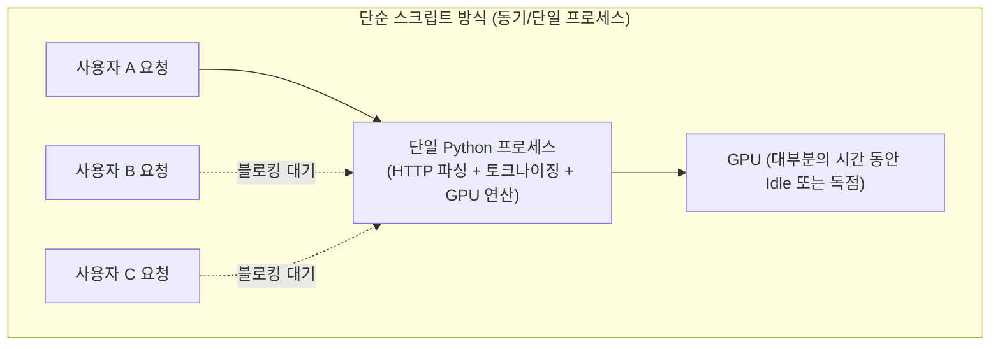
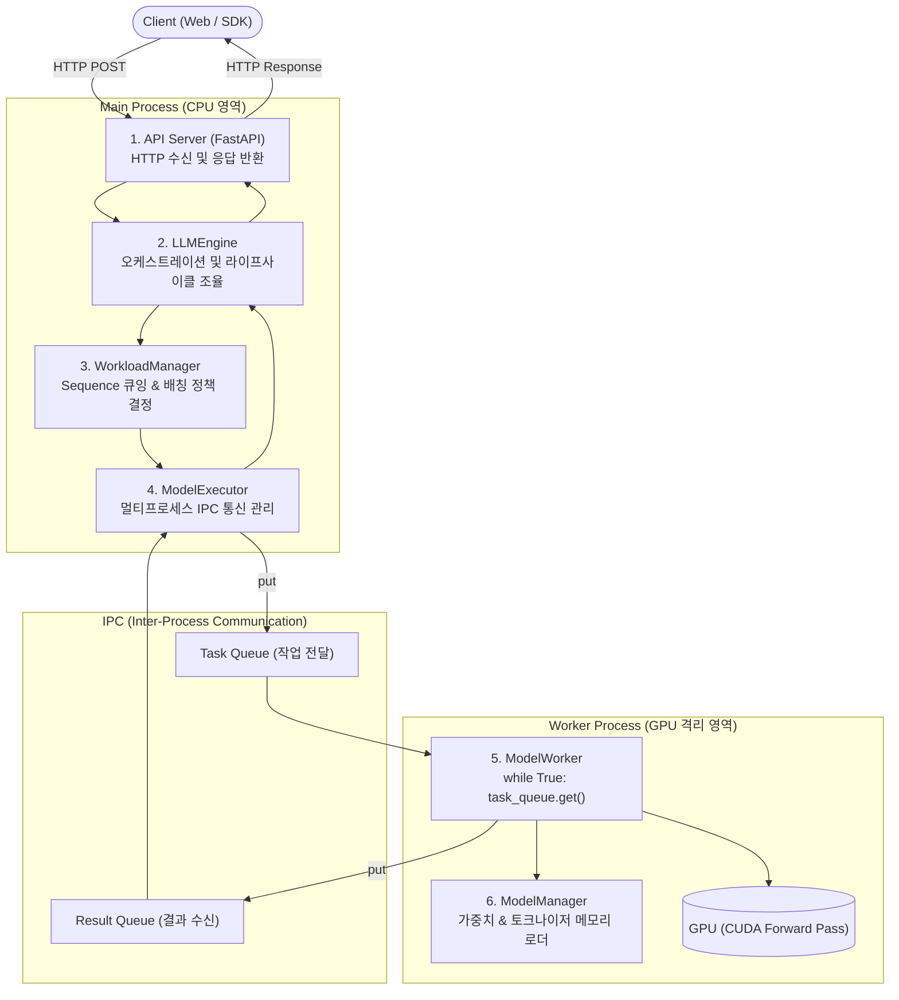
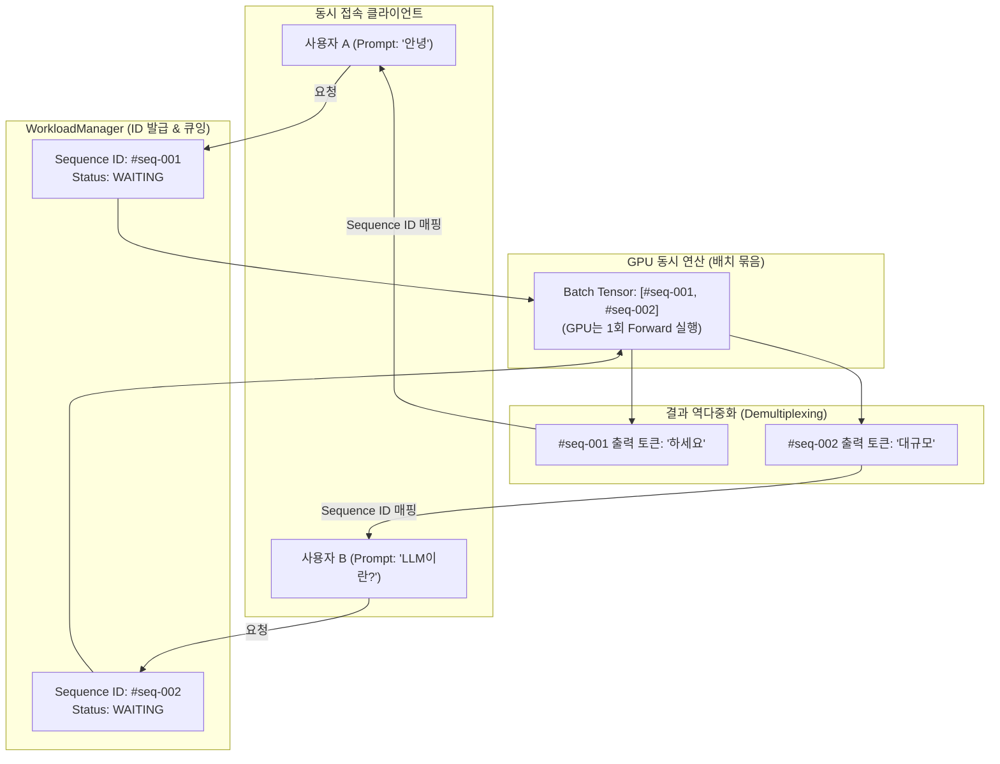
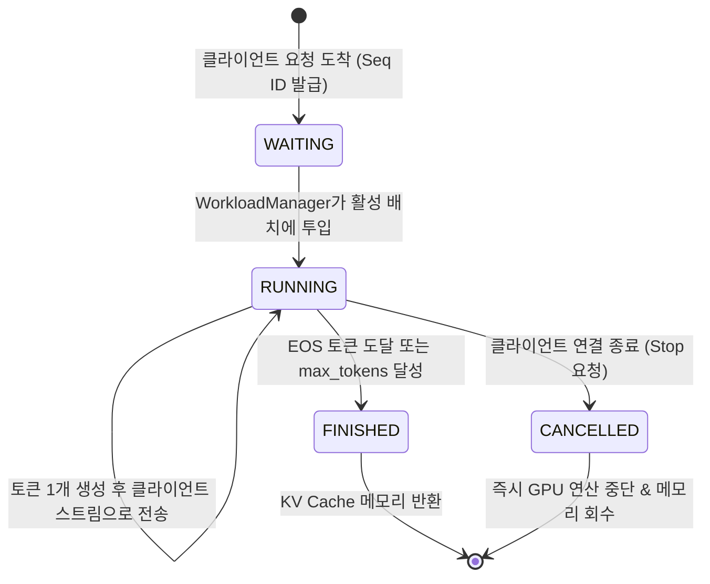
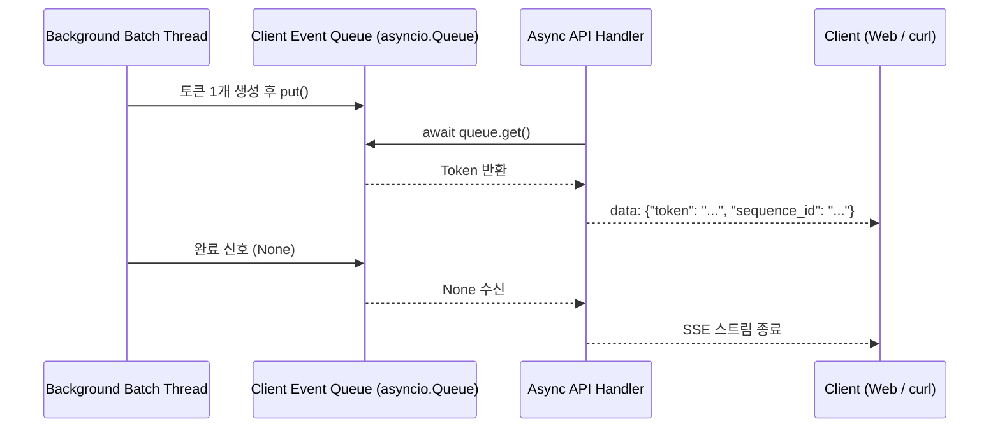
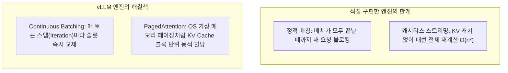
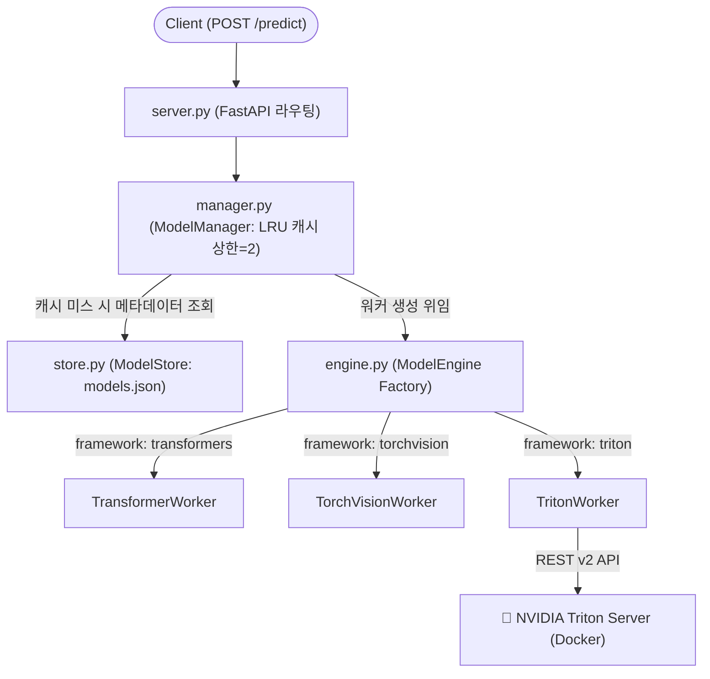
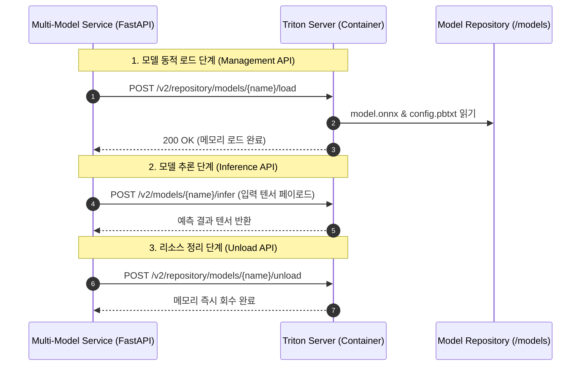
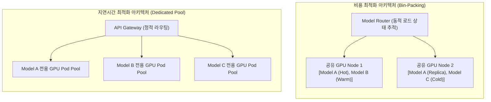

:::note[스터디 기록]
CloudNet - Hands-On LLM Serving and Optimization 스터디 2주차

프레임워크 뒤에 가려진 기본 원리(First Principles)를 체득하기 위해, 단일 모델 서빙 아키텍처(IPC 격리, 배칭, 스트리밍)부터 멀티 모델 서빙 시스템(LRU 캐싱, Triton 연동, 트레이드오프)까지 바닥부터 시스템 엔지니어링 관점으로 분석한 3편 포스트입니다.
:::

---

:::note[📖 Quick Glossary: Part 3 핵심 시스템 설계 용어 사전]
| 용어 | 이 글에서 알아둘 뜻 |
| :--- | :--- |
| **LLMEngine** | 서빙 시스템의 전체 라이프사이클과 컴포넌트 간 흐름을 총괄하는 오케스트레이터입니다. |
| **WorkloadManager** | 요청 큐잉, Sequence 상태 관리, 배치 구성을 담당하는 스케줄러입니다. |
| **ModelExecutor** | 별도 프로세스로 실행되는 워커와 IPC(프로세스 간 통신) 큐를 중계하는 브릿지입니다. |
| **ModelWorker** | GPU에서 모델 forward pass를 실행하는 격리된 독립 작업자 프로세스입니다. |
| **Sequence ID** | 배칭과 반복 디코딩 과정에서 개별 요청의 데이터, 상태, 출력을 식별하는 고유 ID입니다. |
| **Static Batching** | 고정된 개수의 요청이 모일 때까지 대기하여 한 번에 처리하는 고전적 배칭 방식입니다. |
| **Continuous Batching** | 토큰 단위(Iteration level)로 완료된 요청을 즉시 방출하고 새 요청을 투입하는 현대적 동적 배칭입니다. |
| **Cold Start Latency** | 메모리에 로드되어 있지 않은 모델을 최초 호출할 때 발생하는 디스크/네트워크 로딩 지연시간입니다. |
| **LRU Eviction** | 한정된 메모리 자원에서 가장 오랫동안 사용되지 않은 모델을 메모리에서 언로드하는 캐시 관리 기법입니다. |
| **Bin-Packing** | 최소한의 GPU/서버 인스턴스에 여러 모델을 몰아넣어 인프라 비용을 극대화하는 자원 배치 전략입니다. |
:::

---

## 1. 들어가며: 왜 단순 `model.generate()` 한 줄로는 서빙할 수 없을까?

연구나 프로토타입 단계에서는 파이썬 스크립트에서 아래 한 줄로 추론을 실행하는 것으로 충분합니다.

```python
output = model.generate(**inputs)
```

하지만 **다수의 사용자가 동시에 접속하는 온라인 서비스 환경**에서는 이 방식이 즉시 한계에 부딪힙니다.



### 단순 동기 방식의 3대 물리적 병목
1. **GPU 유휴 시간(Idle) 발생**: HTTP 요청 수신, JSON 직렬화, 토큰화(Tokenization) 같은 CPU 전처리 작업이 끝날 때까지 고가의 GPU가 연산을 멈추고 대기합니다.
2. **파이썬 GIL(Global Interpreter Lock) 병목**: 웹 요청을 처리하는 비동기 I/O 스레드와 GPU 텐서 연산 스레드가 하나의 인터프리터 안에서 충돌하여 레이턴시가 급증합니다.
3. **단일 장애점(SPOF)과 결함 전파**: 한 사용자의 비정상적인 긴 입력으로 인해 `CUDA Out of Memory`가 발생하면 전체 웹 서버 프로세스가 강제 종료되어 모든 사용자의 세션이 끊어집니다.

따라서 실제 서빙 시스템은 단순한 모델 호출이 아니라, **API 처리, 비동기 큐잉, 프로세스 격리, 메모리 관리, 배치 스케줄링을 함께 다루는 분산 시스템 엔지니어링**으로 설계되어야 합니다.

---

## 2. 단일 모델 서빙 아키텍처: 6대 컴포넌트와 프로세스 격리

고성능 서빙 시스템은 CPU 바운드 작업(웹 통신, 스케줄링)과 GPU 바운드 작업(행렬 연산)을 물리적으로 분리합니다.



### 6대 핵심 컴포넌트의 역할 분담

| 컴포넌트 | 실행 영역 | 핵심 책임 |
| :--- | :--- | :--- |
| **API Server** | CPU (메인 프로세스) | FastAPI 기반 HTTP 엔드포인트 노출, 요청 유효성 검증, SSE(Server-Sent Events) 스트림 연결 유지 |
| **LLMEngine** | CPU (메인 프로세스) | 시스템 전체의 지휘자. 워커 초기화, 요청 전달, 결과 취합 등 전체 파이프라인 조율 |
| **WorkloadManager** | CPU (메인 프로세스) | 고유 `Sequence ID` 부여, FIFO 대기 큐 관리, 배칭(Batching) 전략 스케줄링 |
| **ModelExecutor** | CPU (메인 프로세스) | `mp.Process`로 워커 프로세스를 생성하고 `multiprocessing.Queue`를 통한 프로세스 간 통신(IPC) 중계 |
| **ModelWorker** | GPU (독립 프로세스) | 외부 I/O와 격리되어 오직 GPU 순방향 연산(`forward pass`)만 전담 |
| **ModelManager** | GPU (독립 프로세스) | 모델 가중치와 토크나이저를 스토리지/허브에서 메모리로 로드 |

### CPU와 GPU 프로세스를 물리적으로 격리하는 이유
1. **GPU Utilization 극대화 (Non-blocking Pipeline)**:
   - 메인 프로세스가 HTTP 요청을 받고 큐를 스케줄링하는 동안, GPU는 이전 배치의 행렬 곱셈(GEMM)에 100% 집중할 수 있습니다.
2. **결함 격리 (Fault Tolerance)**:
   - GPU 드라이버 에러나 CUDA OOM이 발생해 `ModelWorker` 프로세스가 죽더라도, 메인 `API Server`는 생존하여 클라이언트에게 적절한 에러를 반환하거나 워커 프로세스만 즉시 재시작할 수 있습니다.
3. **단일 노드 내 IPC 최적화**:
   - 단일 머신 내부에서 CPU 프로세스와 GPU 프로세스가 통신할 때는 네트워크 스택(TCP/IP)을 타지 않고 OS 메모리 기반 IPC(`multiprocessing.Queue`, Shared Memory)를 사용하여 컨텍스트 스위칭과 데이터 복사 오버헤드를 최소화합니다.

---

## 3. 요청 추적의 핵심: Sequence ID와 생명주기 관리

전통적인 REST API와 달리, LLM 서빙에서는 여러 사용자의 프롬프트가 **하나의 배치로 합쳐진 뒤 수십~수백 번의 토큰 생성 스텝(Iteration)**을 거치게 됩니다. 

GPU는 순수한 숫자(텐서) 연산만 수행하므로, "지금 생성된 토큰이 어느 사용자의 응답인지" 추적할 식별자가 필요합니다. 이 역할을 하는 것이 바로 `Sequence ID`입니다.



### Sequence 생명주기 상태 머신



1. **다중화 및 역다중화 (Multiplexing / Demultiplexing)**:
   - GPU가 배치 텐서 `[B, 1]`의 토큰들을 출력하면, `Sequence ID`를 키(Key)로 역다중화하여 각 사용자의 `client_stream` 이벤트 큐로 정확히 배달합니다.
2. **개별 시퀀스 종료(EOS) 추적**:
   - 배치 내의 특정 시퀀스가 먼저 완료되어 `<eos>` 토큰이 나오면, 해당 시퀀스만 `FINISHED` 상태로 전환하고 다음 배치 슬롯에서 제외합니다.
3. **조기 중단(Early Cancellation)을 통한 자원 보호**:
   - 사용자가 브라우저에서 '생성 중단'을 누르면, 시스템이 해당 `Sequence ID`를 조회하여 GPU 큐에서 즉시 제거함으로써 비싼 GPU 자원 낭비를 방지합니다.

---

## 4. 서빙 엔드포인트의 4단계 진화 과정

단일 모델 서빙 아키텍처는 처리량과 응답 지연을 최적화하기 위해 다음과 같은 단계로 진화합니다.

```
┌──────────────────┬────────────────────────────────────────────────────────────┬───────────────────────────────────────────┐
│    엔드포인트       │                         실행 경로                            │                 캐싱 / 배칭               │
├──────────────────┼────────────────────────────────────────────────────────────┼───────────────────────────────────────────┤
│ /basic_generate  │ ModelExecutor → HF model.generate() (단일 시퀀스)           │ HF 내부 기본 캐시 (1:1 직렬 처리)          │
├──────────────────┼────────────────────────────────────────────────────────────┼───────────────────────────────────────────┤
│ /generate        │ WorkloadManager 큐 → 최대 4개 정적 배치 → model.generate()     │ 정적 배칭 (Static Batching, batch_size=4) │
├──────────────────┼────────────────────────────────────────────────────────────┼───────────────────────────────────────────┤
│ /generate_stream │ Background Thread → 토큰 1개씩 forward (SSE 스트리밍)        │ use_cache=False (매 스텝 전체 재계산)      │
├──────────────────┼────────────────────────────────────────────────────────────┼───────────────────────────────────────────┤
│ /generate_vllm   │ vLLM EngineCore 직접 호출                                    │ Continuous Batching + PagedAttention      │
└──────────────────┴────────────────────────────────────────────────────────────┴───────────────────────────────────────────┘
```

---

### (1) `/basic_generate` : 단일 요청 직렬 처리

가장 단순한 형태로, 클라이언트의 요청을 받아 1:1로 모델 워커에 전달합니다.

```python
# llm/llm.py
def basic_generate(self, prompt: str) -> str:
    sequence = Sequence(str(uuid.uuid4()), prompt, None, None)
    results = self.model_executor.execute(sequence)
    return results[0]["generated_text"]
```

- **한계점**:
  - 요청 10개가 들어오면 1번 요청이 끝날 때까지 2~10번 요청은 큐에서 무작정 대기합니다.
  - GPU의 수천 개 텐서 코어 중 극히 일부만 사용되므로 **처리량(Throughput)이 최악**인 구조입니다.

---

### (2) `/generate` : 정적 배칭(Static Batching)과 Bubble 병목

`WorkloadManager`를 도입하여 대기 큐(`incoming_queue`)에 쌓인 요청을 최대 4개(`batch_size=4`)씩 묶어 한 번의 GPU 호출로 처리합니다.

```python
# llm/workload_manager.py
def get_next_batch(self) -> List[Sequence]:
    while len(self.active_sequences) < self.batch_size and not self.incoming_queue.empty():
        sequence = self.incoming_queue.get()
        self.active_sequences.append(sequence)
    return self.active_sequences
```

- **정적 배칭의 한계 (Bubble 현상)**:
  - 4개의 요청 중 1번 요청은 5토큰만에 끝났지만, 2번 요청이 100토큰을 생성해야 한다면?
  - 정적 배칭에서는 **2번 요청이 끝날 때까지 1번 요청의 빈 슬롯이 패딩(Padding) 상태로 남아 GPU 자원을 낭비**합니다.

```
[ 정적 배칭의 슬롯 낭비 (Bubble) ]
Req 1 (5 tokens):   ■■■■■ ░░░░░░░░░░░░░░░░░░░░░░░░░░░ (대기/낭비)
Req 2 (30 tokens):  ■■■■■■■■■■■■■■■■■■■■■■■■■■■■■■
Req 3 (10 tokens):  ■■■■■■■■■■ ░░░░░░░░░░░░░░░░░░░░ (대기/낭비)
Req 4 (15 tokens):  ■■■■■■■■■■■■■■■ ░░░░░░░░░░░░░░░ (대기/낭비)
                    ▲ 모든 요청이 끝날 때까지 새 요청 진입 불가!
```

---

### (3) `/generate_stream` : 토큰 단위 스트리밍과 슬라이딩 윈도우

전체 문장이 완성될 때까지 기다리지 않고, 토큰이 1개 생성될 때마다 `Server-Sent Events(SSE)`로 즉시 내려주어 사용자의 체감 지연(TTFT)을 극적으로 낮춥니다.



#### 시간대별(T0~T3) 동적 배치 슬라이딩 윈도우 시뮬레이션

| 시간 | 이벤트 | 백엔드 Active Batch | 클라이언트로 전송되는 스트리밍 토큰 |
| :--- | :--- | :--- | :--- |
| **T0** | User A 도착 (`Prompt 1: "Hello, I am"`) | `[Prompt 1]` | User A: `"a"` |
| **T1** | User B 도착 (`Prompt 2: "I want to"`) | `[Prompt 1, Prompt 2]` | User A: `"student"`, User B: `"see"` |
| **T2** | User C 도착 (`Prompt 3: "I like to"`) | `[Prompt 1, Prompt 2, Prompt 3]` | User A: `"[EOS]"`, User B: `"a"`, User C: `"eat"` |
| **T3** | **User A 완료 퇴출**, User D 합류 | `[Prompt 2, Prompt 3, Prompt 4]` | User B: `"to"`, User C: `"food"`, User D: `"success"` |

- **KV Cache 부재 시의 비효율**:
  - 교육용 코드에서 `use_cache=False`로 실행하면, 매 토큰을 만들 때마다 이전 프롬프트 전체를 다시 forward pass하게 되어 토큰 길이가 길어질수록 연산량이 $O(n^2)$로 폭증합니다.
  - 이를 통해 "KV Cache가 왜 실전 서빙의 필수 전제조건인가"를 역설적으로 체감할 수 있습니다.

---

### (4) `/generate_vllm` : 현대 서빙 프레임워크의 해답

직접 구현한 정적 배칭과 캐시리스 스트리밍의 한계를 프로덕션 프레임워크인 vLLM은 2가지 핵심 기술로 해결합니다:



1. **Continuous Batching (Iteration-level Scheduling)**:
   - 고정된 배치가 끝날 때까지 기다리지 않고, **매 토큰 디코딩 스텝마다** 완료된 시퀀스를 즉시 방출하고 대기 큐의 새 시퀀스를 배치 슬롯에 투입합니다.
2. **PagedAttention**:
   - 가변 길이의 KV Cache를 물리적으로 연속된 VRAM에 할당하지 않고, 고정 크기 블록(Block)으로 나누어 가상 메모리 매핑을 통해 파편화율을 4% 미만으로 낮춥니다.

---

## 5. 멀티 모델 서빙 (Multi-Model Serving) 아키텍처

실제 서비스에서는 요약 모델, 감성 분석 모델, 임베딩 모델, 이미지 분류 모델 등 **여러 개의 모델을 하나의 시스템에서 제공**해야 합니다.

하지만 모든 모델을 GPU VRAM에 미리 상주시키는 것은 막대한 인프라 비용을 초래합니다.



### 멀티 모델 서빙의 5대 핵심 구성 요소

1. **`server.py` (통합 API 계층)**:
   - 클라이언트에게 일관된 `/predict` 인터페이스(`model_id`, `input_data`)를 제공하며, 백엔드 모델 프레임워크에 종속되지 않습니다.
2. **`manager.py` (ModelManager & LRU 캐시)**:
   - `OrderedDict` 기반 LRU 캐시를 관리하며, 활성 모델 수가 상한(`max_models=2`)을 초과하면 가장 오랫동안 사용되지 않은 모델을 메모리에서 제거(Eviction)합니다.
3. **`engine.py` (ModelEngine Factory)**:
   - 모델 메타데이터의 `framework` 필드(`transformers`, `torchvision`, `triton`)에 따라 적절한 워커 인스턴스를 동적으로 생성합니다.
4. **`worker.py` (ModelWorker 추상화)**:
   - 다형성(Polymorphism)을 통해 `_load_model()`과 `predict()` 추상 메서드를 강제하여 다양한 머신러닝 라이브러리를 단일 규격으로 처리합니다.
5. **`store.py` (ModelStore)**:
   - 모델의 식별자, 프레임워크 유형, 버전 정보 등이 담긴 메타데이터를 관리합니다.

---

## 6. NVIDIA Triton 연동과 전문 서빙 엔진 위임 패턴

직접 구현한 프레임워크 팩토리 대신, 프로덕션 환경에서는 검증된 멀티 모델 엔진인 **NVIDIA Triton Inference Server**에 추론 책임을 위임하는 패턴이 널리 쓰입니다.



- **Wrapper 패턴의 이점**:
  - 비즈니스 인증, 요청 검증, 속도 제한(Rate Limiting), 결제 로직은 앞단의 가벼운 웹 계층이 담당하고,
  - 무거운 C++ 기반 모델 실행, 하드웨어 가속(TensorRT, ONNX Runtime), 동적 배칭은 Triton이 전담하여 안정성과 성능을 동시에 확보합니다.

---

## 7. 엔터프라이즈 멀티 모델 설계 트레이드오프

대규모 인프라에서 멀티 모델 시스템을 설계할 때는 **비용 최적화**와 **지연시간 최적화** 사이의 근본적인 트레이드오프를 평가해야 합니다.

```
┌────────────────┬───────────────────────────────────────┬────────────────────────────────────────────────────────┐
│    비교 항목    │       비용 최적화 (Cost-Optimized)     │       지연시간 최적화 (Latency-Optimized)              │
├────────────────┼───────────────────────────────────────┼────────────────────────────────────────────────────────┤
│ 자원 배치 방식 │ 여러 모델이 공유 인스턴스/GPU를 분할  │ 모델마다 전용 GPU 인스턴스/Pod를 독립 할당             │
├────────────────┼───────────────────────────────────────┼────────────────────────────────────────────────────────┤
│ 모델 로딩 시점 │ 온디맨드 동적 로딩 (LRU 캐시 기반)    │ 사전 프로비저닝 (Always-On 상시 가동)                  │
├────────────────┼───────────────────────────────────────┼────────────────────────────────────────────────────────┤
│ Cold Start     │ 🔴 발생 (Cache Miss 시 수 초~수십 초)  │ 🟢 제로 (항상 메모리에 상주)                          │
├────────────────┼───────────────────────────────────────┼────────────────────────────────────────────────────────┤
│ 인프라 비용    │ 🟢 매우 낮음 (Bin-Packing 자원 공유)   │ 🔴 높음 (유휴 모델도 GPU 독점)                         │
├────────────────┼───────────────────────────────────────┼────────────────────────────────────────────────────────┤
│ 적합한 사례    │ 사내 개발용, Long-tail(가끔 쓰이는) 모델│ 고객 대면 실시간 서비스, 핵심 프로덕션 모델            │
└────────────────┴───────────────────────────────────────┴────────────────────────────────────────────────────────┘
```



### LLM 환경에서의 멀티 모델 서빙 패러다임
거대 언어 모델(LLM)에서도 이 멀티 모델 서빙의 캐싱·라우팅 원리는 그대로 유효합니다:
1. **Multi-LoRA 서빙**: 거대한 베이스 모델 1개(예: LLaMA-3 70B)는 GPU에 고정으로 띄워두고, 사용자의 요청에 따라 100MB 크기의 **LoRA 어댑터만 동적으로 스왑/캐싱**하여 서빙합니다.
2. **프리픽스 캐싱(Prefix Caching) 기반 라우팅**: 공통 프롬프트나 시스템 문서가 동일한 요청들을 해당 KV Cache가 이미 계산되어 있는 특정 GPU 워커로 라우팅하여 중복 연산을 제거합니다.

---

## 8. 마치며: 3장의 핵심 교훈

1. **모델 서빙은 단순 추론이 아닌 시스템 엔지니어링**:
   - GPU의 유휴 시간을 없애기 위해 CPU와 GPU를 멀티프로세스(IPC Queue)로 격리해야 합니다.
2. **Sequence ID는 비동기 배칭의 생명선**:
   - 섞여서 실행되는 GPU 텐서 연산 속에서 개별 사용자의 요청, 토큰 스트림, 생명주기를 끝까지 이어주는 핵심 식별자입니다.
3. **정적 배칭에서 동적 배칭(Continuous Batching)으로**:
   - 요청 단위가 아닌 토큰 단위(Iteration level) 스케줄링이 GPU의 연산 버블을 없앱니다.
4. **멀티 모델 서빙의 핵심은 캐시와 라우팅**:
   - 공유 인프라에서의 온디맨드 로딩(비용 최적화)과 전용 인스턴스 사전 할당(지연시간 최적화) 사이에서 서비스 요구사항에 맞는 균형점을 찾아야 합니다.

<div class="series-nav">
  <a href="/space-notes/posts/ai/llm-serving-part-2/" class="series-nav-item prev">
    <span class="series-nav-label">이전 파트</span>
    <span class="series-nav-title">← [Part 2] LLM 서빙 실전과 vLLM 최적화</span>
  </a>
  <a href="/space-notes/posts/ai/llm-serving-part-4/" class="series-nav-item next">
    <span class="series-nav-label">다음 파트</span>
    <span class="series-nav-title">[Part 4] 분산 모델 서빙과 RayService →</span>
  </a>
</div>

