:::note[스터디 기록]
CloudNet - Hands-On LLM Serving and Optimization 스터디 3~4주차

Chapter 4 (Distributed Model Serving and Infrastructure) 내용을 바탕으로, 지식 서빙(RAG vs CAG), 추측 디코딩 원리, KubeRay(RayService) 기반의 엔터프라이즈 분산 LLM 서빙 시스템을 시스템 엔지니어링 관점에서 정리한 4편 포스트입니다.
:::

---

:::note[Quick Overview: Part 4 핵심 주제]
- **지식 서빙 및 지능형 에이전트**: RAG(검색 증강)와 CAG(캐시 증강)의 근본적 트레이드오프, Tool Calling & Model Context Protocol (MCP)
- **엔터프라이즈 분산 서빙 7계층 아키텍처**: Layer 1(Rate Limiting & 보안 방어) ~ Layer 7(전주기 관측성)
- **GPU 하드웨어 메모리 대역폭과 추측 디코딩 심층 분석**:
  - SRAM(100MB)과 HBM(80~140GB)의 전송 병목, 트랜스포머 레이어의 순차적(Sequential) 연산 특성
  - 추측 디코딩의 Prefill 1회 병렬 검증 원리 및 Speculative Sampling 무손실 수학적 증명
  - Continuous Batching에서 동일 모델 시퀀스 간 가중치 공유 및 Multi-Model/Multi-LoRA 서빙 메커니즘
- **Ray & KubeRay 분산 아키텍처**:
  - Ray Core(Actor/Task/Object Store) ➔ Ray Cluster ➔ Ray Serve
  - `OpenAiIngress`(FastAPI)와 `LLMServer`(vLLM)의 2:1 비율 설계 이유 및 `target_ongoing_requests` 오토스케일링
  - `RayService` CRD vs `RayCluster` 차이점, Zero-Downtime 무중단 롤링 배포 원리
- **[실습 검증] Kubernetes(`kind`) + WSL2 GPU 패스스루 + KubeRay 구축**:
  - WSL2 드라이버(`/usr/lib/wsl`, `/dev/dxg`) 매핑 및 NVIDIA Device Plugin DaemonSet
  - KubeRay Operator 및 `vllm-service.yaml` (Qwen2.5-AWQ + vLLM) 배포 및 가변 워크로드 부하 테스트
- **클라우드 벤더 서빙 6단계 스펙트럼 & TCO 경제성**:
  - `Bedrock`(Option 1)부터 `KubeRay/BYOI`(Option 6)까지의 서빙 스펙트럼
  - TCO Crossover Point 분석, 자체 온프레미스 GPU Deck/IDC 장벽 및 대안 AI 클라우드(RunPod, Lambda)
- **프로덕션 서빙의 4대 핵심 성능 지표**: TTFT, TPOT/ITL, Throughput(RPS/TPS), MFU
:::

---

## 1. 지식 서빙(Knowledge Serving) & 지능형 에이전트 아키텍처

현대 엔터프라이즈 서빙 환경에서 LLM은 단순한 텍스트 완성 모델을 넘어, 사내 데이터베이스 및 외부 도구와 상호작용하는 **지능형 에이전트(Knowledge Agent)**의 핵심 두뇌로 동작합니다.

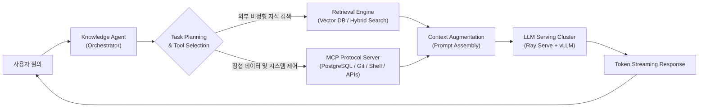

### 1.1 RAG (Retrieval-Augmented Generation) vs CAG (Cache-Augmented Generation)

지식 기반 LLM 애플리케이션을 구축할 때 가장 중요한 아키텍처 결정은 "문맥(Context)을 질의 시점에 검색하여 주입할 것인가(RAG), 아니면 방대한 문맥을 GPU KV 캐시에 미리 상주시킬 것인가(CAG)"입니다.

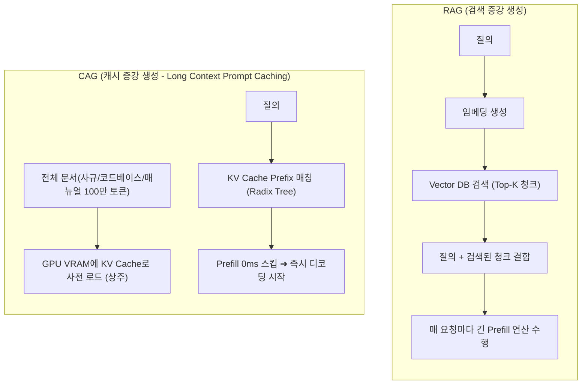

| 비교 항목 | RAG (Retrieval-Augmented Generation) | CAG (Cache-Augmented Generation) |
| :--- | :--- | :--- |
| **핵심 동작 방식** | 질의마다 Vector DB/Search에서 Top-K 청크를 검색하여 프롬프트에 동적 결합 | 10만~100만 토큰의 대용량 문서를 모델 컨텍스트에 상시 로드하고 **KV Cache를 재사용** |
| **데이터 스케일** | 수십 GB ~ 수 TB 이상의 방대하고 동적인 지식 저장소 | 10만~100만 토큰 내외의 고정/준고정 문서 (사규집, API 레퍼런스, 특정 리포지토리 코드) |
| **정보의 온전성** | 청킹(Chunking) 과정에서 문맥 단절 및 검색 누락(False Negative) 발생 가능 | 전체 원문이 모델 Attention 범위 내에 존재하므로 환각 및 누락 극소화 |
| **서빙 시스템 병목** | Vector DB 검색 레이턴시 + 매 요청마다 반복되는 긴 Prefill 연산 | **GPU VRAM의 KV Cache 용량 급증** (프롬프트 캐싱 및 Eviction 전략 필수) |
| **핵심 인프라 기술** | Embedding Pipeline, Hybrid Search (Dense+BM25), Re-ranker | **Radix Attention (SGLang)**, **Automatic Prefix Caching (vLLM)** |

---

## 2. 엔터프라이즈 분산 서빙 7계층 아키텍처

단일 모델 인스턴스가 아닌 수만 명의 동시 요청과 다양한 서비스를 지탱하는 대규모 엔터프라이즈 환경은 철저한 계층화 설계를 따릅니다.

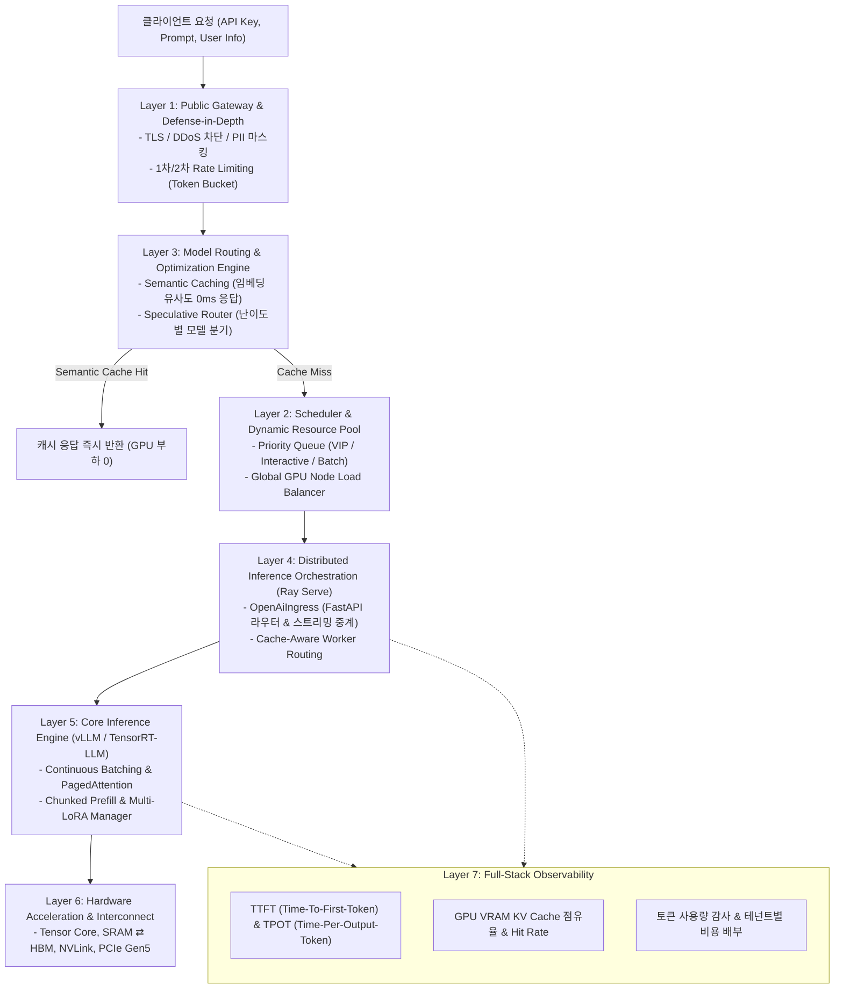

### 계층별 상세 엔지니어링 설계
1. **Layer 1: Public Gateway & Defense-in-Depth (심층 방어 게이트웨이)**:
   - **1차 방어선 (IP/네트워크 계층)**: Cloudflare/Kong/Envoy에서 비정상 트래픽 및 DDoS를 차단합니다.
   - **2차 방어선 (토큰/테넌트 계층)**: 사용자별 토큰 소비량(TPM - Tokens Per Minute)과 분당 요청 수(RPM)를 Redis 기반의 분산 Token Bucket 알고리즘으로 제어합니다.
2. **Layer 3: Model Routing & Semantic Caching (지능형 라우팅 및 시맨틱 캐시)**:
   - **Semantic Cache (GPTCache/Redis)**: 입력 프롬프트를 벡터 임베딩하여 기존 질의와의 코사인 유사도가 0.95 이상일 경우, GPU를 전혀 태우지 않고 캐시된 응답을 5ms 안에 반환합니다.
   - **Complexity Classifier**: 단순 요약이나 분류는 경량 모델(0.5B~7B)로 라우팅하고, 심층 코딩이나 복잡한 추론은 대형 모델(70B)로 분기시킵니다.
3. **Layer 2: Scheduler & Dynamic Resource Pool (글로벌 스케줄러)**:
   - 요청의 긴급도에 따라 대화형(Interactive) 트래픽은 최우선순위 큐에 배치하고, 백그라운드 배치 작업은 유휴 GPU 자원으로 스케줄링합니다.
4. **Layer 4: Distributed Inference Orchestration (Ray Serve 분산 계층)**:
   - 클라이언트 통신을 전담하는 `OpenAiIngress`와 실제 GPU 워커인 `LLMServer`를 완전히 분리하여 고동시성 환경의 네트워크 I/O 병목을 해소합니다.
5. **Layer 5: Core Inference Engine (vLLM / TensorRT-LLM)**:
   - Continuous Batching, PagedAttention, Speculative Decoding, Multi-LoRA 서빙을 실행합니다.

---

## 3. GPU 하드웨어 메모리 대역폭과 추측 디코딩 심층 원리

LLM 추론 시스템의 병목을 이해하고 해결하기 위해서는 **GPU 하드웨어 메모리 계층(SRAM vs HBM)**과 **트랜스포머의 연산 메커니즘**을 물리적으로 분석해야 합니다.

### 3.1 SRAM vs HBM 메모리 대역폭과 트랜스포머 연산

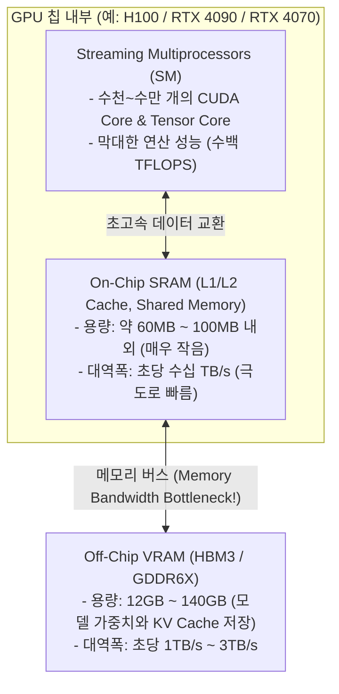

#### 왜 대형 모델일수록 메모리 대역폭이 절대적인 병목이 되는가?
1. **SRAM의 물리적 한계**: GPU 내부의 고속 SRAM은 용량이 기껏해야 **60MB ~ 100MB** 수준입니다. 따라서 140GB(70B FP16 모델)에 달하는 방대한 가중치는 SRAM에 한꺼번에 담길 수 없으며, 반드시 외부 VRAM(HBM/GDDR)에 상주해야 합니다.
2. **트랜스포머 블록의 순차적(Sequential) 연산**:
   - 80개의 레이어로 구성된 트랜스포머 모델에서 1번 레이어의 출력이 나와야 2번 레이어가 계산되고, 2번 출력이 나와야 3번 레이어가 계산됩니다.
   - 따라서 GPU는 **1번 레이어 연산을 위해 1번 가중치를 HBM에서 SRAM으로 읽어오고 ➔ 계산 후 ➔ 2번 가중치를 HBM에서 SRAM으로 읽어오는 과정**을 80번 반복해야 합니다.
3. **Decode 단계의 Memory-Bound 특성**:
   - 토큰을 **단 1개 생성(Decode)**할 때, 연산량 자체는 아주 작습니다(토큰 1개 벡터와 가중치 행렬의 곱).
   - 하지만 이 토큰 1개를 계산하기 위해 **140GB에 달하는 전체 모델 가중치를 HBM에서 SRAM으로 100% 전부 읽어와야 합니다.**
   - HBM 대역폭이 2TB/s라면, 140GB 가중치를 읽는 데만 최소 `140GB / 2000GB/s = 0.07초(70ms)`가 소요되며, 초당 14토큰 생성이 하드웨어적 한계가 됩니다.

---

### 3.2 추측 디코딩(Speculative Decoding)의 병렬 검증 원리

추측 디코딩은 "대형 모델의 Decode(1개씩 생성)를 Prefill(여러 개를 한 번에 검증)로 전환"하여 HBM 가중치 로드 횟수를 획기적으로 줄이는 기술입니다.

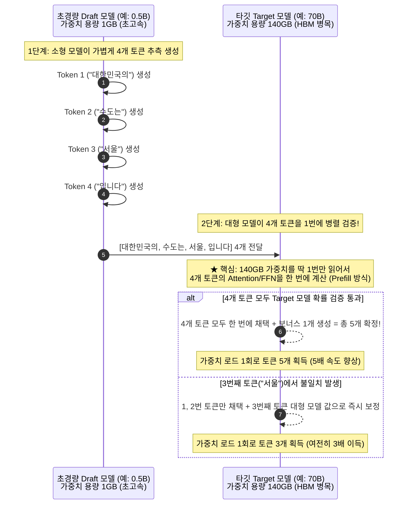

#### 어떻게 4개 토큰을 1번에 계산할 수 있는가?
- 이미 단어가 정해져 있는 4개 토큰은 **Prefill 연산과 완전히 동일**합니다.
- 토큰이 없을 때는 순차적으로 뽑아야 하지만, 후보 토큰 4개가 이미 주어져 있으므로 대형 모델은 4x4 Attention Causal Mask를 씌워 **행렬 연산을 한 번에 병렬 수행**합니다.
- 결과적으로 **140GB 가중치를 HBM에서 딱 1번 읽는 동안 4~5개 토큰이 한꺼번에 확정**되므로 지연 시간(Latency)이 2~4배 단축됩니다.

#### 맞다/아니다 검증과 Speculative Sampling (무손실 보증)
추측 디코딩은 단순한 threshold(예: 80% 이상) 비교가 아니라, **Speculative Sampling**이라는 통계적 알고리즘을 사용합니다.

$$\text{수락 확률 } P(\text{Accept}) = \min\left(1, \frac{P_{\text{target}}(x)}{P_{\text{draft}}(x)}\right)$$

- 소형 모델이 단어 $x$를 뽑을 확률 $P_{\text{draft}}(x)$보다 대형 모델의 확률 $P_{\text{target}}(x)$가 더 높다면 **100% 무조건 채택**합니다.
- 대형 모델의 확률이 더 낮더라도 비율에 맞추어 확률적으로 수락하며, 거절될 경우 잔여 확률 분포(Residual Distribution)에서 대형 모델의 본래 분포대로 다시 샘플링합니다.
- **수학적 무손실(Lossless) 증명**: 이 알고리즘을 거친 최종 출력의 수학적 확률 분포는 **대형 모델 단독으로 추론했을 때의 확률 분포와 100% 완벽히 일치**합니다 (`Top-k`, `Temperature` 등 모든 샘플링 파라미터가 보존됨).

---

### 3.3 Continuous Batching과 Multi-Model / Multi-LoRA 가중치 공유

엔터프라이즈 환경에서 쉴 새 없이 밀려드는 요청들은 어떻게 처리될까요?

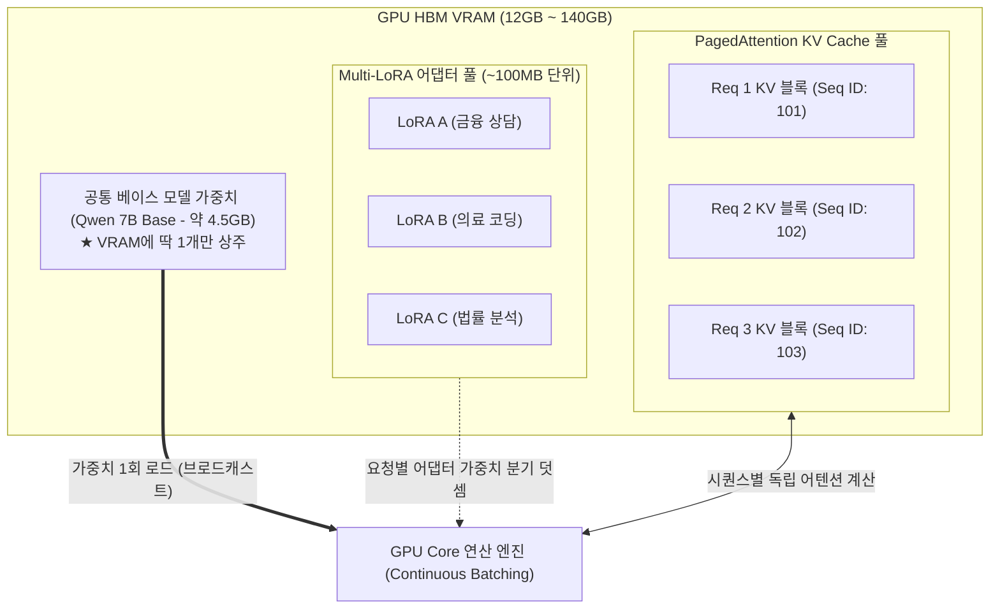

1. **동일 모델 요청 (Continuous Batching)**:
   - 64명의 사용자가 동시에 요청을 보내더라도, 베이스 모델 가중치는 HBM에서 **딱 1번만 SRAM으로 로드**됩니다.
   - 64개의 입력 벡터(Activation)를 하나의 큰 배치 행렬로 묶어 로드된 가중치와 한 번에 행렬 곱(GEMM)을 수행하므로 GPU 메모리 대역폭 낭비가 0이 됩니다.
2. **다양한 모델 요청 (Multi-LoRA 서빙)**:
   - 모델 전체 구조가 다른 경우(예: LLaMA와 Mistral)는 가중치를 동시에 로드할 수 없어 별도 GPU 인스턴스로 분리해야 합니다.
   - 하지만 동일한 베이스 모델에 서로 다른 파인튜닝 어댑터를 적용한 **Multi-LoRA 구조**에서는, **공통 베이스 가중치 1회 로드 + 시퀀스별 초경량 LoRA 어댑터(수십 MB) 분기 덧셈** 방식으로 단일 GPU에서 수십 개의 맞춤형 모델을 초고속 서빙합니다.

---

## 4. 분산 서빙 프레임워크: Ray & KubeRay 아키텍처

단일 머신에서 `vllm serve` 명령어로 프로세스를 띄우는 것과, 수십~수백 대의 GPU 클러스터에서 엔터프라이즈급으로 모델을 서빙하는 것은 완전히 다른 차원의 문제입니다.

### 4.1 왜 단일 vLLM을 넘어 Ray가 필요한가?

단일 머신 기반 서빙(FastAPI + vLLM)은 다음과 같은 현실적인 벽에 부딪힙니다:
1. **Python GIL 및 단일 프로세스 병목**: HTTP 요청 파싱, 스트리밍 SSE 인코딩, 모델 추론이 단일 프로세스에 묶여 동시 접속자가 늘어나면 CPU 이벤트 루프가 먼저 마비됩니다.
2. **멀티 GPU / 멀티 노드 확장 한계**: 여러 대의 GPU 서버로 모델을 분산 배치하고 부하를 분산하려면 복잡한 로드 밸런서, 프로세스 간 통신(IPC), 헬스체크, 복구 메커니즘을 밑바닥부터 구현해야 합니다.
3. **무중단 롤링 배포의 부재**: 모델 가중치(수십 GB)를 교체할 때 서비스를 내리지 않고 새로운 버전으로 트래픽을 안전하게 넘기는 오케스트레이션이 필요합니다.

이 문제를 해결하기 위해 AI 분산 컴퓨팅의 표준 프레임워크인 **Ray**와 **Ray Serve**를 도입합니다.

---

### 4.2 Ray란 무엇인가? (Ray의 철학과 3대 핵심 원시 단위)

**Ray**는 UC 버클리 RISELab에서 개발된 **AI 및 분산 Python 애플리케이션을 위한 오픈소스 분산 실행 프레임워크**입니다. 복잡한 네트워크 통신이나 소켓 프로그래밍 없이, 일반 Python 코드에 데코레이터(`@ray.remote`)만 붙이면 수천 대의 노드로 연산을 자동 분산시킵니다.

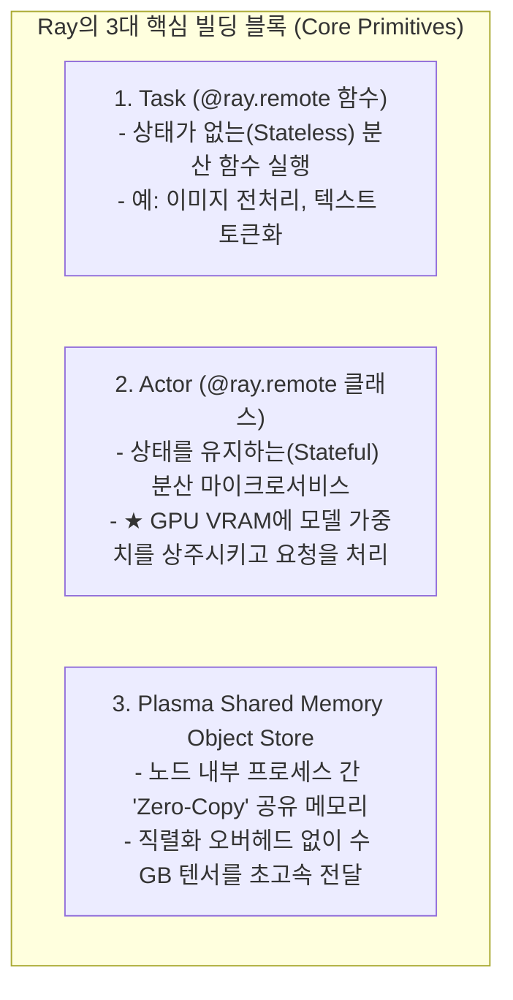

#### Ray 생태계 계층 구조

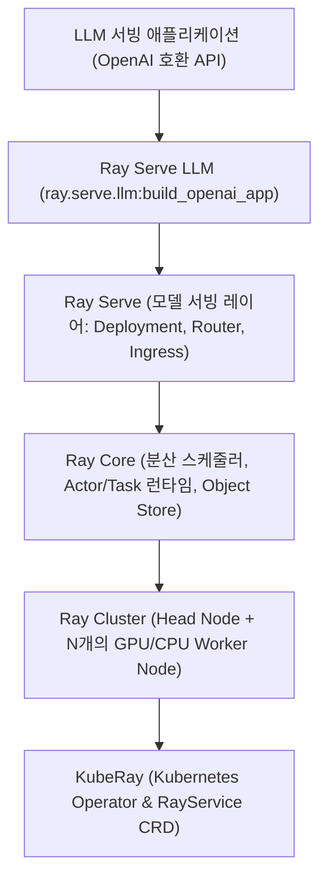

1. **Ray Core**: 분산 스케줄러, 액터 수명주기, 분산 메모리를 관리하는 엔진.
2. **Ray Cluster**: 
   - **Head Node**: 클러스터 전체 상태를 관리하는 **GCS (Global Control Store)**, 대시보드, 오토스케일러가 실행되는 컨트롤 타워.
   - **Worker Node**: 실제 GPU 연산(Ray Actor)을 수행하는 작업 노드.
3. **Ray Serve**: Ray Core 위에서 구축된 확장 가능한 모델 서빙 전용 라이브러리.
4. **Ray Serve LLM**: vLLM 등의 추론 엔진을 Ray Serve 액터로 감싸 OpenAI 호환 API를 제공하는 최상위 LLM 서빙 프레임워크.

---

### 4.3 Ray Serve LLM의 내부 컴포넌트와 2:1 비율 설계

Ray Serve LLM은 엔터프라이즈 서빙의 성능을 위해 **역할을 둘로 분리**합니다.

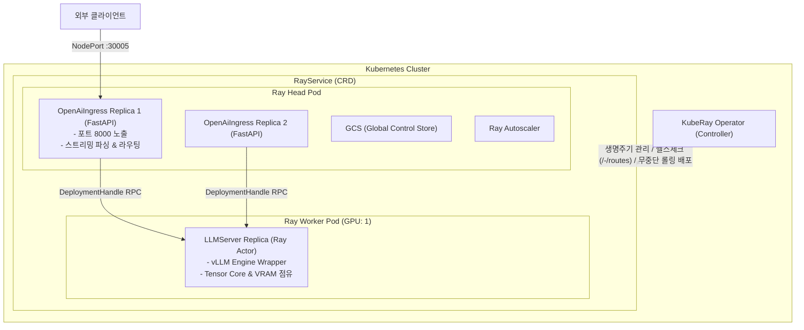

1. **`OpenAiIngress` (FastAPI 진입점)**:
   - 클라이언트의 HTTP 요청을 수신하고, JSON 파싱, SSE(Server-Sent Events) 스트리밍 토큰 중계, LoRA 모델 멀티플렉싱을 전담합니다.
   - GPU 없이 순수 Python 비동기 이벤트 루프로 동작합니다.
2. **`LLMServer` (vLLM 추론 엔진)**:
   - 실제 GPU VRAM을 점유하고 vLLM 분산 엔진을 실행하는 Ray Actor입니다.
3. **왜 Ingress와 LLMServer의 비율을 2:1 이상으로 권장하는가?**:
   - `OpenAiIngress`는 FastAPI(단일 이벤트 루프)로 동작하므로 동시 접속자가 급증하면 **CPU 이벤트 루프가 먼저 포화(Saturation)**되어 GPU가 놀고 있는데도 응답이 지연됩니다.
   - Ingress는 GPU를 쓰지 않으므로 저렴한 CPU 레플리카로 2배 앞서 증설(2:1)하여 네트워크 I/O 병목을 완벽히 방지합니다.

#### 오토스케일링 큐 제어 (`target_ongoing_requests`)
- vLLM 프로파일링 상 GPU 1장이 감당 가능한 최대 동시 요청이 `64`라면:
  - `LLMServer`의 `target_ongoing_requests`: **`48`** (최대치의 75% 수준에서 미리 스케일아웃 트리거)
  - `OpenAiIngress`의 `target_ongoing_requests`: **`24`** (2:1 비율에 맞추어 Ingress가 항상 2배 앞서 증설되도록 유도)

---

### 4.4 KubeRay와 `RayService` CRD 선정 이유

Kubernetes 환경에서 Ray를 운영할 때 KubeRay가 제공하는 3가지 CRD 중 왜 `RayService`를 사용하는지 비교합니다.

| CRD 종류 | 역할 및 용도 | 헬스체크 / 무중단 배포 | 적합한 워크로드 |
| :--- | :--- | :--- | :--- |
| **RayCluster** | Head Pod와 Worker Pod의 클러스터 인프라 자체만 관리 | Serve 애플리케이션 헬스체크 없음, 수동 재배포 필요 | 일반 분산 데이터 처리, 대규모 분산 학습 |
| **RayJob** | RayCluster를 생성하여 단발성 잡을 실행하고 완료 시 클러스터 삭제 | 작업 완료 시 자동 정리 | 정기적인 대규모 배치 추론 / 파인튜닝 |
| **RayService (권장)** | RayCluster + Ray Serve 애플리케이션의 수명주기를 단일 매니페스트로 통합 관리 | K8s `/-/routes` 엔드포인트 기반 헬스체크 + Zero-Downtime 무중단 롤링 업데이트 | 24/365 실시간 LLM 온라인 서빙 |

`RayService`를 사용하면 모델을 교체하거나 파라미터를 수정할 때 `kubectl apply` 한 번으로 새로운 RayCluster를 띄워 헬스체크를 통과한 후 트래픽을 넘기는 **Blue/Green 무중단 롤링 업데이트**가 자동으로 수행됩니다.

---

## 5. RayService 기반 프로덕션 배포 및 검증 아키텍처

실제 Kubernetes 클러스터 상에서 KubeRay Operator와 `RayService` CRD를 통해 배포된 LLM 서빙 시스템의 동작 검증과 모니터링 구조입니다.

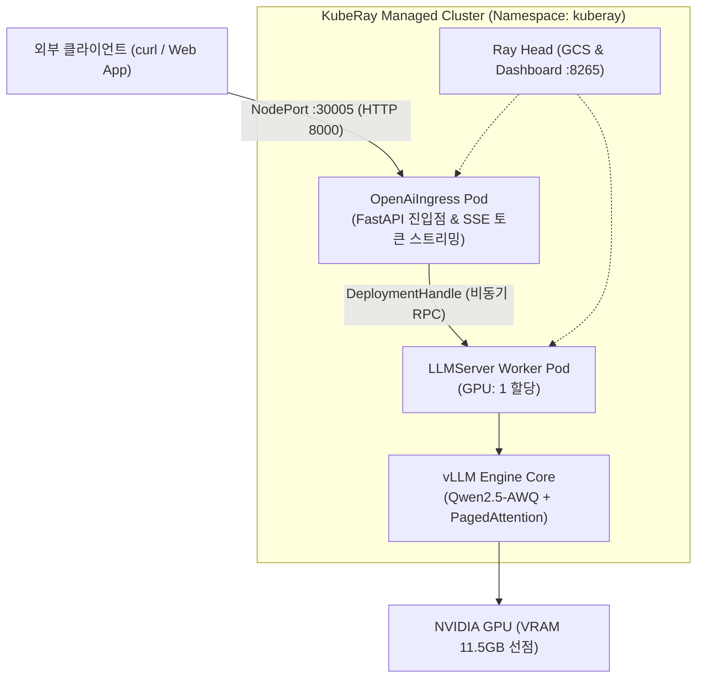

### 5.1 OpenAI 호환 API 추론 검증 (`curl`)

`RayService`가 기동되면 표준 OpenAI SDK 및 `curl`을 통해 `/v1/chat/completions` 엔드포인트로 즉시 추론을 요청할 수 있습니다.

```bash
curl -X POST http://localhost:8000/v1/chat/completions \
  -H "Content-Type: application/json" \
  -d '{
    "model": "qwen2.5-1.5b-instruct-awq",
    "messages": [
      {"role": "system", "content": "You are a helpful AI assistant."},
      {"role": "user", "content": "Ray Serve와 vLLM의 차이점을 한 문장으로 멋지게 설명해줘."}
    ],
    "temperature": 0.7,
    "max_tokens": 150
  }' | jq
```

```json
{
  "id": "chatcmpl-0877c0a2-992f-46c2-a880-832368e7de03",
  "object": "chat.completion",
  "created": 1786786246,
  "model": "qwen2.5-1.5b-instruct-awq",
  "choices": [
    {
      "index": 0,
      "message": {
        "role": "assistant",
        "content": "\"Ray Serve는 빅데이터 처리 및 분석을 위한 솔루션, 반면 vLLM은 자연어 학습 모델을 위한 인공지능 언어 서비스.\""
      },
      "finish_reason": "stop"
    }
  ],
  "usage": {
    "prompt_tokens": 42,
    "total_tokens": 86,
    "completion_tokens": 44
  }
}
```

---

### 5.2 Ray Web Dashboard를 통한 분산 클러스터 관측성

Ray Dashboard(`:8265`)를 통해 클러스터 노드 상태와 서빙 배포 현황을 실시간으로 추적합니다.

#### 1. Overview 탭 (클러스터 및 배포 요약)
`Serve Deployments`에 `LLMServer`와 `OpenAiIngress`가 등록되어 정상 서빙 중이며, GPU 리소스가 1.0/1.0 할당된 상태를 보여줍니다.


#### 2. Serve 탭 (애플리케이션 및 라우팅 상태)
`llms` 애플리케이션의 컨트롤러와 프록시가 `HEALTHY` 상태이며, `OpenAiIngress`(라우팅)와 `LLMServer`(vLLM 엔진) 레플리카가 독립된 상태로 관리됩니다.


#### 3. Cluster 탭 (Head 노드 및 GPU Worker 노드 점유율)
Head 노드(`10.244.0.7`, GCS/라우팅)와 GPU Worker 노드(`10.244.0.8`, **GPU VRAM 11.79 GiB 점유**)가 분리되어 실행되는 토폴로지를 확인할 수 있습니다.


---

### 5.3 동시성 부하 테스트를 통한 Continuous Batching 실증

vLLM의 반복 단위 동적 스케줄링(Iteration-level Continuous Batching)이 실제 GPU 인프라에서 어떻게 지연시간을 단축하고 처리량을 극대화하는지 검증하기 위해 Python 표준 라이브러리 기반 부하 테스트를 수행했습니다.

#### 1. 가변 워크로드 부하 테스트 스크립트 (`load_test_varied.py`)

```python
import concurrent.futures
import json
import time
import urllib.request

URL = "http://localhost:8000/v1/chat/completions"
MODEL = "qwen2.5-1.5b-instruct-awq"

# 질문별 요구 토큰 길이를 40 ~ 200 토큰으로 다양하게 설정
TASKS = [
    (1, "What is a GPU?", 50),
    (2, "Define Kubernetes in 10 words.", 40),
    (3, "Explain Transformer attention in short.", 100),
    (4, "What is continuous batching?", 80),
    (5, "Summarize why KV caching is needed.", 70),
    (6, "Explain Docker container isolation.", 120),
    (7, "Write an essay about distributed model serving.", 180),
    (8, "Compare Ray Serve vs Triton in detail.", 200),
]

def send_task(item):
    req_id, prompt, max_tok = item
    payload = json.dumps({
        "model": MODEL,
        "messages": [{"role": "user", "content": prompt}],
        "temperature": 0.7,
        "max_tokens": max_tok
    }).encode("utf-8")
    
    t0 = time.perf_counter()
    req = urllib.request.Request(URL, data=payload, headers={"Content-Type": "application/json"})
    try:
        with urllib.request.urlopen(req, timeout=60) as resp:
            data = json.loads(resp.read().decode("utf-8"))
            elapsed = time.perf_counter() - t0
            tokens = data.get("usage", {}).get("completion_tokens", max_tok)
            tps = tokens / elapsed if elapsed > 0 else 0
            return {"id": req_id, "success": True, "elapsed": elapsed, "target": max_tok, "tokens": tokens, "tps": tps}
    except Exception as e:
        elapsed = time.perf_counter() - t0
        return {"id": req_id, "success": False, "elapsed": elapsed, "error": str(e)}

def main():
    with concurrent.futures.ThreadPoolExecutor(max_workers=len(TASKS)) as executor:
        futures = [executor.submit(send_task, task) for task in TASKS]
        results = [f.result() for f in futures]
    
    results.sort(key=lambda x: x["elapsed"])
    for r in results:
        if r["success"]:
            print(f"[Req {r['id']:02d}] 완료: {r['elapsed']:.2f}s | 출력: {r['tokens']} tok (목표 {r['target']}) | 처리량: {r['tps']:.1f} tok/s")

if __name__ == "__main__":
    main()
```

#### 2. 실측 벤치마크 결과 및 백분위 지표

##### [통계 지표 요약]

| 워크로드 유형 | 동시성 | 성공률 | 평균 지연시간 | P50 지연시간 | P95 지연시간 | P99 지연시간 | 총 출력 토큰 | 클러스터 총 처리량 |
| :--- | :--- | :--- | :--- | :--- | :--- | :--- | :--- | :--- |
| **고정 길이 (각 150 tok)** | 8 | **100% (8/8)** | **4.22s** | 4.22s | 4.22s | 4.22s | 1,200 tok | **281.7 tok/s** |
| **가변 길이 (40~200 tok)** | 8 | **100% (8/8)** | **3.03s** | 2.68s | 5.37s | 5.64s | 760 tok | **133.6 tok/s** |

##### [가변 워크로드 개별 요청 완료 타임라인]

| 요청 ID | 목표 토큰 | 실제 생성 토큰 | 소요 시간 | 단일 스트림 처리량 | 스케줄링 동작 특성 |
| :--- | :--- | :--- | :--- | :--- | :--- |
| **Req 02** | 40 | 40 | **1.24s** | 32.4 tok/s | **최소 지연 완료 및 GPU 슬롯 즉시 반환** |
| **Req 01** | 50 | 41 | **1.56s** | 32.1 tok/s | 조기 종료 토큰(EOS) 감지 및 즉시 방출 |
| **Req 05** | 70 | 70 | **2.13s** | 32.8 tok/s | 정상 디코딩 완료 |
| **Req 04** | 80 | 80 | **2.41s** | 33.1 tok/s | 정상 디코딩 완료 |
| **Req 03** | 100 | 100 | **2.96s** | 33.7 tok/s | 중간 크기 요청 완료 |
| **Req 06** | 120 | 120 | **3.52s** | 34.1 tok/s | 정상 디코딩 완료 |
| **Req 07** | 180 | 180 | **5.09s** | 35.4 tok/s | 고부하 요청 처리 |
| **Req 08** | 200 | 200 | **5.64s** | 35.4 tok/s | **최장 요청 (전체 배치 연산 완료점)** |

#### 3. 정적 배칭 vs 연속 배칭 동작 메커니즘

```
[ 전통적 정적 배칭 (Static Batching) ]
Req 02 (40tok)  : [=== 디코딩 ===][.......... 패딩 대기 (4.40초 유휴 낭비) ..........] ➔ 5.64s 반환
Req 08 (200tok) : [==================== 전체 디코딩 지속 ====================] ➔ 5.64s 반환
* 한계: 40토큰 요청도 가장 긴 요청(200토큰)이 끝날 때까지 GPU 슬롯을 잡고 5.64초 동안 대기해야 함.

[ vLLM 연속 배칭 (Iteration-level Continuous Batching) ]
Req 02 (40tok)  : [=== 디코딩 ===] ➔ 1.24초 즉시 응답 반환 및 KV Cache 슬롯 회수!
Req 08 (200tok) : [==================== 전체 디코딩 지속 ====================] ➔ 5.64s 반환
* 이점: Req 02가 빠져나간 VRAM/연산 여유 공간에 새로운 대기 큐의 요청이 즉시 진입 가능.
```

- **지연시간 단축**: 짧은 질의(40토큰)를 보낸 클라이언트는 정적 배칭 대비 **지연시간이 78% 감소(5.64초 ➔ 1.24초)**했습니다.
- **자원 회수**: 토큰 생성이 끝난 요청은 매 반복(iteration) 단위로 즉시 슬롯과 KV Cache 블록을 반환하므로, GPU 메모리 파편화 없이 새로운 요청을 지체 없이 수용할 수 있습니다.

---

:::tip[로컬 GPU 환경 구축 & 상세 트러블슈팅 매뉴얼]
Windows WSL2·Docker·`kind` 환경에서 로컬 GPU(RTX 4070)를 패스스루하고 KubeRay를 구성하며 발생한 상세 시행착오 및 트러블슈팅 전 과정은 [Windows WSL2·kind에서 로컬 RTX 4070 GPU 패스스루와 KubeRay(RayService) 구축하기](/space-notes/posts/ai/local-gpu-wsl2-rayservice-guide/) 문서에 독립적으로 정리되어 있습니다.
:::

---

## 6. 클라우드 벤더 서빙 6단계 스펙트럼 (The 6-Stage Serving Spectrum)

모델 서빙은 "완전 자체 구축(Build)"과 "완전 구매(Buy)"의 단순한 이분법이 아니라, **커스터마이징 자유도(Flexibility)와 운영 관리 부담(Operational Burden) 사이의 6단계 스펙트럼**으로 나뉩니다.

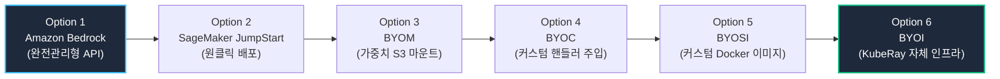

### 6.1 단계별 핵심 비교 및 아키텍처

| 단계 | 서빙 방식 | 사용자 제공 자산 | 인프라 과금 방식 | 커스터마이징 자유도 | 운영 관리 부담 (Ops) |
| :--- | :--- | :--- | :--- | :--- | :--- |
| **Option 1** | `Amazon Bedrock` | 프롬프트만 전달 | **사용한 토큰 / 요청당 과금** | 최저 (제한적) | **거의 없음 (Zero)** |
| **Option 2** | `SageMaker JumpStart` | 사전학습 모델 선택 | **인스턴스 시간당 과금** (`g5.48xlarge` 등) | 낮음 | 낮음 |
| **Option 3** | `BYOM (Bring Your Own Model)` | 자체 학습 가중치 (`S3`) | 인스턴스 시간당 과금 | 중간 | 중간 |
| **Option 4** | `BYOC (Bring Your Own Code)` | 가중치 + 커스텀 `inference.py` | 인스턴스 시간당 과금 | 높음 | 높음 |
| **Option 5** | `BYOSI (Bring Your Own Serving Image)` | 자체 빌드 Docker 이미지 (`ECR`) | 인스턴스 시간당 과금 | 매우 높음 | 매우 높음 |
| **Option 6** | `BYOI (Build Your Own Infra)` | 전체 시스템 (K8s/KubeRay/vLLM) | GPU VM / 베어메탈 시간당 과금 | **최고 (Full Control)** | **최고 (Full Ops)** |

1. **Option 1: Fully Managed Foundation-Model Serving (`Amazon Bedrock`)**:
   - 서버 프로비저닝 없이 AWS SDK(`boto3`)로 즉시 호출하는 서버리스 환경입니다.
   - **장점**: 초기 구축 시간 제로, 트래픽 유휴 시 비용 0원.
   - **한계점 (3불가)**: 인스턴스 타입 선택 불가, vLLM 파라미터/양자화 커널 수정 불가, 자체 비공개 모델 배포 불가.
2. **Option 2~5: Amazon SageMaker 호스팅 계층 (전용 GPU 인스턴스)**:
   - 사용자의 AWS 계정에 전용 인스턴스(`g5.2xlarge`, `p4d.24xlarge` 등)를 띄우는 방식입니다.
   - `JumpStart`(원클릭)부터 시작해 `BYOM`(가중치 마운트), `BYOC`(커스텀 전/후처리 스크립트 주입), `BYOSI`(자체 빌드 vLLM Docker 이미지 실행)로 갈수록 제어권이 넓어집니다.
3. **Option 6: Build Your Own Infrastructure (`BYOI` - KubeRay + vLLM)**:
   - AWS EKS 또는 온프레미스 K8s 위에 KubeRay와 vLLM 스택을 통째로 직접 배포하는 방식입니다.
   - 클라우드 벤더의 관리 마크업(마진)을 제거하고, Continuous Batching 및 PagedAttention 메모리 할당(`gpu_memory_utilization`)을 100% 제어할 수 있습니다.

---

## 7. Build vs Buy 의사결정 프레임워크 & TCO 경제성 분석

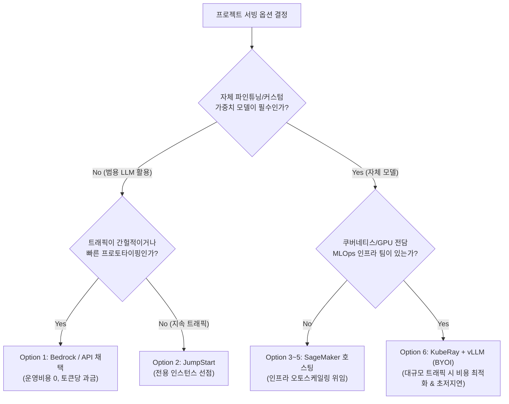

### 7.1 TCO Crossover Point (비용 역전 지점)

- **초기/저트래픽 단계**: `Bedrock`이나 상용 API가 압도적으로 저렴합니다 (유휴 GPU 비용 낭비 제로).
- **대규모 지속 트래픽 (월 5천만~1억 토큰 이상)**:
  - 토큰당 과금액이 전용 GPU 인스턴스 렌탈 비용을 넘어서는 **Crossover Point**가 발생합니다.
  - 이 구간에서는 **전용 GPU 클러스터에 Continuous Batching + AWQ 양자화를 적용해 처리량을 극대화하는 것이 TCO를 수배 이상 절감**합니다.

| 서빙 방식 | 비용 특성 | 월 1,000만 토큰 (PoC) | 월 5억 토큰 (프로덕션) | 월 50억 토큰 (엔터프라이즈) |
| :--- | :--- | :--- | :--- | :--- |
| **Option 1: Bedrock / API** | 사용량 비례 (Linear) | **약 $30 (매우 저렴)** | 약 $1,500 | **약 $15,000 ~ $30,000** |
| **Option 2~5: AWS GPU EC2** (`g5.2xlarge`) | 시간당 고정 (Fixed OpEx) | 약 $870 (낭비) | 약 $870 | 약 $2,600 (3대 증설) |
| **Option 6: 자체 GPU Deck 구축** | 장비 구매(CapEx) + 전기세 | 초기 비용 발생 | **월 $150 수준 (전기세/감가)** | **월 $400 수준** |

### 7.2 온프레미스 GPU Deck 구축의 현실과 대안 AI 클라우드 (Neo-Clouds)

더 극단적인 원가 절감을 위해 온프레미스 **GPU Deck(소비자용 RTX 4090/5090 4~8장 랙 서버)**을 직접 조립하여 운영할 수 있습니다. 2년 감가상각 후에는 월 수십억 토큰을 뽑아내도 순수 전기세(월 10~20만 원)만 발생합니다.

그러나 실제 IDC(데이터센터) 입주 시 다음과 같은 **물리적 설비 장벽**을 마주하게 됩니다:
1. **전력 밀도 (Power Density)**: 일반 랙(3~5kW) 대비 GPU 랙은 **20kW ~ 40kW+**의 고전력을 소모하므로 전용 특수 전산실이 필수입니다.
2. **공조 및 발열 (Cooling)**: 30kW의 열기를 식히기 위한 핫에일(Hot-Aisle) 차폐 및 칩셋 수랭(DLC) 배관 설비가 요구됩니다.
3. **노드 간 고속 통신**: 멀티노드 분산 텐서 병렬화를 위한 **400Gbps InfiniBand** 및 **RoCE v2(PFC/ECN 무손실 네트워크)** 인프라 구축에 높은 초기 비용이 듭니다.

:::note[대안 AI 클라우드 (Neo-Clouds)의 포지셔닝]
이러한 물리적 IDC 설비 부담을 피하면서도 AWS 대비 50~70% 저렴한 비용을 취하기 위해 **Lambda Labs, RunPod, CoreWeave** 같은 특화 AI 클라우드가 급부상하고 있습니다. KubeRay + vLLM 스택은 이러한 대안 클라우드 K8s 위에서도 100% 동일하게 이식됩니다.
:::

---

## 8. 프로덕션 서빙의 4대 핵심 성능 평가 지표

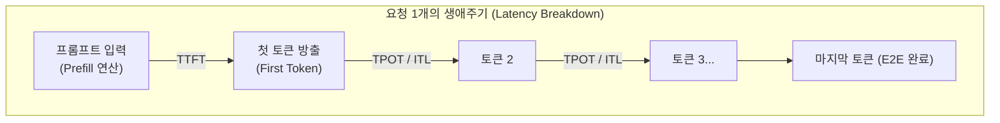

1. **TTFT (Time to First Token)**:
   - 요청 도착 후 **첫 번째 토큰이 출력될 때까지 걸린 시간**.
   - **결정 요인**: 프롬프트 길이(Prefill 연산) + 큐 대기 시간 (**Compute-bound** 영역).
2. **TPOT (Time Per Output Token) / ITL (Inter-Token Latency)**:
   - 첫 토큰 이후 **다음 토큰이 하나씩 연속 생성되는 데 걸리는 간격 시간**.
   - **결정 요인**: 모델 파라미터 크기, 배치 크기, GPU 메모리 대역폭 (**Memory-bandwidth-bound** 영역).
   - 사용자가 체감하는 실시간 스트리밍 "타이핑 속도"를 직접 좌우.
3. **E2E Latency (전체 지연시간)**:
   $$\text{E2E Latency} = \text{TTFT} + (N_{\text{output\_tokens}} - 1) \times \text{TPOT}$$
4. **Throughput (처리량) & MFU**:
   - **RPS (Requests Per Second)**: 초당 완료된 서빙 요청 수.
   - **TPS (Tokens Per Second)**: 초당 클러스터가 생성한 총 토큰 수.
   - **MFU (Model FLOPs Utilization)**: 하드웨어의 이론상 최대 연산량 대비 모델 순수 추론 연산의 실제 비중.

---

## 9. 프로덕션 분산 서빙 아키텍처 요약 및 결론

Part 1부터 Part 4까지 다룬 LLM 서빙 엔지니어링의 핵심 진화 과정을 요약하면 다음과 같습니다:

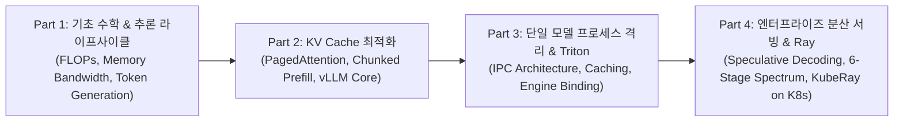

1. **하드웨어 메모리 벽의 극복**:
   - Decode 단계는 가중치를 HBM에서 SRAM으로 읽는 **Memory-bound** 특성을 갖습니다.
   - 이를 극복하기 위해 **추측 디코딩(Speculative Decoding)**으로 Prefill 병렬 검증을 유도하고, **Continuous Batching**과 **Multi-LoRA**를 통해 가중치 브로드캐스트 효율을 극대화합니다.
2. **소프트웨어 계층의 분리와 전문화**:
   - `OpenAiIngress`(I/O 및 라우팅 전담)와 `LLMServer`(GPU 텐서 연산 전담)를 분리함으로써, Python 단일 이벤트 루프 병목을 원천 차단하고 GPU 가동률을 극대화합니다.
3. **클라우드 스펙트럼과 경제적 최적화**:
   - PoC 단계에서는 `Bedrock`(Option 1)으로 빠른 검증을 수행하고, 트래픽 증가 시 `KubeRay + vLLM`(Option 6) 또는 대안 AI 클라우드로 전환하여 TCO를 최적화하는 전략적 의사결정이 필요합니다.

<div class="series-nav">
  <a href="/space-notes/posts/ai/llm-serving-part-3/" class="series-nav-item prev">
    <span class="series-nav-label">이전 파트</span>
    <span class="series-nav-title">← [Part 3] 모델 서빙 시스템 설계와 구현</span>
  </a>
  <a href="/space-notes/posts/ai/llm-serving-part-5/" class="series-nav-item next">
    <span class="series-nav-label">다음 파트</span>
    <span class="series-nav-title">[Part 5] LLM 서빙의 하드웨어 기초와 메모리 벽 →</span>
  </a>
</div>


