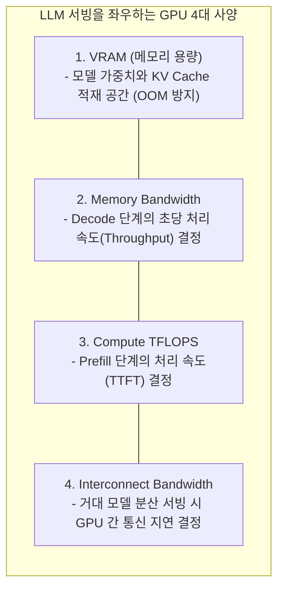
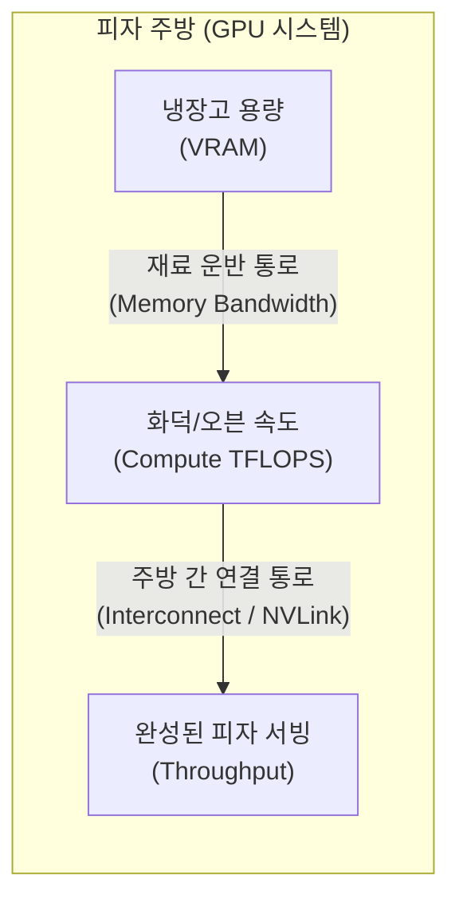
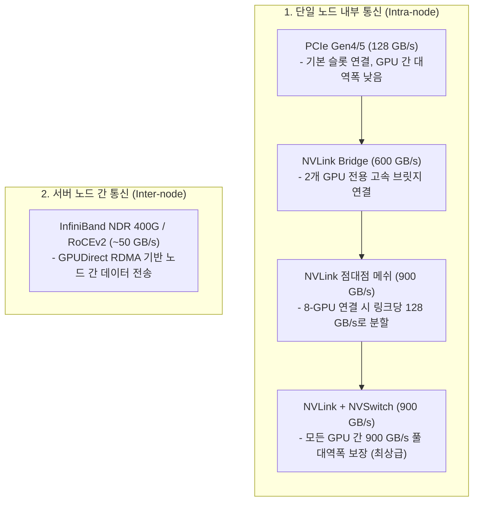
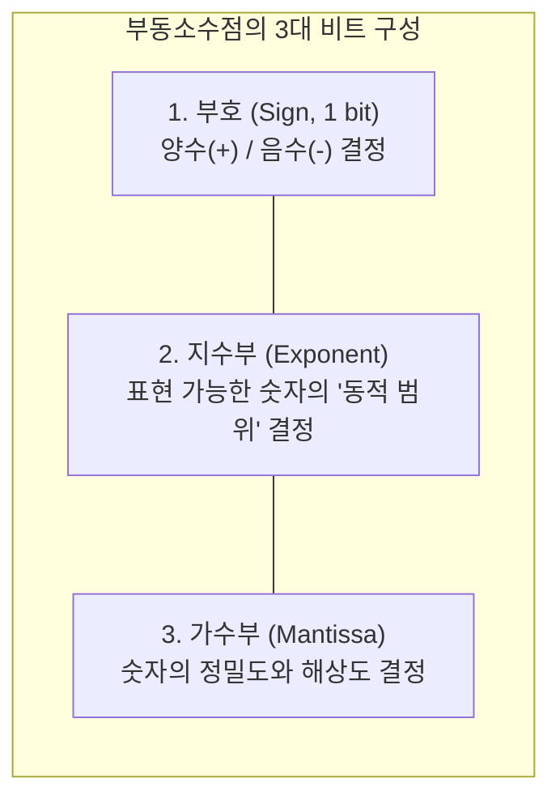
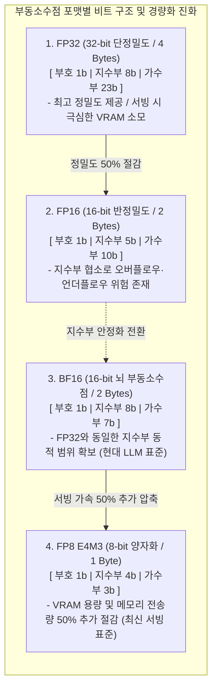
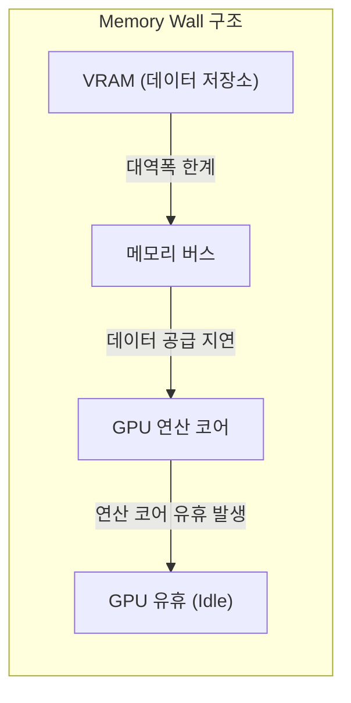
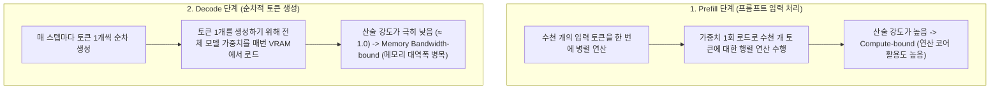

:::note[스터디 기록]
CloudNet - Hands-On LLM Serving and Optimization 스터디 5주차

Chapter 5 (Challenges When Serving LLMs) 내용을 바탕으로, LLM 서빙 시스템을 이해하기 위한 GPU 하드웨어 구조, 수치 정밀도, 메모리 풋프린트 산출, 메모리 벽(Memory Wall) 현상을 엔지니어링 관점에서 정리한 포스트입니다.
:::

---

:::note[📖 Quick Glossary: Part 5 핵심 하드웨어 및 수치 용어 사전]
| 용어 | 설명 |
| :--- | :--- |
| **VRAM** | 모델 가중치(Weights)와 대화 문맥(KV Cache)을 적재하는 GPU 비디오 메모리입니다. |
| **Memory Bandwidth** | VRAM에서 연산 코어로 1초 동안 전송할 수 있는 메모리 데이터 전송 속도(GB/s, TB/s)입니다. |
| **TFLOPS** | GPU가 1초 동안 처리할 수 있는 테라(1조) 단위의 부동소수점 연산 횟수(Tera Floating Point Operations Per Second)입니다. |
| **Interconnect** | 여러 GPU가 분산 처리를 위해 데이터를 주고받는 통신 대역폭(NVLink, PCIe 등)입니다. |
| **FP (Floating Point)** | 실수를 부호, 지수부, 가수부의 비트 조합으로 근사하여 컴퓨터에 표현하는 부동소수점 데이터 타입입니다. |
| **Memory Wall** | GPU 연산 코어의 처리 속도 발전율에 비해 메모리(HBM) 대역폭의 발전율이 현저히 뒤처져, 연산 코어가 데이터를 제때 공급받지 못하고 메모리 전송 속도의 한계에 가로막히는 아키텍처적 병목 현상입니다. |
:::

---

## 1. GPU 4대 핵심 사양과 LLM 서빙의 관계

### TFLOPS 연산력과 실제 서빙 성능의 차이
LLM 서빙 인프라를 구축할 때 흔히 하는 실수가 단순히 TFLOPS 연산력만 보고 GPU를 선택하는 것입니다.

LLM 추론은 일반적인 딥러닝 훈련이나 그래픽 렌더링과 달리, Prefill과 Decode의 하드웨어 요구 특성이 완전히 다릅니다. 연산 코어가 아무리 빨라도 Memory Bandwidth나 VRAM 용량이 부족하면 GPU 성능의 극히 일부만 사용된 채 심각한 병목에 직면합니다.

따라서 LLM 서빙 GPU를 선정하고 인프라 사이징을 진행할 때는 다음 4대 핵심 사양을 종합적으로 분석해야 합니다.



---

### GPU 4대 핵심 사양과 피자 주방 비유

LLM 서빙에서 하드웨어 사양 간의 상호작용은 **피자 주방의 운영 구조**에 직관적으로 비유할 수 있습니다.



| GPU 하드웨어 사양 | 피자 주방 비유 | LLM 서빙에서의 실제 역할 |
| :--- | :--- | :--- |
| **VRAM** | 냉장고 크기 | 모델 가중치(Weights)와 대화 문맥(KV Cache)을 적재하는 공간 |
| **Memory Bandwidth** | 재료 운반 속도 | VRAM에서 연산 코어로 초당 데이터를 밀어넣어 주는 통로 속도 |
| **TFLOPS** | 오븐 화력/속도 | 행렬 곱셈(MatMul) 및 어텐션 연산을 수행하는 텐서 코어 계산 속도 |
| **Interconnect** | 주방 간 통로 | 거대 모델을 여러 GPU로 나눠 서빙할 때의 통신 속도 (NVLink, RDMA 등) |
| **TDP / Power** | 주방 전기 용량 | 랙당 배치 가능한 GPU 수와 데이터센터 냉각 비용 한계 |

#### 세 요소의 불균형이 초래하는 서빙 병목
1. **VRAM 용량 부족**: 모델 가중치와 KV Cache를 담지 못해 OOM (Out of Memory) 에러가 발생하며 서빙이 불가능해집니다.
2. **대역폭 부족 (Memory Wall)**: TFLOPS는 충분하지만 Memory Bandwidth가 느리면 연산 코어가 데이터를 기다리며 유휴 상태(Memory-bound)에 빠집니다.
3. **연산력 부족 (Compute-bound)**: 대량의 입력 프롬프트를 처리할 때 연산 코어 처리량이 부족하면 Prefill 지연이 발생합니다.

---

### 하드웨어 사양별 서빙 영향과 병목 분석

1. **VRAM**:
   * 모델 가중치 크기(파라미터 수 × 정밀도 바이트)와 동시 접속자들의 KV Cache를 합산한 크기가 VRAM 용량보다 작아야 서빙이 가능합니다.
   * VRAM이 부족하면 Batch Size를 키울 수 없어 동시 처리량이 급격히 제한됩니다.
2. **Memory Bandwidth**:
   * Decode 단계는 매 토큰을 생성할 때마다 수십~수백 GB에 달하는 모델 가중치 전체를 VRAM에서 연산 코어로 읽어와야 합니다.
   * 따라서 메모리 대역폭이 초당 생성 가능한 Throughput과 TPOT을 직접 결정합니다.
3. **Compute TFLOPS**:
   * 입력된 수천 토큰의 프롬프트를 한 번에 병렬 연산하는 Prefill 단계의 속도를 결정합니다.
   * 연산력이 높을수록 첫 글자가 찍히기까지의 시간인 TTFT가 단축됩니다.
4. **Interconnect Bandwidth**:
   * 70B 이상의 거대 모델은 단일 GPU에 올라가지 않으므로 Tensor Parallelism이나 Pipeline Parallelism을 적용해야 합니다.
   * 이때 GPU 간에 레이어 중간 Activation을 주고받는 통신 지연이 발생하며, NVLink 같은 고속 인터커넥트가 있어야 통신 병목 없이 처리 속도를 유지할 수 있습니다.

---

## 2. GPU 아키텍처, 상호 연결(Interconnect) 및 대표 칩셋 비교

### GPU 상호 연결 구조 (Intra-node vs Inter-node)

모델이 커질수록 단일 GPU의 한계를 넘어 여러 GPU를 묶는 통신 구조(Topology)가 서빙의 승패를 가릅니다.



#### 통신 방식별 대역폭 비교 (NVIDIA H100 기준)

| 연결 구성 (Setup) | GPU 간 실효 대역폭 | 특징 및 적합한 서빙 구성 |
| :--- | :--- | :--- |
| **NVLink + NVSwitch** | 900 GB/s (All-to-All) | 모든 GPU 간 풀 대역폭 제공. 70B~671B 거대 모델 텐서 병렬화 필수 |
| **NVLink Bridge** | 600 GB/s | 2개 GPU 전용 연결. H100 NVL 기반 70B 2-GPU 서빙에 최적 |
| **NVLink Mesh (8-GPU)** | 7 × 128 GB/s | NVSwitch 없이 점대점으로 분할 연결되어 GPU 수가 늘면 링크당 대역폭 감소 |
| **PCIe Gen5** | 128 GB/s | 표준 슬롯 연결. GPU 간 통신이 적은 독립 경량 모델 복제 서빙용 |
| **InfiniBand (Inter-node)** | ~50 GB/s (400Gbps) | 노드 간 통신 속도는 노드 내부 대비 현저히 느리므로 단일 노드 최적화가 우선 |

---

### 인기 GPU 5종 스펙 및 서빙 워크로드별 선택 가이드

GPU 선택은 "서빙하려는 모델의 크기와 워크로드가 해당 GPU의 특정 기능(FP8, 메모리 대역폭, NVLink)에서 실제로 비용 대비 성능 이득을 얻는가?"에 달려 있습니다.

| 주요 사양 | NVIDIA H200 SXM | NVIDIA H100 SXM | NVIDIA A100 SXM | NVIDIA L40S | NVIDIA A10 | RTX 4070 (PC) |
| :--- | :--- | :--- | :--- | :--- | :--- | :--- |
| **VRAM** | 141GB HBM3e | 80GB HBM3 | 80GB HBM2e | 48GB GDDR6 | 24GB GDDR6 | 12GB GDDR6X |
| **Memory Bandwidth** | 4.8 TB/s | 3.35 TB/s | 1.935 TB/s | 0.864 TB/s | 0.600 TB/s | 0.504 TB/s |
| **BF16 TFLOPS** | 1,979 TFLOPS | 1,979 TFLOPS | 312 TFLOPS | 362 TFLOPS | 125 TFLOPS | 39 TFLOPS |
| **FP8 지원** | O | O | X | O | X | O |
| **NVLink 지원** | 900 GB/s | 900 GB/s | 600 GB/s | X | X | X |
| **온디맨드 비용** | ~$6.3 / hr | ~$6.2 / hr | ~$2.7 / hr | ~$2.25 / hr | <$1.25 / hr | 로컬 장비 |

#### 서빙 워크로드별 최적 GPU 매핑 전략
1. **소형 모델 (~8B, 예: Llama-3-8B, Qwen-7B)**:
   * **추천 GPU**: NVIDIA A10 또는 RTX 4090 / 4070
   * 8B 모델은 BF16 기준 가중치가 약 16GB이므로 24GB VRAM을 가진 저렴한 GPU 1장으로도 충분히 로드 및 서빙이 가능합니다.
2. **중형 모델 (~14B~32B, 예: DeepSeek-R1-Distill-Qwen-14B / 32B)**:
   * **추천 GPU**: NVIDIA L40S (48GB)
   * FP8 정밀도를 네이티브로 활용하여 가중치를 14GB~32GB 안으로 압축하고, 다중 GPU 분할 통신 오버헤드 없이 단일 GPU에서 긴 문맥과 높은 배치를 처리하기에 이상적입니다.
3. **대형 모델 (70B~671B, 예: DeepSeek-R1 671B, Llama-3-70B)**:
   * **추천 GPU**: NVIDIA H200 / H100 8-GPU + NVLink/NVSwitch
   * 모델 크기가 수백 GB에 달해 단일 GPU에 올릴 수 없으므로, NVLink + NVSwitch 기반의 초고속 All-to-All 통신망을 갖춘 8-GPU 단일 노드 머신이 필수적입니다.

---

## 3. 부동소수점(FP) 정밀도: 모델 파라미터와 데이터 타입

### 부동소수점의 기본 비트 구조
LLM의 모든 지식은 행렬(Matrix) 형태의 부동소수점 숫자로 저장됩니다. 이 숫자를 몇 비트(bit)로 표현하느냐에 따라 모델의 용량, 연산 속도, 메모리 전송량이 달라집니다.



---

### 주요 부동소수점 포맷 비교



| 포맷 | 총 비트 (바이트) | 부호 (Sign) | 지수부 (Exponent) | 가수부 (Mantissa) | 특징 및 서빙 용도 |
| :--- | :--- | :--- | :--- | :--- | :--- |
| **FP32** | 32 bits (4 B) | 1 bit | 8 bits | 23 bits | 전통적 단정밀도. 서빙용으로는 메모리 낭비가 큼 |
| **FP16** | 16 bits (2 B) | 1 bit | 5 bits | 10 bits | 반정밀도. 지수부가 좁아 오버플로우/언더플로우 위험 |
| **BF16** | 16 bits (2 B) | 1 bit | 8 bits | 7 bits | FP32와 동일한 지수부 범위(8 bits). 현대 LLM 표준 |
| **FP8 (E4M3)** | 8 bits (1 B) | 1 bit | 4 bits | 3 bits | 가중치 용량 50% 절감. 최신 GPU 네이티브 가속 지원 |

#### 파라미터 정밀도 BF16 (2B) → FP8 (1B) 전환 효과
* **VRAM 용량 50% 절감**: 70B 모델 기준 모델 가중치 용량이 140GB에서 70GB로 감소합니다.
* **메모리 전송량 50% 감소**: VRAM에서 연산 코어로 퍼 올려야 하는 데이터 크기가 반으로 줄어들어 토큰 생성 처리량이 최대 2배 향상됩니다.
* **텐서 코어 연산 처리량 2배 향상**: 최신 GPU(Ada, Hopper)의 FP8 텐서 코어는 클록당 처리량이 16비트 대비 2배 높습니다.

---

## 4. 모델 가중치와 KV Cache 크기 산출 공식

### 모델 가중치 용량 산출
```
가중치 용량 (Bytes) = 파라미터 수 × 정밀도(바이트)
```

* **계산 예시: Llama-2-7b (약 70억 파라미터)**
  * **FP16 / BF16 (2 바이트)**: 7,000,000,000 × 2 Bytes ≈ 14 GB
  * **FP8 (1 바이트)**: 7,000,000,000 × 1 Byte ≈ 7 GB
  * **AWQ 4-bit (0.5 바이트)**: 7,000,000,000 × 0.5 Byte ≈ 3.5 GB

---

### KV Cache 메모리 산출 공식

```
토큰당 KV Cache 크기 (Bytes) = 2 × 레이어 수 × 어텐션 헤드 수 × 헤드 차원 × 데이터 타입 크기(바이트)
```

* 앞의 계수 2는 **Key와 Value 두 개의 텐서를 각각 저장**해야 하기 때문에 곱해집니다.

#### 실전 예시: Llama-2-7b (기본 MHA 방식)
* **모델 조건**:
  * 레이어 수: 32개
  * 어텐션 헤드 수: 32개 (MHA: Query와 1:1 매핑)
  * 헤드 차원: 128 (히든 차원 4096 / 32)
  * 정밀도: FP16 / BF16 (2 바이트)
* **토큰 1개당 KV Cache 크기**:
  $$\text{KV Cache}_{\text{token}} = 2 \times 32 \times 32 \times 128 \times 2\text{ Bytes} = 524,288\text{ Bytes} = \mathbf{0.5\text{ MB}}$$
* **동시 요청(배치 크기) 16건, 각 4,096 토큰 시 필요한 총 KV Cache**:
  $$\text{총 KV Cache} = 0.5\text{ MB/토큰} \times 4,096\text{ 토큰} \times 16\text{건} = \mathbf{32\text{ GB}}$$
* **핵심 통찰**: 동시 사용자 16명만 붙어도 필요한 KV Cache 용량(32GB)이 **모델 자체 가중치 용량(14GB)의 2배를 초과**합니다.

---

### 인프라 사이징 비교: NVIDIA A10 vs L40S

동일한 Llama-2-7b (가중치 14GB, 컨텍스트 길이 4,096) 환경에서 GPU 메모리에 따른 동시 수용력과 비용 효율성을 비교합니다.

| GPU 모델 | VRAM 용량 | 모델 로드 후 여유 메모리 | 최대 배치 크기 (동시 요청 수) | AWS 온디맨드 비용 |
| :--- | :--- | :--- | :--- | :--- |
| **NVIDIA A10** | 24 GB | 10 GB (24 - 14) | **4건** ($10 \times 1024 / (0.5 \times 4096) \approx 5$) | \$2.00 / hr |
| **NVIDIA L40S** | 48 GB | 34 GB (48 - 14) | **16건** ($34 \times 1024 / (0.5 \times 4096) \approx 17$) | \$3.75 / hr |

* **비용 효율 분석**:
  * L40S는 A10 대비 시간당 비용이 약 1.87배 높지만, 동시 처리 가능한 요청 수(Throughput)는 **4배(4건 → 16건)** 증가하여 **요청당 서빙 단가가 훨씬 저렴**해집니다.
  * ⚠️ **주의**: 이론적 최대 배치 크기(5건, 17건)를 100% 다 채울 경우, 연산 중간에 생성되는 활성화(Activation) 텐서 및 임시 버퍼 공간 부족으로 CUDA OOM이 발생하므로 보수적으로 4건, 16건으로 제한합니다.

---

### 실전 VRAM 산정 기준 (Rule of Thumb)

* **최소 권장 VRAM**: 실전 LLM 서빙 환경에서는 병렬 처리 확장성과 KV Cache, Prefix Caching 공간 확보를 위해 **최소 모델 가중치 크기의 2배에 해당하는 GPU 메모리를 초기 사이징 기준으로 설정**합니다.
* MHA 환경에서 토큰당 0.5MB에 달하는 극심한 메모리 부담을 해결하기 위해, 이후 6장에서 다룰 **GQA (Grouped-Query Attention)** 나 **MLA (Multi-Head Latent Attention)** 같은 어텐션 경량화 아키텍처가 필수적으로 도입되었습니다.

---

## 5. Memory Wall과 서빙 병목

### Memory Wall과 산술 강도의 핵심 개념

지난 수십 년간 GPU의 연산 코어 처리 속도(TFLOPS)는 급격히 발전했지만, 메모리(VRAM)에서 데이터를 공급하는 대역폭(Memory Bandwidth)의 발전 속도는 물리적 한계로 인해 상대적으로 뒤처졌습니다.

이로 인해 **연산 코어의 처리 성능은 충분하지만, 메모리 전송 속도의 한계로 인해 코어가 데이터를 기다리며 유휴 상태(Idle)에 머무르는 아키텍처적 병목 현상**이 발생하며 이를 **Memory Wall**이라고 부릅니다.



#### 산술 강도(Arithmetic Intensity)의 개념
* **산술 강도 정의**: 메모리에서 **데이터 1바이트를 읽어왔을 때, GPU 코어가 그 데이터로 몇 번의 부동소수점 연산(FLOPs)을 수행하는가**를 나타내는 지표입니다.
* **Compute-bound (연산 제한)**: 메모리에서 읽어온 데이터로 수많은 연산을 반복 수행하는 상태입니다. 산술 강도가 높아 GPU 연산 코어가 최대로 가동됩니다.
* **Memory Bandwidth-bound (메모리 대역폭 제한)**: 대용량 데이터를 메모리에서 전송받는 시간에 비해 실제 수행하는 연산량이 적은 상태입니다. 산술 강도가 낮아 연산 코어가 놀고 메모리 대역폭에 의해 전체 처리 속도가 제한됩니다.

---

### Prefill과 Decode의 산술 강도 및 병목 특성 비교

LLM 서빙의 두 단계는 입력 토큰의 병렬성 차이로 인해 상반된 산술 강도 특성을 보입니다.



#### Prefill과 Decode의 비교

| 비교 항목 | Prefill (프롬프트 입력 처리) | Decode (토큰 순차 생성) |
| :--- | :--- | :--- |
| **처리 토큰 수** | 수천 토큰을 한 번에 병렬 처리 ($s = 4,096$) | 매 스텝마다 토큰 1개씩 순차 생성 ($s = 1$) |
| **가중치 활용도** | 가중치 1회 로드로 수천 토큰 연산 수행 | 가중치 1회 로드 후 토큰 1개 연산만 수행 |
| **병목 특성** | **Compute-bound** (연산 코어 처리량 제한) | **Memory Bandwidth-bound** (메모리 전송 속도 제한) |
| **핵심 성능 지표** | 첫 토큰 생성 시간 (**TTFT**) | 토큰 간 생성 시간 (**TPOT**) 및 초당 처리량 (**Throughput**) |
| **최적화 해결책** | 연산량 자체를 최적화하는 커널 가속 (**FlashAttention**) | 배치를 확대하거나 가중치를 압축 (**Continuous Batching, 양자화**) |

---

## 6. 핵심 3줄 요약

1. **GPU 사양과 서빙 지표**: VRAM은 모델 크기와 동시 수용력을, Memory Bandwidth는 Decode 속도를, TFLOPS는 Prefill 처리 속도를 결정합니다.
2. **부동소수점 정밀도**: BF16은 FP32급의 안정적인 범위를 제공하는 표준이며, FP8 양자화를 통해 VRAM 용량과 메모리 전송량을 절반으로 줄일 수 있습니다.
3. **Memory Wall과 Decode 병목**: Decode 단계는 Memory Bandwidth-bound 워크로드이므로, Batch Size 확대와 캐시 최적화 기법이 필수적입니다.

<div class="series-nav">
  <a href="/space-notes/posts/ai/llm-serving-part-4/" class="series-nav-item prev">
    <span class="series-nav-label">이전 파트</span>
    <span class="series-nav-title">← [Part 4] 분산 모델 서빙과 RayService</span>
  </a>
  <a href="/space-notes/posts/ai/llm-serving-part-6/" class="series-nav-item next">
    <span class="series-nav-label">다음 파트</span>
    <span class="series-nav-title">[Part 6] LLM 핵심 서빙 최적화 기법 →</span>
  </a>
</div>

