:::note[스터디 기록]
CloudNet - Hands-On LLM Serving and Optimization 스터디 6주차

Chapter 6 (Essential LLM Optimization Techniques) 내용을 바탕으로, LLM 서빙의 병목을 해결하는 4대 최적화 기술(스케줄링, 어텐션 아키텍처, 모델 압축·증류, 프리픽스 캐싱)을 시스템 엔지니어링 관점에서 정리한 포스트입니다.
:::

---

:::note[📖 Quick Glossary: Part 6 핵심 최적화 용어 사전]
| 용어 | 설명 |
| :--- | :--- |
| **Continuous Batching** | 토큰 생성(Iteration) 단위로 완료된 요청을 즉시 내보내고 대기 중인 새 요청을 투입하여 GPU 유휴 시간을 줄이는 동적 배칭 기법입니다. |
| **Chunked Prefill** | 긴 프롬프트를 고정 크기(예: 512토큰)로 나누어 기존 Decode 요청과 함께 처리함으로써 ITL 지연 스파이크를 방지하는 기법입니다. |
| **GQA (Grouped-Query Attention)** | 여러 Query 헤드가 1개의 Key/Value 헤드를 공유하도록 그룹화하여 KV Cache 용량을 75% 절감하는 어텐션 아키텍처입니다. |
| **FlashAttention** | HBM(VRAM)에 중간 어텐션 행렬을 쓰지 않고, 온칩 SRAM 안에서 타일 단위로 연산을 완결하는 커널 최적화 기법입니다. |
| **PagedAttention** | 가상 메모리 페이징 원리를 적용하여 KV Cache를 고정 크기 블록으로 나누고 비연속 VRAM에 할당해 메모리 단편화를 제거한 기술입니다. |
| **Quantization (양자화)** | 가중치 데이터 정밀도를 16비트에서 8비트나 4비트로 변환하여 VRAM 용량과 메모리 대역폭 요구량을 줄이는 기법입니다. |
| **Distillation (지식 증류)** | 대형 교사(Teacher) 모델의 출력 확률 분포(Logits)를 소형 학생(Student) 모델에 전수하여 작은 파라미터로 높은 추론 성능을 확보하는 기법입니다. |
| **Prefix Caching** | 반복되는 시스템 프롬프트나 참조 문서의 KV Cache를 재사용하여 첫 토큰 생성 시간(TTFT)을 단축하는 캐싱 기술입니다. |
| **RadixAttention** | SGLang에서 도입한 기수 트리(Radix Tree) 기반의 프리픽스 캐시 매칭 기술로, 복합 프롬프트와 멀티턴 대화의 캐시 재사용률을 높입니다. |
:::

---

## 1. 요청 배칭 및 스케줄링 최적화

토큰 생성(Decode) 단계는 매 스텝마다 가중치 전체를 읽어야 하는 메모리 대역폭 중심 워크로드입니다. 따라서 가중치를 한 번 읽을 때 가능한 많은 요청을 묶어서 처리(배칭)해야 GPU 연산 코어 활용도를 높일 수 있습니다.

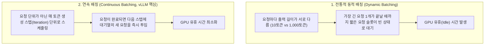

### Dynamic Batching의 한계와 Continuous Batching
* **Dynamic Batching**: 여러 요청을 묶었을 때, 짧은 요청이 먼저 끝나도 가장 긴 요청이 완료될 때까지 빈 슬롯을 유지한 채 자원이 낭비됩니다.
* **Continuous Batching (In-Flight Batching)**: 배치를 고정된 요청 묶음으로 처리하지 않고, **매 토큰을 생성하는 Iteration 단위**로 유동적으로 관리합니다. 완료된 요청은 즉시 반환하고 다음 스텝에 대기 중인 새 요청을 빈자리에 채워 넣습니다.

---

### 긴 프롬프트 처리와 Chunked Prefill

연속 배칭 환경에서 여러 사용자가 텍스트를 Decode받는 도중 긴 문서(예: 8,000토큰) 요약 요청(Prefill)이 들어오면 연산 불균형이 발생합니다.

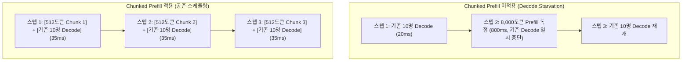

* **Decode Starvation**: 긴 Prefill 연산이 GPU 자원을 장시간 독점하여, 기존 Decode 사용자들의 출력이 일시적으로 멈추는 ITL 지연 스파이크가 발생합니다.
* **Chunked Prefill**: 긴 프롬프트를 **512토큰 단위의 작은 조각(Chunk)** 으로 분할합니다.
  * 매 스텝마다 **[512토큰 Prefill 조각] + [기존 사용자들의 1토큰 Decode]** 를 묶어 처리합니다.
  * 스텝당 실행 시간이 일정하게 유지되어 텍스트 출력이 끊김 없이 이어집니다.

---

## 2. 어텐션 아키텍처의 진화: MHA → MQA → GQA

KV Cache 크기는 레이어 수, 헤드 수, 헤드 차원, 데이터 정밀도에 비례합니다.

```
토큰당 KV Cache 크기 (Bytes) = 2 × 레이어 수 × KV 헤드 수 × 헤드 차원 × 정밀도(바이트)
```

문맥이 길어질수록 KV Cache가 VRAM을 점유하는 문제를 해결하기 위해, Key/Value 헤드 개수를 줄이는 아키텍처 개선이 이루어졌습니다.

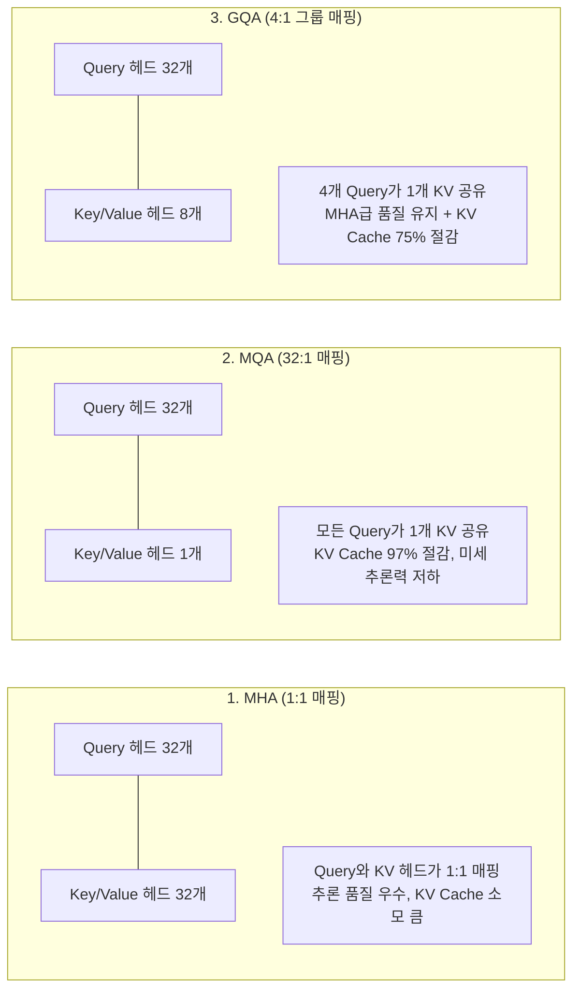

### 어텐션 방식 비교

| 어텐션 구조 | Query 헤드 수 | Key/Value 헤드 수 | KV Cache 크기 | 특징 및 대표 모델 |
| :--- | :--- | :--- | :--- | :--- |
| **MHA (Multi-Head Attention)** | 32개 | 32개 (1:1 매핑) | 100% (기준) | 품질은 우수하나 긴 문맥 서빙 시 VRAM 소모가 큼 (Llama-1) |
| **MQA (Multi-Query Attention)** | 32개 | 1개 (모든 Query 공유) | 3.1% (97% 절감) | VRAM 절감 폭은 크나 복잡한 문맥 추론력이 감소 (Falcon) |
| **GQA (Grouped-Query Attention)** | 32개 | 8개 (4:1 그룹 공유) | 25% (75% 절감) | MHA 수준 품질 유지 + VRAM 1/4 축소 (Llama-3, Mistral) |

* **작동 원리**: 런타임에 동적으로 헤드를 묶는 것이 아니라, 모델 학습 단계에서 4개의 Query가 1개의 Key/Value를 바라보도록 고정합니다.
* 학습 과정에서 해당 1개의 Key/Value 헤드가 4개 Query의 공통 문맥을 표현하도록 최적화되어 품질 손실을 최소화하면서 메모리 요구량을 줄입니다.

---

## 3. 커널 및 메모리 가상화 최적화

### FlashAttention의 SRAM 타일링과 HBM 전송 제거

#### 표준 어텐션의 메모리 입출력(IO) 한계

트랜스포머의 표준 어텐션 수식은 다음과 같이 정의됩니다.

$$\text{Attention}(Q, K, V) = \text{softmax}\left(\frac{QK^T}{\sqrt{d}}\right)V$$

이 연산에서 시퀀스 길이 $N$이 커질 때 심각한 하드웨어 병목이 발생합니다.

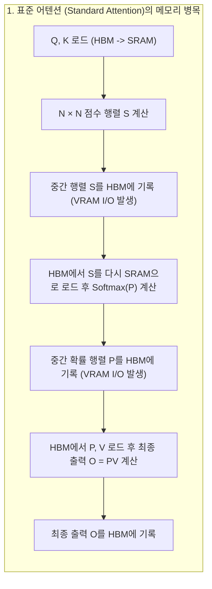

* **메모리 I/O 복잡도 $O(N^2)$**:
  * 시퀀스 길이가 $N=8,192$인 경우, $N \times N$ 행렬은 약 6,700만 개의 요소를 가집니다.
  * 표준 어텐션은 이 거대한 중간 행렬($S, P$)을 느린 GPU HBM(VRAM)에 썼다가 다시 읽어오는 과정을 반복합니다.
  * GPU 연산 코어(텐서 코어)가 아무리 빨라도 **HBM 메모리 대역폭의 한계에 가로막혀 연산 코어가 대부분의 시간을 데이터 대기에 소모(Memory Bandwidth-bound)** 하게 됩니다.

---

#### 온칩 SRAM 타일링과 Online Softmax 메커니즘

FlashAttention은 GPU의 메모리 계층 구조를 활용하여 **HBM 메모리 I/O를 $O(N^2)$에서 $O(N)$으로 혁신적으로 줄인 커널 최적화 기술**입니다.

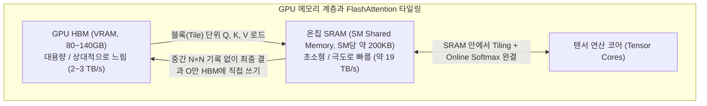

FlashAttention이 중간 $N \times N$ 행렬을 HBM에 쓰지 않고 온칩 SRAM 안에서 연산을 완결할 수 있는 핵심 비결은 **타일링(Tiling)** 과 **Online Softmax**입니다.

1. **타일링 (Tiling)**:
   * 입력 행렬 $Q, K, V$를 초고속 온칩 SRAM에 한 번에 들어갈 수 있는 작은 블록(Tile) 단위로 분할하여 로드합니다.
2. **Online Softmax (온라인 소프트맥스)**:
   * 일반적인 Softmax는 시퀀스 전체($N$개)의 최댓값과 분모 합계($\sum e^{x_i}$)를 전부 알아야 각 원소의 확률값을 계산할 수 있습니다.
   * Online Softmax는 블록을 순회하면서 **새로운 블록이 들어올 때마다 지역 최댓값(Local Max)과 정규화 통계량을 점진적으로 보정(Rescaling)** 합니다.
   * 이전 블록의 계산 결과에 스케일링 계수를 곱해 보정하는 방식으로 전체 $N \times N$ 행렬을 메모리에 적재하지 않고도 수학적으로 100% 동일한 정확한 결과를 산출합니다.

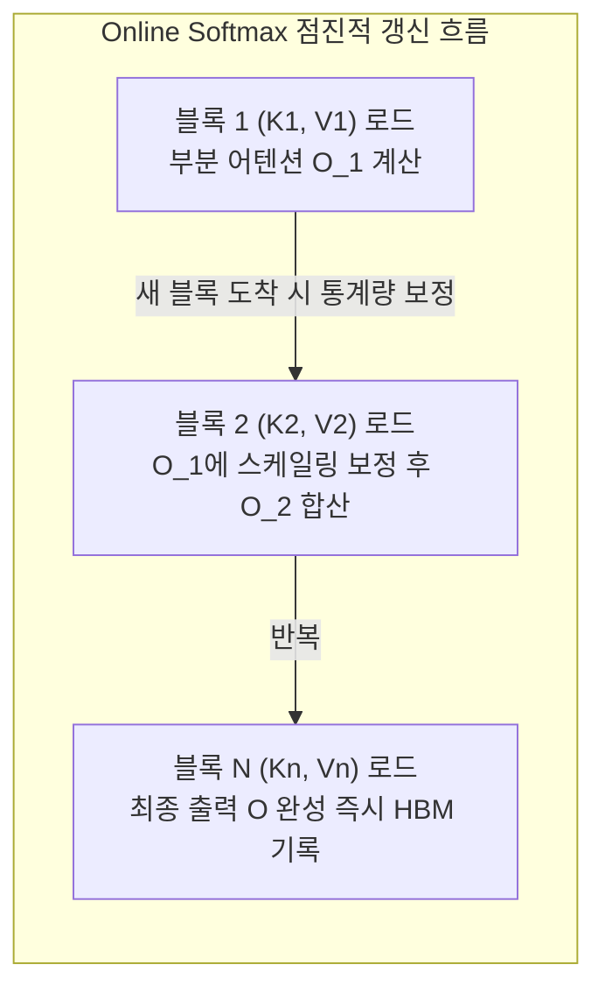

---

#### FlashAttention 세대별 발전: v1에서 v3까지

FlashAttention은 GPU 하드웨어 아키텍처 발전에 맞춰 진화해왔습니다.

| 구분 | FlashAttention-1 (2022) | FlashAttention-2 (2023) | FlashAttention-3 (2024, Hopper) |
| :--- | :--- | :--- | :--- |
| **핵심 혁신** | 기본 SRAM Tiling & Online Softmax 도입 | 연산 루프 재배치 및 워프 분할 최적화 | Hopper 하드웨어 비동기 파이프라이닝 |
| **HBM I/O 축소** | $O(N^2) \to O(N)$ 감소 | $O(N^2) \to O(N)$ 유지 | FP8 저정밀도 지원으로 I/O 추가 반감 |
| **연산 효율 (FLOPs/s)** | 이론상 최대치의 30~50% | 이론상 최대치의 50~73% | 이론상 최대치의 75~85% (거의 1 PFLOPS) |
| **주요 개선점** | 중간 $N \times N$ 행렬 제거 (2~4배 가속) | $Q$ 외부 루프화로 스레드 동기화 오버헤드 제거 | TMA(Tensor Memory Accelerator) 비동기 전송 & WGMMA 명령어 활용 |

* **FlashAttention-2의 개선**:
  * 바깥 루프를 $Q$ 블록으로 두고 안쪽 루프를 $K, V$ 블록으로 변경하여 GPU 스레드 블록 간의 통신 및 동기화 오버헤드를 대폭 줄였습니다.
  * 불필요한 스케일링 연산을 줄이고 텐서 코어가 가장 잘하는 행렬 곱셈(MatMul) 비중을 높였습니다.
* **FlashAttention-3의 개선 (NVIDIA Hopper H100 특화)**:
  * **TMA (Tensor Memory Accelerator)** 를 활용하여 HBM에서 SRAM으로 데이터를 가져오는 비동기 전송과 텐서 코어의 행렬 연산을 완벽하게 겹쳐서 수행(Overlapping)합니다.
  * FP8 정밀도를 네이티브 지원하여 긴 컨텍스트 연산 처리량을 비약적으로 상승시켰습니다.

---

#### 서빙 환경에서의 실전 영향과 FlashDecoding

* **Prefill 가속**: 수천~수만 토큰의 긴 프롬프트가 유입될 때 $O(N^2)$ I/O 병목을 제거하여 **첫 토큰 생성 시간(TTFT)을 2배에서 4배 단축**합니다.
* **FlashDecoding (Decode 단계 가속)**:
  * 토큰을 1개씩 생성하는 Decode 단계($q=1$)에서는 연산 병렬성이 낮아 FlashAttention의 타일링 효과가 제한적이었습니다.
  * 이를 해결하기 위해 긴 KV Cache 시퀀스 차원을 잘게 쪼개어 **다수의 SM(Streaming Multiprocessor)에 병렬로 나누어 연산한 뒤 마지막에 통합하는 FlashDecoding 기술**이 도입되어 긴 문맥 Decode 속도를 획기적으로 끌어올렸습니다.

---

### PagedAttention 기반 메모리 가상화와 단편화 제거

운영체제(OS)가 가상 메모리를 4KB 단위 페이지(Page)로 나누어 물리 메모리에 비연속적으로 적재하듯, KV Cache를 고정 크기 블록(Block, 예: 16토큰) 단위로 분할하여 관리하는 기술입니다.

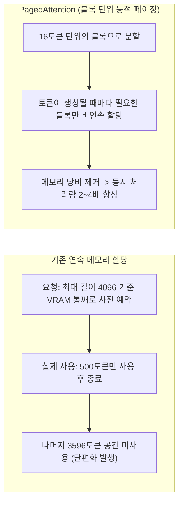

* **기존 방식의 문제**: 요청의 최대 길이에 맞춰 VRAM을 연속 공간으로 미리 예약하여 내부 단편화(Internal Fragmentation)가 발생했습니다.
* **PagedAttention 방식**: 토큰이 생성될 때마다 16토큰 단위 블록을 동적으로 할당하여 메모리 낭비를 제거하고 동일 GPU에서 수용 가능한 동시 요청 수를 2~4배 확대합니다.

---

## 4. 모델 압축 기술: 양자화(Quantization)와 지식 증류(Distillation)

서빙 효율을 높이기 위해 모델 자체의 크기를 물리적으로 줄이는 두 가지 핵심 접근법입니다.

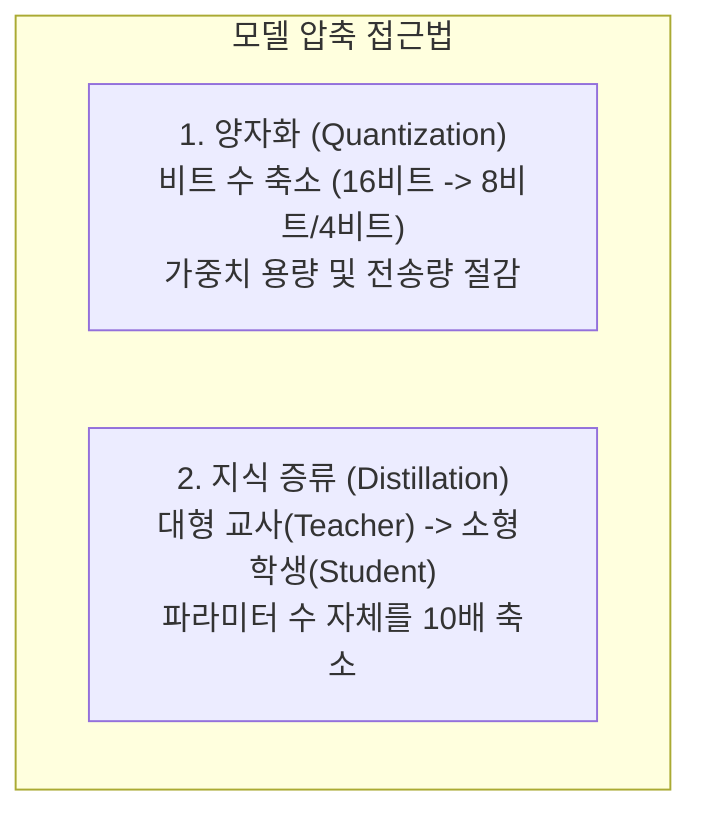

---

### 양자화(Quantization)를 통한 수치 정밀도 압축

#### 정밀도 압축과 서빙 병목 해소

트랜스포머 모델의 파라미터는 기본적으로 16비트 부동소수점(BF16/FP16, 파라미터당 2바이트)으로 표현됩니다. 하지만 실전 서빙 환경에서는 높은 정밀도가 곧바로 메모리 용량과 대역폭의 병목으로 이어집니다.

* **BF16 / FP16 (16비트, 2바이트)**: 높은 정밀도를 보장하지만 가중치 용량이 크고, Decode 단계에서 매 토큰 생성 시마다 대량의 바이트를 HBM에서 연산 코어로 전송해야 하므로 심각한 Memory Wall 병목을 겪습니다.
* **양자화(Quantization)**: 가중치 및 활성화 텐서의 정밀도를 **8비트(FP8, INT8)** 나 **4비트(INT4, AWQ, GPTQ)** 로 낮추어 병목을 해소합니다.
  * **VRAM 용량 50%~75% 절감**: 70B 모델 기준 140GB(BF16)에서 70GB(FP8), 35GB(AWQ 4-bit)로 감소하여 소형 GPU 단일 장비에서도 거대 모델 로드가 가능해집니다.
  * **메모리 전송 대역폭 병목 완화**: HBM에서 연산 코어로 실어나르는 데이터 크기가 반토막 이하로 줄어들어 Decode 단계의 초당 토큰 처리량(Throughput)이 비약적으로 향상됩니다.
  * **최신 GPU 하드웨어 가속**: NVIDIA Ada Lovelace(L40S, RTX 4090) 및 Hopper(H100) 아키텍처는 FP8 텐서 코어를 내장하여 클록당 연산 처리량이 16비트 대비 2배 높습니다.

---

#### 주요 양자화 방식 비교 (FP8, AWQ, GPTQ)

| 양자화 기법 | 데이터 포맷 | 압축률 | 작동 원리 및 특징 | 추천 서빙 워크로드 |
| :--- | :--- | :--- | :--- | :--- |
| **FP8 (E4M3 / E5M2)** | W8A8 (가중치 8B, 활성화 8B) | 2x 절감 | 가중치와 활성화 모두 8비트 부동소수점으로 유지하여 정밀도 손실이 거의 없음 (최신 서빙 표준) | H100, L40S 등 FP8 지원 GPU에서의 범용 고성능 서빙 |
| **AWQ (Activation-aware)** | W4A16 (가중치 4B, 활성화 16B) | 4x 절감 | 활성화 크기가 큰 상위 1% 중요 가중치(Salient Weights)를 식별하여 채널 단위 스케일링으로 보존 | 70B 모델 단일 GPU 탑재 및 대화 품질 보존 서빙 |
| **GPTQ** | W4A16 (가중치 4B, 활성화 16B) | 4x 절감 | 2차 미분(Hessian Matrix) 기반 오차 보정을 통해 레이어 단위로 가중치를 4비트 양자화 | A10, RTX 3090/4090 등 단일 GPU 환경에서의 단일 배치 서빙 |
| **FP8 KV Cache** | KV Cache 전용 8비트 | 2x 절감 | 가중치뿐 아니라 문맥 길이에 따라 급증하는 KV Cache 텐서를 FP8로 저장 | 장문 컨텍스트(32k+) 및 대규모 동시 요청 환경 |

---

#### Hugging Face 모델 `config.json` 설정 예시

Hugging Face Hub에 등록된 양자화 모델들은 메타데이터 `config.json`에 `quantization_config` 필드를 포함하고 있어, 서빙 엔진이 이를 자동으로 감지하고 최적화 커널을 로드합니다.

##### 1) AWQ 4-bit 모델 `config.json` 예시
```json
{
  "architectures": ["LlamaForCausalLM"],
  "model_type": "llama",
  "torch_dtype": "float16",
  "quantization_config": {
    "quant_method": "awq",
    "bits": 4,
    "group_size": 128,
    "zero_point": true,
    "version": "gemm"
  }
}
```

##### 2) FP8 모델 `config.json` 예시 (Neural Magic / vLLM 표준)
```json
{
  "architectures": ["LlamaForCausalLM"],
  "model_type": "llama",
  "torch_dtype": "bfloat16",
  "quantization_config": {
    "quant_method": "fp8",
    "activation_scheme": "dynamic",
    "weight_block_size": [128, 128]
  }
}
```

---

#### 실전 vLLM 서빙 CLI 실행 커맨드

vLLM은 사전 양자화된 모델을 불러오거나 서빙 기동 시점에 동적으로 양자화를 적용할 수 있는 유연한 CLI 옵션을 제공합니다.

##### 1) 사전 양자화된 AWQ 모델 서빙
```bash
# 7B/8B AWQ 4-bit 모델을 1장의 GPU(24GB VRAM)에 적재하여 고속 서빙
vllm serve casperhansen/llama-3-8b-instruct-awq \
  --quantization awq \
  --dtype half \
  --max-model-len 8192 \
  --gpu-memory-utilization 0.90
```

##### 2) FP8 양자화 모델 서빙 및 FP8 KV Cache 동시 활성화
```bash
# FP8 가중치 모델 로드 + KV Cache도 FP8로 설정하여 메모리 효율 극대화
vllm serve neuralmagic/Meta-Llama-3.1-8B-Instruct-FP8 \
  --quantization fp8 \
  --kv-cache-dtype fp8 \
  --max-model-len 16384
```

##### 3) 순정 BF16 모델에 동적(On-the-fly) FP8 양자화 적용
```bash
# 원본 BF16 가중치 모델을 로드하면서 메모리 상에서 실시간 FP8로 압축하여 서빙
vllm serve meta-llama/Meta-Llama-3.1-70B-Instruct \
  --quantization fp8 \
  --tensor-parallel-size 4 \
  --kv-cache-dtype fp8
```

---

### 지식 증류(Knowledge Distillation)를 통한 소형 모델 지능 전수

양자화는 기존 모델 가중치의 비트 정밀도를 낮추는 기법이고, **지식 증류(Distillation)** 는 대형 교사(Teacher) 모델의 출력 분포와 추론 능력을 소형 학생(Student) 모델에 학습시키는 기법입니다.

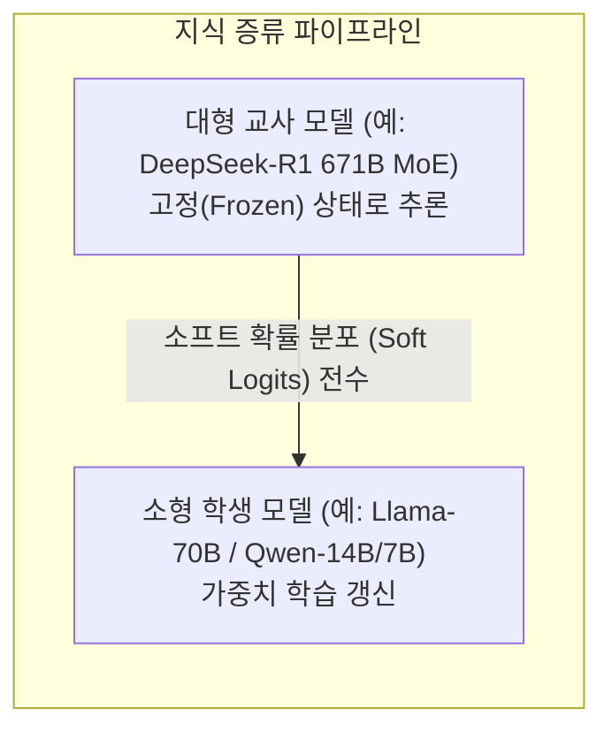

#### 지식 증류의 핵심 원리: 소프트 로짓(Soft Logits)
* 학생 모델에게 단순 정답 텍스트(Hard Label)만 제공하는 대신, 교사 모델이 각 단어를 선택할 때 생성한 **모든 후보 단어들의 확률 분포(Soft Logits)** 를 함께 학습시킵니다.
* **실전 사례 (DeepSeek-R1 Distill)**:
  * 교사 모델: DeepSeek-R1 (671B MoE)
  * 학생 모델: DeepSeek-R1-Distill-Llama-70B, DeepSeek-R1-Distill-Qwen-32B/14B/7B/1.5B
  * 결과: 70B 크기의 학생 모델이 671B 교사 모델의 주요 벤치마크 점수의 95% 이상을 10배 작은 파라미터로 달성했습니다.

#### 양자화 vs 지식 증류 비교

| 비교 항목 | 양자화 (Quantization) | 지식 증류 (Distillation) |
| :--- | :--- | :--- |
| **적용 대상** | 기존 모델 파라미터의 비트 수 축소 | 작은 규모의 새로운 학생 모델 학습 |
| **추가 학습 데이터** | 거의 불필요 (Post-Training Quantization) | 대규모 고품질 학습 데이터셋 필요 |
| **엔지니어링 난이도** | 낮음 (수 분 내 변환 및 서빙 적용) | 높음 (교사 모델 추론 및 학생 재학습 필요) |
| **메모리 절감 폭** | 2배 ~ 4배 (FP8, INT4) | 10배 ~ 50배 (671B → 70B/14B/7B) |
| **실무 적용 전략** | 배포된 모델의 서빙 비용을 즉시 낮출 때 | 에지 기기나 단일 GPU에 최적화된 고성능 모델을 배포할 때 |

---

## 5. 프롬프트 캐싱 (Prefix Caching) 심층 분석

### 프리픽스 캐싱의 동작 원리와 TTFT 단축

자주 반복되는 **공통 시스템 프롬프트**, **RAG 기반 참조 문서**, **멀티턴 대화 기록**의 KV Cache를 VRAM에 보존하여 매 요청마다 발생하는 중복 Prefill 연산을 생략하는 기술입니다.

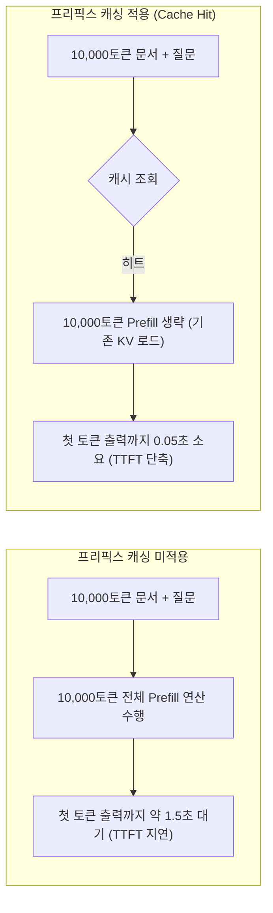

* **TTFT 단축**: 공통 접두사(Prefix) 연산을 건너뛰어 첫 토큰 응답 속도를 수 초에서 수십 밀리초(ms) 단위로 줄입니다.
* **GPU 연산 자원 확보**: Prefill 연산량이 감소하여 GPU가 실시간 토큰 생성(Decode)에 자원을 집중할 수 있습니다.

---

### 서빙 엔진별 프리픽스 캐싱 내부 구현

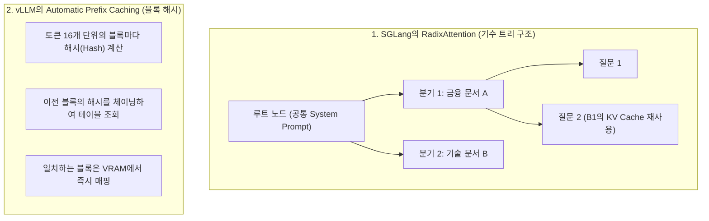

1. **SGLang의 RadixAttention**:
   * 토큰 시퀀스를 **기수 트리(Radix Tree)** 구조로 관리합니다.
   * 여러 사용자가 동일한 시스템 프롬프트를 공유하거나 대화가 분기되더라도 트리 경로를 따라 **일치하는 최장 접두사(Longest Common Prefix)를 탐색해 캐시 히트**를 처리합니다.
2. **vLLM의 Automatic Prefix Caching (APC)**:
   * PagedAttention의 16토큰 블록 단위로 **블록 해시 체인**을 생성하여 캐시를 매칭합니다 (--enable-prefix-caching).
3. **LRU(Least Recently Used) 방출 정책**:
   * GPU VRAM 공간이 부족해지면, **가장 오랫동안 참조되지 않은 캐시 블록부터 순차적으로 해제**하여 메모리 안정성을 유지합니다.

---

### 실전 Prefix Caching 3대 Best Practices

#### 1) 고정된 텍스트는 프롬프트의 '맨 앞'에 배치
* 프롬프트를 구성할 때 **[고정 시스템 프롬프트] → [참조 문서] → [사용자 동적 질문]** 순서로 배치해야 앞부분이 캐시 히트됩니다.
* **주의**: 프롬프트 맨 앞에 사용자 ID나 타임스탬프(user_id: 12345)를 배치하면 첫 토큰부터 해시가 변경되어 **뒤따라오는 긴 문서 캐시가 모두 무효화(Cache Miss)** 됩니다.

#### 2) RAG 검색 문서의 정렬(Ordering) 고정
* RAG 파이프라인에서 검색된 문서 청크들의 내용이 같더라도 검색 순서가 달라지면 캐시 미스가 발생합니다.
* 검색된 청크들을 **문서 ID나 알파벳순으로 정렬하여 프롬프트에 주입**해야 캐시 히트율을 유지할 수 있습니다.

#### 3) Cache-Aware Routing (멀티 GPU 환경)
* 여러 대의 서빙 인스턴스를 운영할 때, 로드 밸런서가 **동일한 시스템 프롬프트나 사용자 요청을 해당 KV Cache가 적재된 GPU 인스턴스로 라우팅**하여 중복 Prefill을 방지합니다.

---

## 6. 핵심 3줄 요약

1. **배칭과 스케줄링**: Continuous Batching으로 GPU 유휴를 줄이고, Chunked Prefill로 긴 프롬프트 유입 시의 ITL 지연 스파이크를 방지합니다.
2. **어텐션 및 메모리 가상화**: GQA로 KV Cache를 75% 절감하고, FlashAttention과 PagedAttention으로 HBM 전송 병목과 메모리 단편화를 제거합니다.
3. **압축·증류와 캐싱**: 양자화 및 지식 증류로 모델 크기를 2배~10배 줄이고, Prefix Caching으로 첫 토큰 응답 시간(TTFT)을 대폭 단축합니다.

<div class="series-nav">
  <a href="/space-notes/posts/ai/llm-serving-part-5/" class="series-nav-item prev">
    <span class="series-nav-label">이전 파트</span>
    <span class="series-nav-title">← [Part 5] LLM 서빙의 하드웨어 기초와 메모리 벽</span>
  </a>
  <a href="/space-notes/posts/" class="series-nav-item next">
    <span class="series-nav-label">시리즈 완료</span>
    <span class="series-nav-title">스터디 아카이브 목록으로 →</span>
  </a>
</div>

